<div align="center">


# GFS

### 现代化文件管理网盘系统

一个基于 Spring Boot 4.x 的企业级文件管理网盘系统后端，专注于提供高性能、高可靠的文件存储和管理服务。

 
 

[问题反馈](https://github.com/guangheUlti/gfs/issues) · [功能请求](https://github.com/guangheUlti/gfs/issues/new)

</div>

---

## 源码地址

[GitHub：https://github.com/guangheUlti/gfs](https://github.com/guangheUlti/gfs)

---

## 特性

### 核心亮点

- **大文件上传** - 分片上传、断点续传、秒传功能，支持 TB 级文件
- **实时上传进度** - 实时推送上传进度，精确到分片级别
- **秒传功能** - 基于 MD5 双重校验，相同文件秒级完成
- **插件化存储** - SPI 机制热插拔，5 分钟接入一个新存储平台
- **本地目录挂载** - 把服务器真实目录挂进网盘，写操作穿透真实文件系统，外部改动定时/手动扫描同步
- **对外文件服务** - 系统自身对外充当 WebDAV / SFTP 服务端，客户端可把网盘直接挂载为本地磁盘
- **国际化支持** - 中英文双语支持，轻松扩展更多语言
- **虚拟线程** - 全面启用 Java 虚拟线程，异步任务、定时任务与预览队列高并发下更稳
- **模块化架构** - 清晰的分层设计，易于维护和扩展
- **在线预览与编辑** - 支持多种文件格式的在线预览，文本/代码/Markdown 可直接编辑保存，预览防盗链功能
- **安全可靠** - Sa-Token 会话认证（服务端可即时登出/踢人）、多端并发登录、会话存 Redis（重启不掉线、可多实例）、权限控制、文件完整性校验

### 功能特性

- **文件管理**
    - 文件上传（分片上传、断点续传、秒传，支持文件框选与外部文件拖入）
    - 文件下载（任务式分片下载，支持限速、并发与进度展示）
    - 文件预览与在线编辑（文本/代码/Markdown 直接编辑保存）
    - 文本文件创建（TXT/JSON/Markdown，后端自动补后缀）
    - 文件夹创建与管理
    - 文件/文件夹重命名、移动
    - 文件列表右键菜单、双击预览
    - 文件分享/授权码分享
    - 文件删除（入回收站，或永久删除）

- **国际化**
    - 中文简体
    - 英文
    - 支持扩展更多语言

- **认证与授权**
    - 用户名密码登录
    - Sa-Token 会话认证（会话存 Redis，重启不掉线、可多实例）
    - 新注册用户审核
    - 登录管理（查看在线设备、管理员强制下线）

- **回收站**
    - 文件还原（支持批量操作）
    - 彻底删除（支持批量操作）
    - 一键清空回收站
    - 自动清理机制

- **存储平台**
    - 内置本地存储，支持 MinIO、阿里云 OSS、RustFS 等 S3 兼容对象存储
    - 远程协议接入：SMB/CIFS（NAS 共享）、WebDAV（坚果云/Alist/Nextcloud）、SFTP（密码/私钥）、FTP/FTPS
    - 本地目录挂载：真实目录挂进网盘，增删改直接作用于真实文件，外部改动可定时/手动扫描同步
    - 一键切换存储平台
    - 平台配置声明式生成（JSON Schema），保存前自动连接测试，密码等敏感字段掩码展示
    - 存储空间统计

- **对外文件服务**（管理员可配，实时运行状态）
    - **WebDAV 服务端**：复用主服务 HTTP 端口（80），路径前缀 `/dav`，支持 Windows 网络驱动器映射（`net use Z: http://<主机>/dav`）、rclone、davfs2 等客户端
    - **SFTP 服务端**：独立端口（默认 9022，Apache MINA SSHD），支持 sshfs 挂载与 WinSCP / FileZilla / OpenSSH 客户端
    - 认证复用网盘账号（BCrypt 校验），删除进回收站与 Web 端语义一致，内容级去重秒传
    - 启用/停用热生效，服务重启后自动拉起；SFTP 主机密钥持久化，重启后客户端无指纹告警
    - 已知限制：WebDAV 未实现 LOCK（Office 在线编辑保存可能失败，资源管理器映射不受影响）；SFTP 仅支持顺序写

### 预览支持

**系统默认支持以下多种文件类型的预览，文本/代码/Markdown 支持在线编辑保存**：

- 图片: jpg, jpeg, png, gif, bmp, webp, svg, tif, tiff
- 文档: pdf, doc, docx, xls, xlsx, csv, ppt, pptx
- 文本/代码: txt, log, ini, properties, yaml, yml, conf, java, js, jsx, ts, tsx, py, c, cpp, h, hpp, cc, cxx, html, css,
  scss, sass, less, vue, php, go, rs, rb, swift, kt, scala, json, xml, sql, sh, bash, bat, ps1, cs, toml
- Markdown: md, markdown
- 音视频: mp4, avi, mkv, mov, wmv, flv, webm, mp3, wav, flac, aac, ogg, m4a, wma
- 压缩包: zip, rar, 7z, tar (支持查看目录结构，支持预览压缩包中的文件)
- 其他: drawio

---

## 快速开始

### 环境要求

- JDK >= 21
- Maven >= 3.8
- MySQL >= 8.0 或 PostgreSQL >= 14
- Redis >= 8.0

### 安装

```bash
# 克隆项目
git clone https://github.com/guangheUlti/gfs.git

# 进入项目目录
cd gfs

# 编译项目
mvn clean install -DskipTests
```

### 配置

1. **初始化数据库**

   ```bash
   # mysql
   mysql -u root -p gfs < sql/mysql/gfs.sql
   ```

   ```bash
   # postgresql
   psql -U postgres -c "CREATE DATABASE gfs;"
   psql -U postgres -d gfs -f sql/postgresql/gfs_pg.sql
   ```

2. **修改配置文件**

   修改 `fs-admin/src/main/resources/application-dev.yml` 中的数据库和 Redis 配置

### 运行

```bash
# 启动后端
cd fs-admin
mvn spring-boot:run

# 或使用 IDE 运行 FsAdminApplication

# 启动前端（开发地址 http://localhost:5173，/apis 代理到后端 80）
cd fs-ui
pnpm install
pnpm dev
```

访问：

- 服务地址：http://localhost
- API 文档：http://localhost/swagger-ui.html

### 默认账号

| 账号    | 密码    |
|-------|-------|
| admin | admin |

### Windows 一键部署

仓库内 `release/deploy-package/` 是一个自带 JDK 21、MySQL 8.4、Redis 的免安装部署包，目标服务器无需预装任何软件；压缩包不入库，发布时由 `script/package-release.ps1` 构建，并以 **GitHub Release 附件**（`gfs-<版本>-windows-x64.zip`）提供下载：

```bat
cd release\deploy-package
bin\verify.bat          :: 检查包内容与端口
bin\start.bat           :: 首次运行自动初始化数据库并启动三件套
bin\stop.bat            :: 全部停止
bin\status.bat          :: 查看运行状态
bin\install-service.bat :: 注册开机自启（需管理员）
```

端口、数据库密码、JVM 参数统一在 `bin\env.bat` 里改，详见 `release/deploy-package/README.md`。

---

## 设计文档

| 文档 | 内容 |
|------|------|
| [`doc/login-auth-design.md`](doc/login-auth-design.md) | 登录认证链路设计、多端登录互不影响的原理、Sa-Token / security 配置项逐条含义 |
| [`doc/storage-plugin-expansion-guide.md`](doc/storage-plugin-expansion-guide.md) | 存储插件扩展实施指南：SPI 接口与注册方式、插件配置 Schema、挂载扫描设计与孤儿平台清理 |
| [`doc/webdav-sftp-service-guide.md`](doc/webdav-sftp-service-guide.md) | 对外文件服务实施指南：WebDAV / SFTP 服务端架构、Sa-Token 上下文桥接、流式直传与生命周期管理 |

---

## 界面预览

| 功能   | 效果图                                                                                                                  | 效果图                                                                                                                     | 效果图                                                                                                                          |
|------|----------------------------------------------------------------------------------------------------------------------|-------------------------------------------------------------------------------------------------------------------------|------------------------------------------------------------------------------------------------------------------------------|
| 登录   |                                                           |           |                                                                                                                              |
| 我的文件 | 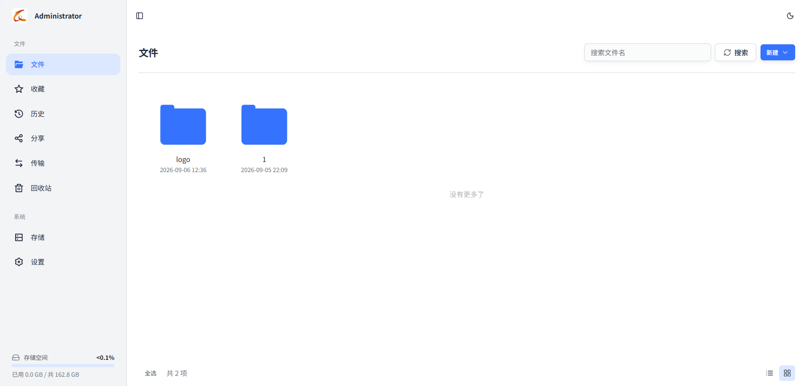      | 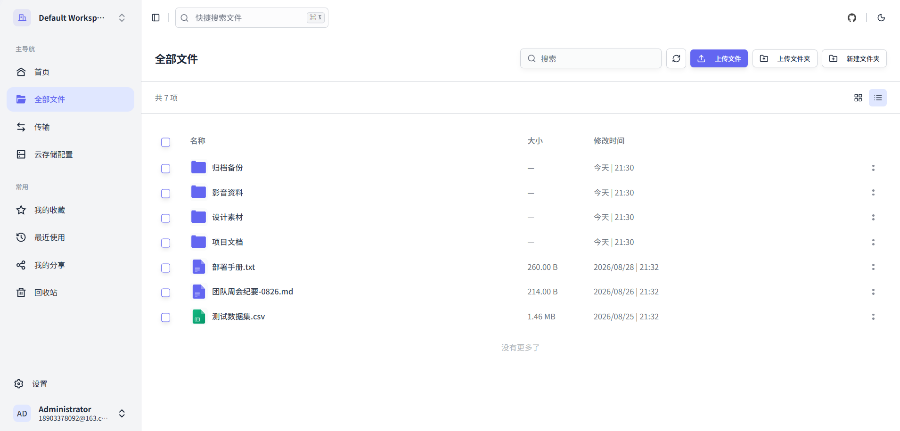                   |                                                                                                                              |
| 回收站  | 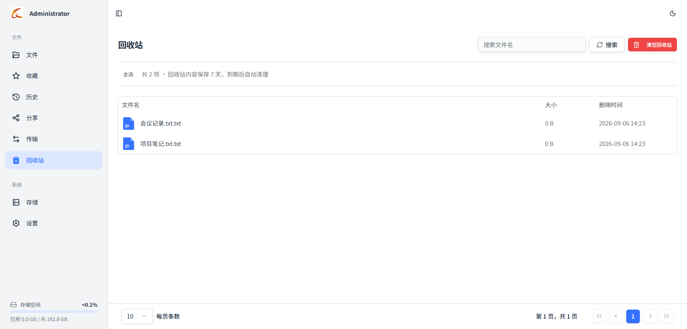          | 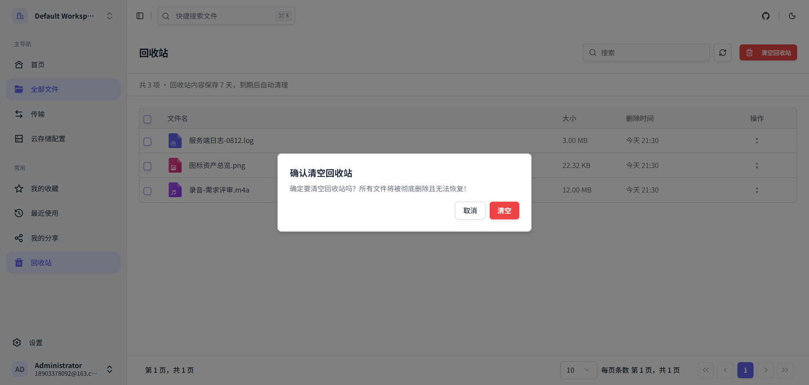 |                                                                                                                              |
| 分享文件 | 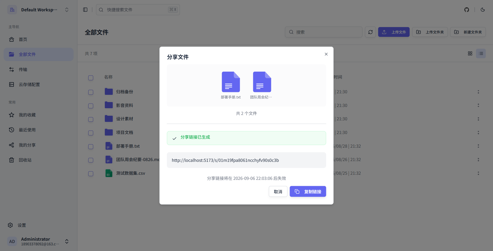              | 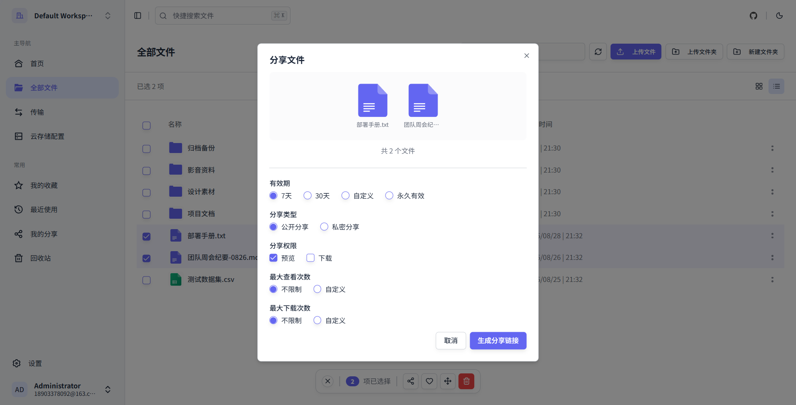   | 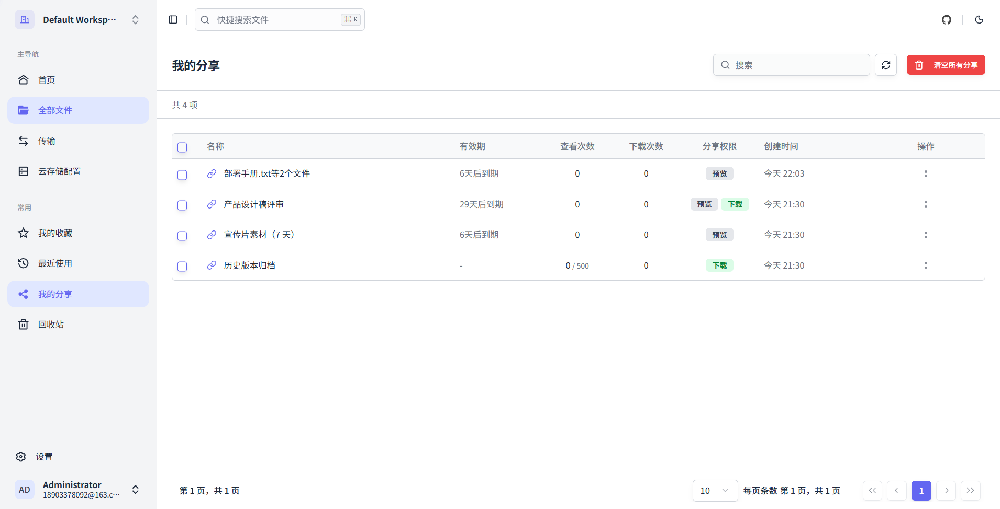            |
| 移动文件 | 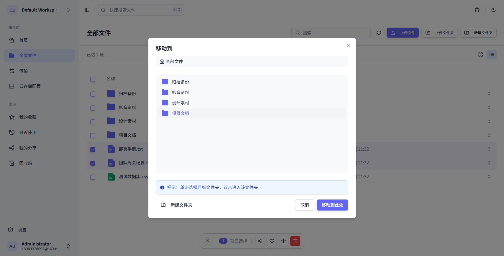                |                                                                                                                         |                                                                                                                              |
| 传输   | 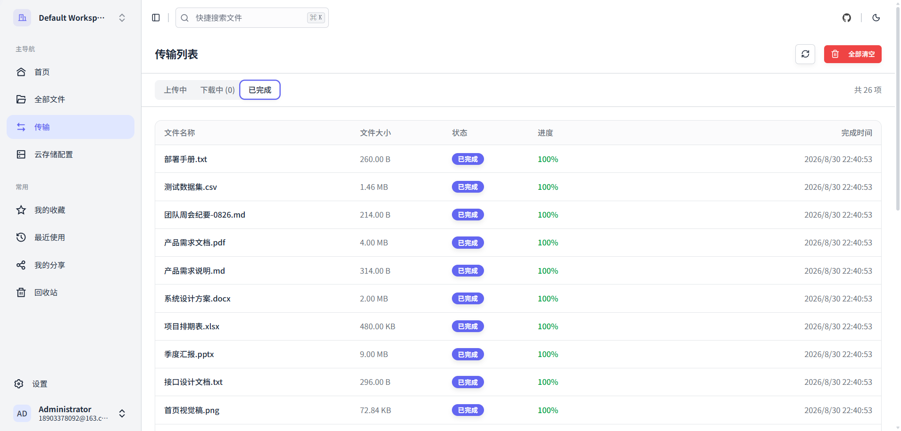 |                                                                                                                         |                                                                                                                              |
| 存储平台 | 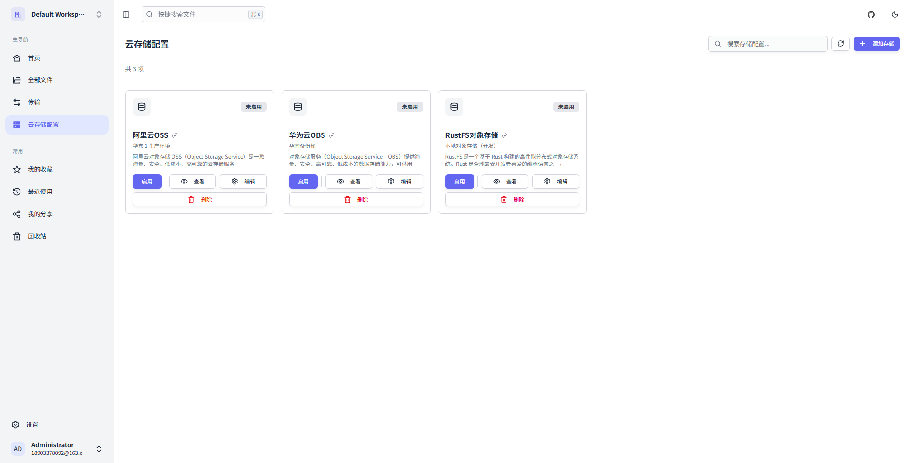          | 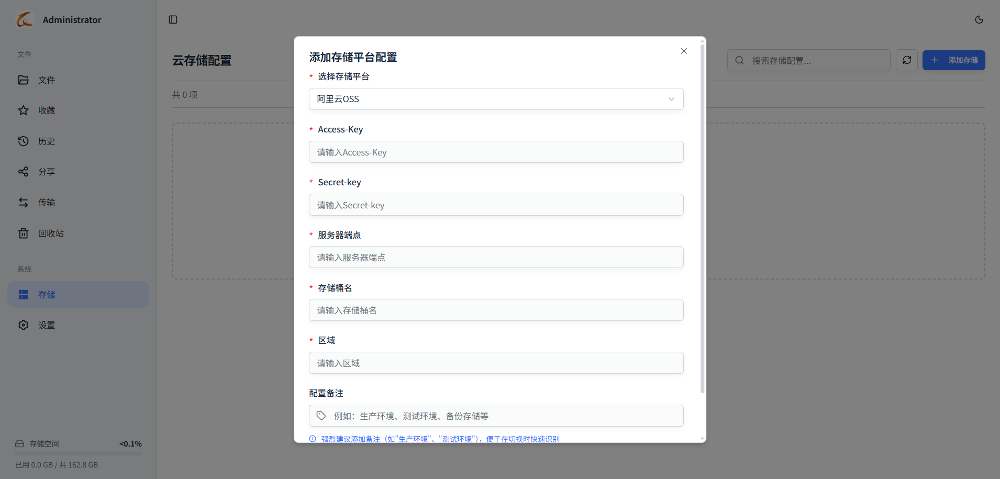     | 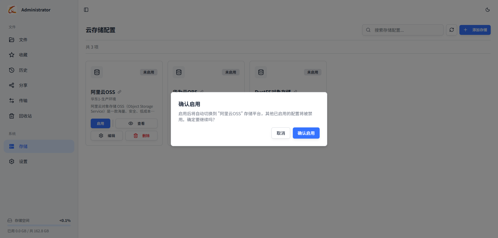    |
| 个人信息 | 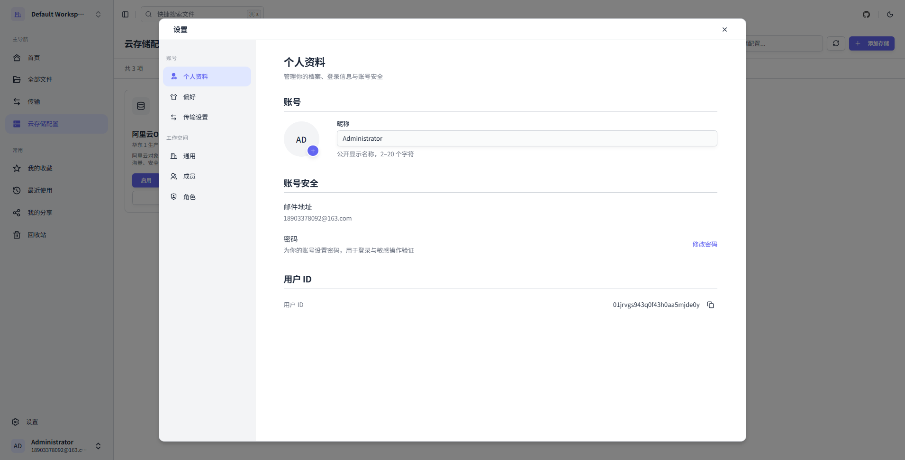          | 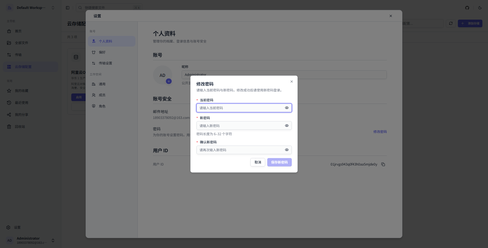   |                                                                                                                              |

---

## 项目结构

```
gfs/
├── fs-admin/                    # Web 管理模块
├── fs-dependencies/             # 依赖版本管理（BOM）
├── fs-framework/                # 框架层
│   ├── fs-common-core/          # 公共核心模块
│   ├── fs-notify/               # 通知模块（邮件通知）
│   ├── fs-orm/                  # ORM 配置模块
│   ├── fs-preview/              # 预览封装模块
│   ├── fs-redis/                # Redis 配置模块
│   ├── fs-security/             # 安全认证模块
│   ├── fs-swagger/              # API 文档配置
│   ├── fs-sse/                  # SSE 支持
│   └── fs-storage-plugin/       # 存储插件框架
│       ├── storage-plugin-boot/        # 插件核心管理模块
│       ├── storage-plugin-core/        # 插件核心接口模块
│       ├── storage-plugin-local/       # 本地存储插件
│       ├── storage-plugin-localmount/  # 本地目录挂载插件
│       ├── storage-plugin-aliyunoss/   # 阿里云 OSS 插件
│       ├── storage-plugin-minio/       # MinIO 插件
│       ├── storage-plugin-rustfs/      # RustFS 插件
│       ├── storage-plugin-smb/         # SMB/CIFS 网络存储插件
│       ├── storage-plugin-webdav/      # WebDAV 插件
│       ├── storage-plugin-sftp/        # SFTP 插件
│       └── storage-plugin-ftp/         # FTP/FTPS 插件
└── fs-modules/                  # 业务模块
    ├── fs-file/                 # 文件管理模块
    ├── fs-service/              # 对外文件服务模块（WebDAV / SFTP 服务端）
    ├── fs-storage/              # 存储平台管理模块
    ├── fs-system/               # 系统管理模块（用户、注册审核、登录管理）
    └── fs-log/                  # 日志模块
fs-ui/                           # Web 前端（React 19 + Vite）
doc/                             # 设计文档（登录认证、存储插件扩展等）
release/deploy-package/          # 免安装部署包（脚本 + 配置，运行时由脚本重建）
script/                          # 构建/部署脚本（package-release.ps1、docker）
sql/                             # 数据库初始化脚本
```

---

## 路线图

- 更细粒度的权限控制、审计日志

欢迎在 [Issues](https://github.com/guangheUlti/gfs/issues) 中提出你的想法。

---

## 贡献指南

我们欢迎所有的贡献，无论是新功能、Bug 修复还是文档改进！

### 贡献步骤

1. Fork 本仓库
2. 创建你的特性分支 (`git checkout -b feature/AmazingFeature`)
3. 提交你的改动 (`git commit -m 'Add some AmazingFeature'`)
4. 推送到分支 (`git push origin feature/AmazingFeature`)
5. 开启一个 Pull Request

### 代码规范

- 遵循阿里巴巴 Java 开发手册
- 使用 Lombok 简化代码
- 编写清晰的注释
- 提交信息遵循 [Conventional Commits](https://www.conventionalcommits.org/)

### Commit 规范

```
feat: 新功能
fix: 修复 Bug
docs: 文档更新
style: 代码格式调整
refactor: 代码重构
perf: 性能优化
test: 测试相关
chore: 构建/工具链更新
```

---

## 问题反馈

如果你发现了 Bug 或有功能建议，请通过以下方式反馈：

- [GitHub Issues](https://github.com/guangheUlti/gfs/issues)

---

## 鸣谢

- [Spring Boot](https://spring.io/projects/spring-boot) - 感谢 Spring 团队
- [MyBatis Flex](https://mybatis-flex.com/) - 感谢 MyBatis Flex 团队
- [Sa-Token](https://sa-token.cc/) - 感谢 Sa-Token 团队
- 所有贡献者和使用者

---

## 作者

- GitHub: [@guangheUlti](https://github.com/guangheUlti/)

---

<div align="center">

Made with ❤️ by [guangheUlti](https://github.com/guangheUlti/)

</div>
