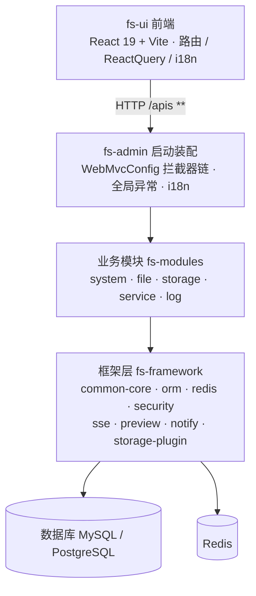

# GFS 系统架构学习指南

> 面向读者：想读懂 GFS 系统整体设计与技术选型的开发者。
>
> 本文档是整套学习文档的入口，告诉你：系统全貌长什么样、文档如何组织、按什么顺序读收获最大、每份文档怎么用。

---

## 1. GFS 是什么

GFS 是一个**现代化文件管理网盘系统**，核心能力包括：

- **文件管理**：目录树浏览、上传/下载、改名/移动/复制、回收站、收藏。
- **多存储后端**：内置本地目录，同时支持通过插件接入 SMB / WebDAV / SFTP / FTP / 阿里云 OSS / MinIO / RustFS 等远程存储。
- **对外文件服务**：把网盘暴露为标准协议，支持 WebDAV 与 SFTP 挂载/访问，以及 S3 兼容 OSS 网关（SigV4 签名，rclone/AWS SDK 可直连）。
- **分享与协作**：文件分享（提取码、匿名下载、直链）、文件合集。
- **高效传输**：分片上传、断点续传、秒传、内容去重、SSE 实时进度。

技术栈一句话概括：**Spring Boot 4 + MyBatis-Flex + MySQL/PostgreSQL + Redis(Sa-Token 会话) 的后端，React 19 + Vite + TypeScript 的前端。**

## 2. 架构总览（一分钟看懂）

```
                    ┌─────────────────────────────┐
                    │   前端 fs-ui (React 19 + Vite)│
                    │   路由 / ReactQuery / i18n    │
                    └──────────────┬──────────────┘
                                   │ HTTP /apis (**) 
                                   ▼
             ┌───────────────────────────────────────────┐
             │         fs-admin  (Spring Boot 启动装配)     │
             │   WebMvcConfig 拦截器链 / 全局异常 / i18n     │
             └──────────────┬────────────────────────────┘
                            │
      ┌─────────────────────┼─────────────────────────────┐
      ▼                     ▼                             ▼
┌──────────────┐  ┌──────────────────┐          ┌──────────────────┐
│  业务模块     │  │  存储插件体系      │          │  对外文件服务      │
│ fs-modules   │  │ fs-storage-plugin │          │ fs-service        │
│ system/file │  │ core/boot/各协议   │          │ WebDAV / SFTP / OSS│
│ storage/log │  └────────┬─────────┘          └────────┬─────────┘
└──────────────┘           │                            │
              ┌────────────┴────────────────┐            │
              ▼                              ▼            ▼
      ┌─────────────────────────────────────────────────────────┐
      │  框架层 fs-framework                                        │
      │  common-core / orm / redis / security / sse / preview /   │
      |  notify / swagger  +  BOM 依赖统一 fs-dependencies          │
      └─────────────────────────────────────────────────────────┘
              │                        │
              ▼                        ▼```
          MySQL/PG                  Redis
```

下面是等价的分层全貌 Mermaid 图（fs-ui 前端 → fs-admin → 业务模块/存储插件/对外服务 → fs-framework → 数据库）：



## 3. 模块地图

| 层 | 模块 | 职责 | 对应文档 |
| --- | --- | --- | --- |
| 启动装配 | `fs-admin` | 应用入口、Web 拦截器链、SPA 兜底、i18n、profile 配置 | `01-总体架构与技术选型`、`13-安全框架与统一基建` |
| 依赖统一 | `fs-dependencies` | BOM：集中管理所有第三方依赖版本 | `01-总体架构与技术选型` |
| 业务模块 | `fs-system` | 用户、登录认证、权限、登录管理 | `03-认证与用户模块设计` |
| 业务模块 | `fs-file` | 文件数据模型、上传下载、分享、回收站、收藏、合集 | `04` ~ `08` |
| 业务模块 | `fs-storage` | 存储平台与配置管理、门面、挂载同步器 | `09` ~ `10` |
| 业务模块 | `fs-service` | 对外文件服务：WebDAV / SFTP / FTP / OSS | `11-对外文件服务设计` |
| 业务模块 | `fs-log` | 登录日志、操作日志、切面审计 | `12-日志与审计模块设计` |
| 框架层 | `fs-common-core` | 统一返回、全局异常、工具、i18n | `13-安全框架与统一基建` |
| 框架层 | `fs-orm` | MyBatis-Flex 封装、实体基类 | `13-安全框架与统一基建` |
| 框架层 | `fs-redis` | Redis 封装、缓存管理 | `13-安全框架与统一基建` |
| 框架层 | `fs-security` | Sa-Token 集成、权限模型 | `03`、`13` |
| 框架层 | 其他 | sse / preview / notify / swagger | `13-安全框架与统一基建` |
| 前端 | `fs-ui` | React 应用 | `02-前端架构设计` |

## 4. 推荐阅读路径

### 路径 A：快速建立整体认识（适合第一次接触）
```
01-总体架构与技术选型  →  02-前端架构设计  →  03-认证与用户模块设计
```
读完这三份，你对系统"用什么、怎么分层、用户怎么进来"已有完整认识。

### 路径 B：深入文件核心（最重要的业务）
```
04-文件数据模型与目录设计  →  05-上传链路设计  →  06-下载与媒体预览设计
→  07-文件分享与直链设计  →  08-回收站收藏与合集设计
```
这是文件网盘的心脏，推荐重点精读。

### 路径 C：存储与对外能力
```
09-存储插件体系设计  →  10-存储平台与配置设计  →  11-对外文件服务设计
```
理解"一套 file_info 如何映射到多种存储后端、如何对外挂载"。

### 路径 D：地基与治理
```
12-日志与审计模块设计  →  13-安全框架与统一基建设计
```
理解统一骨架：异常/返回结构、ORM、缓存、安全拦截。

## 5. 文档写作规范（新增文档必须遵守）

- **命名**：`NN-中文标题.md`，`NN` 为两位数字编号前缀（控制阅读顺序），中文标题概括主题。
- **统一骨架**（每个模块文档一致）：
  1. 设计定位（这段解决什么、为什么这么设计）
  2. 组件全景（表格：层/组件/位置/职责）
  3. 核心链路（时序图：Mermaid 或 ASCII）
  4. 关键代码段（贴**真实源码** + 说明"为什么"）
  5. 技术选型理由（每个关键选择的 rationale）
  6. 安全与边界（做了哪些防护、明确不做哪些）
  7. 关键文件索引（表格：关注点/文件）
- 语言中文；代码块标注语言；代码锚点引用真实路径。
- 文档间交叉引用用 `文件路径#章节` 格式。

## 6. 常用验证命令（写文档前核对代码现状）

```bash
# 在仓库根目录 D:\workspace\lab\gfs
# 后端编译
'/d/devTools/maven/bin/mvn' -q -DskipTests package
# 前端类型检查（必须在 fs-ui 内）
cd fs-ui && ./node_modules/.bin/tsc --noEmit
# 登录拿 token
curl -s -X POST http://localhost:2000/apis/auth/login -H "Content-Type: application/json" \
  -d '{"loginType":"password","account":"admin","password":"admin"}'
```