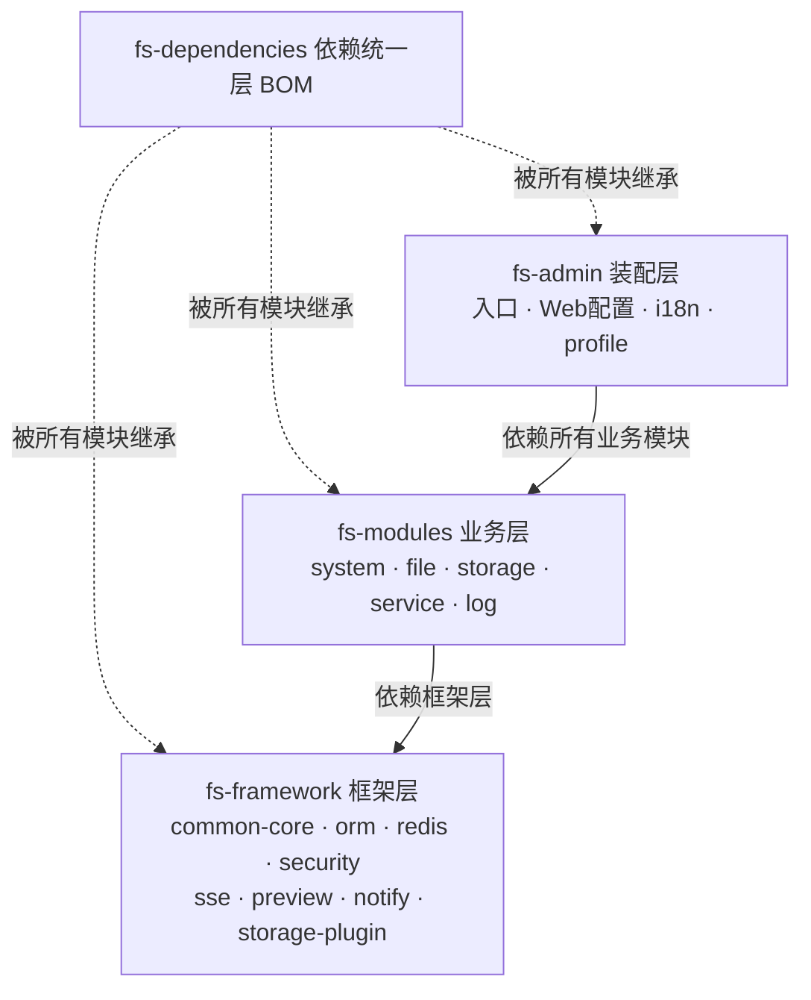
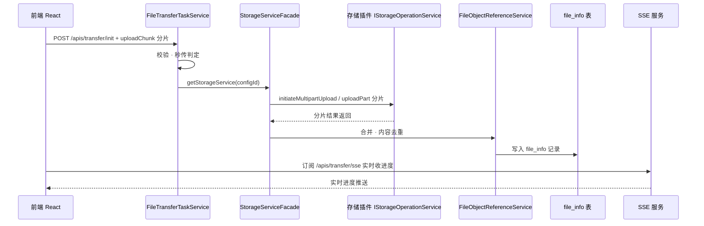

# GFS 总体架构与技术选型

> 面向读者：想系统理解 GFS 的分层架构、模块职责、技术栈及其选型理由的开发者。
>
> 本文档是整套学习文档的「总设计」，回答三个问题：系统分成哪些层、每层用什么技术、为什么这么选。

---

## 1. 设计定位

GFS 的目标是做一个**可靠、可扩展、可自托管的文件管理网盘**。从技术选型上可以读出产品诉求：

- **自托管优先**：默认内置 MySQL、Redis、本地存储，开箱即用；也支持 PostgreSQL、外部 Redis。
- **多存储适配**：不只是存本地，还要能挂 SMB/WebDAV/SFTP/FTP/对象存储——因此必须抽象出**存储插件 SPI**。
- **企业级安全**：登录防爆破、权限模型、回收站、预览防盗链。
- **标准协议开放**：对外提供 WebDAV / SFTP 与 S3 兼容 OSS 网关，让网盘可以被标准客户端挂载或以 S3 SDK 访问。

这些诉求决定了整套技术栈的选择。

## 2. 分层架构

GFS 是经典的分层多模块 Maven 工程，从上到下：

```
┌────────────────────────────────────────────────────────────┐
│  fs-admin        应用装配层：入口、Web配置、i18n、profile    │
├────────────────────────────────────────────────────────────┤
│  fs-modules      业务模块层：system / file / storage /      │
│                  service / log                            │
├────────────────────────────────────────────────────────────┤
│  fs-framework    框架/基础设施层：common-core / orm /       │
│                  redis / security / sse / preview / notify  │
│                  / swagger / storage-plugin                │
├────────────────────────────────────────────────────────────┤
│  fs-dependencies 依赖版本统一层：BOM                        │
└────────────────────────────────────────────────────────────┘
```

下面是等价的分层架构 Mermaid 图，并标注依赖方向：



### 2.1 各层职责

| 层 | 模块 | 职责 | 依赖方向 |
| --- | --- | --- | --- |
| 装配层 | `fs-admin` | 启动入口 `FsAdminApplication`、`WebMvcConfig` 拦截器链、SPA 兜底、i18n、dev/prod/docker profile | 依赖所有业务模块 |
| 业务层 | `fs-system` | 用户、登录认证、防爆破、权限、登录管理 | 依赖框架层 |
| 业务层 | `fs-file` | 文件模型、目录树、上传下载、分享、回收站、收藏、合集、预览 | 依赖 fs-storage、框架层 |
| 业务层 | `fs-storage` | 存储平台配置管理、门面 Facade、挂载同步器 | 依赖 fs-storage-plugin |
| 业务层 | `fs-service` | 对外文件服务：WebDAV / SFTP / FTP / OSS | 依赖 fs-file、fs-system |
| 业务层 | `fs-log` | 登录/操作日志、审计切面 | 依赖框架层 |
| 框架层 | `fs-common-core` | 统一返回、全局异常、业务异常、i18n、工具 | — |
| 框架层 | `fs-orm` | MyBatis-Flex 封装、实体基类、监听器 | — |
| 框架层 | `fs-redis` | Redis 封装、CacheManager | — |
| 框架层 | `fs-security` | Sa-Token 集成、权限模型 | — |
| 框架层 | `fs-storage-plugin` | 存储 SPI、注册、实例管理、各协议插件 | — |
| 框架层 | 其他 | sse / preview / notify / swagger | — |
| 依赖层 | `fs-dependencies` | BOM，统一管理第三方版本 | 被所有模块继承 |

### 2.2 依赖方向约束（架构纪律）

- **框架层不依赖业务层**，只被业务层依赖（防止反向依赖导致循环）。
- **业务层之间**也尽量单向：`fs-file → fs-storage`（文件需要用存储门面）、`fs-service → fs-file`。
- 关键隔离案例：**`fs-file` 不能反向依赖 `fs-storage` 来调用存储**，因为方向反了。实际做法是 `StorageServiceFacade` 在 fs-storage，被 fs-file 依赖，方向正确。
- **版本统一**：根 `pom.xml` 定义 `revision=4.0.0`，`fs-dependencies` BOM 集中管理所有第三方依赖版本，业务模块不再各自指定版本。发布发版时**根 pom 与 BOM 的 revision 两处必须同时改**（漏改 BOM 会报 `Non-resolvable import POM`）。

## 3. 技术栈选型

| 关注点 | 技术 | 版本 | 选型理由 |
| --- | --- | --- | --- |
| 语言 | Java | 21 | 虚拟线程、record、LTS；配合 Spring Boot 4 |
| 框架 | Spring Boot | 4.0.3 | 生态成熟、自动装配、与 Java 21 契合 |
| ORM | MyBatis-Flex | 1.11.6 | 轻量、接近 MyBatis 的 SQL 可控性 + 动态查询 DSL；相比 MyBatis-Plus 更轻、更新快 |
| 会话/权限 | Sa-Token | 1.45.0 | 轻量权限框架，`@SaCheckPermission` 注解式、多端并发会话支持好 |
| 数据库 | MySQL / PostgreSQL | 8.x（内置） | 双 SQL 基线（`sql/mysql` + `sql/postgresql`），自托管灵活 |
| 连接池 | HikariCP | — | Spring Boot 默认，快、稳定 |
| 缓存/会话存储 | Redis | 8.x（内置） | Sa-Token 会话存储 + Spring Cache + 防爆破计数 + 秒传锁 |
| 对象存储多端 | MINIO | 8.5.7 | 插件体系之一，S3 兼容 |
| 工具库 | MapStruct Plus | — | 对象映射、编译期生成，替代手工 BeanUtils |
| 前端 | React 19 + Vite + TypeScript | — | 组件化、类型安全、Vite 开发体验快 |
| 状态/数据 | TanStack React Query + Context | — | 服务端状态缓存、请求竞态管理 |

> **为什么用 MyBatis-Flex 而不是 Spring Data JPA / MyBatis-Plus？**
> 文件系统 SQL 复杂（树查询、批量更新、分组统计），需要可控的 SQL；Flex 保留 MyBatis 的灵活 SQL 能力，同时提供类型安全的 `QueryWrapper` 和实体表 `TableDef` 的编译期列引用（如 `SYS_USER.USERNAME.eq(...)`），比 JPA 更贴合本场景。相较 MyBatis-Plus，Flex 更轻量、更新迭代更快。

## 4. 关键设计决策与理由

### 4.1 统一返回结构：HTTP 200 + body code

约定所有 REST 接口返回 **HTTP 200**，业务结果写在响应体 `{code, msg, data}` 中。

```java
public class Result<T> {
    private int code;      // 200 成功；其他为业务错误码
    private String msg;
    private T data;
    public static <T> Result<T> ok(T data) { ... }   // code=200
    public static <T> Result<T> error(int code, String msg) { ... }
}
```

**为什么：**
- 前端拦截器只需解析 body 的 `code`，统一处理成功/失败/401/403，避免 HTTP 状态码与业务错误混淆。
- 业务异常（`BusinessException`）经 `GlobalExceptionHandler` 统一转成 `Result.error`，业务层只需 `throw new BusinessException(...)` 而不用关心 HTTP 层。

> **排查陷阱**：正因如此，用 curl 验证登录态时**必须看响应体的 `code` 字段**，只看 HTTP 200 会得到「好像没鉴权」的错误结论。未登录实际返回 `{"code":401,...}`。

### 4.2 双数据库 SQL 基线

`sql/mysql/gfs.sql` 与 `sql/postgresql/gfs_pg.sql` 必须**同步修改**。项目**无自动迁移脚本体系**，运行库的 DDL 变更由用户手工执行 ALTER。因此在阅读文档时，凡是涉及表结构，两份 SQL 都要看。

### 4.3 逻辑删除 + 回收站

`file_info` 使用软删除（`is_deleted` 标志）实现回收站。删除文件不碰物理对象，只是标记；永久删除才在事务提交后调用存储插件的 `deleteFile`。

### 4.4 存储插件 SPI

存储后端通过 Java SPI（`ServiceLoader< IStorageOperationService >`）+ `@StoragePlugin` 注解加载，实现「加一种存储不加一条业务分支」。详见 `09-存储插件体系设计`。

### 4.5 对外协议复用业务 Service

WebDAV/SFTP 不去重写文件逻辑，而是**复用** `FileInfoService` 等既有业务方法，只是增加了「协议线程 → Sa-Token 上下文」的桥接。这是 `11-对外文件服务设计` 的核心思想。

## 5. 数据流总览（一次完整的上传）

```
前端 React
  │ 分片 → POST /apis/transfer/init + uploadChunk
  ▼
fs-file FileTransferTaskServiceImpl
  │ 校验 → 秒传判定 → initiateMultipartUpload/uploadPart 分片
  ▼
fs-storage StorageServiceFacade.getStorageService(configId)
  │
  ▼
存储插件 IStorageOperationService
  ├─ Local  → 本地文件系统
  └─ SMB/WebDAV/SFTP/FTP/OSS/MinIO →远程
                │
后端合并 → 内容去重(FileObjectReferenceService) → 写入 file_info
                │
前端 SSE 订阅 /apis/transfer/sse 实时收进度
```

下面用 Mermaid 时序图展示一次完整上传的关键调用链：



## 6. 部署形态

- **开发环境**：前端 `pnpm dev`(8000) + 后端 `mvn spring-boot:run`(2000，dev profile)，npm 走私有/镜像源。
- **生产/发行包**：`release/deploy-package/`，内置 MySQL/Redis/JDK 的独立部署包，`bin/start.bat` 按 **Redis → MySQL → 应用** 顺序拉起。`.gitignore` 忽略运行时数据目录（`data/`、`storage/`、`logs/`），zip 不进代码库，作为 GitHub Release 附件分发。
- 打包脚本：`script/package-release.ps1`。

## 7. 关键文件索引

| 关注点 | 文件 |
| --- | --- |
| 版本/依赖唯一事实源 | `fs-dependencies/pom.xml`（BOM）、根 `pom.xml`（revision） |
| 应用入口 | `fs-admin/src/main/java/com/guanghe/fs/FsAdminApplication.java` |
| Web 拦截器链 | `fs-admin/src/main/java/com/guanghe/fs/web/WebMvcConfig.java` |
| 功能配置 | `fs-admin/src/main/resources/application.yml`、`application-{dev,prod,docker}.yml` |
| 统一返回 | `fs-framework/fs-common-core/.../domain/Result.java`、`PageResult.java` |
| 全局异常 | `fs-framework/fs-common-core/.../exception/handler/GlobalExceptionHandler.java` |
| ORM 装配 | `fs-framework/fs-orm/.../MybatisFlexAutoConfigure.java` |
| Redis 装配 | `fs-framework/fs-redis/.../RedisAutoConfigure.java` |
| 前端入口 | `fs-ui/index.html`、`fs-ui/src/main.tsx` |