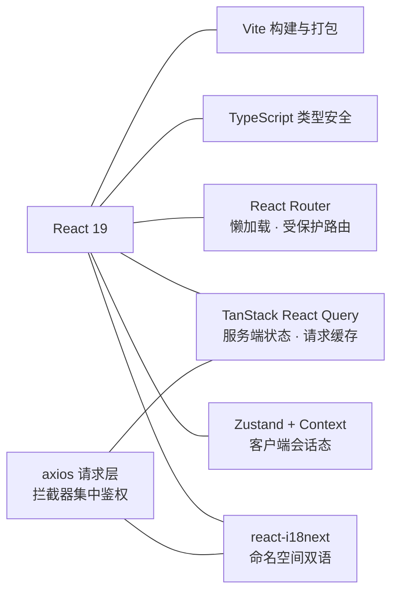
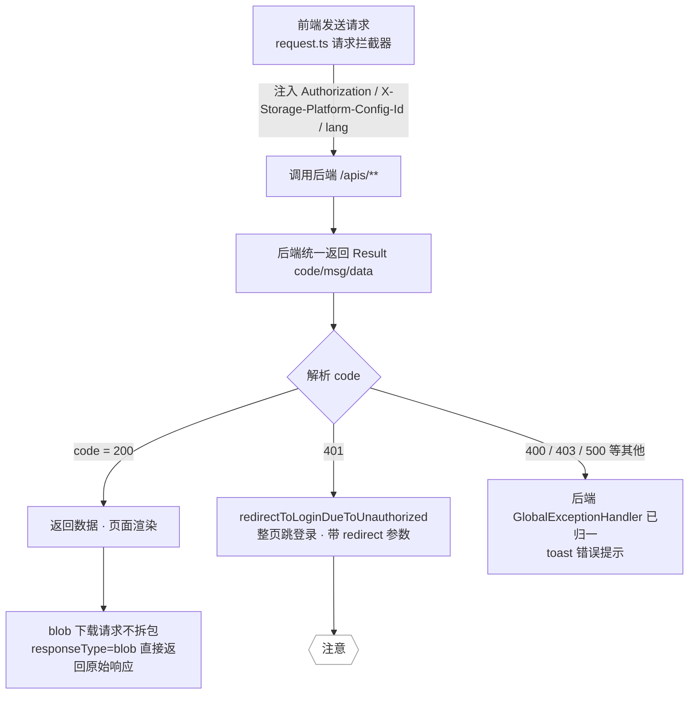

# GFS 前端架构设计

> 面向读者：想理解 GFS 前端（fs-ui）的目录组织、请求层、路由、状态管理与 i18n 机制的开发者。
>
> 前端是纯静态 SPA，通过 HTTP 调用后端 `/apis/**`，登录态与存储选择通过本地存储 + 请求头承载。

---

## 1. 设计定位

GFS 前端承担两件事：
1. **渲染**：网盘文件管理、存储管理、分享页、登录页等页面。
2. **桥接**：把「登录 token、当前存储平台、语言偏好」注入到每一次后端请求。

它**不持有任何权威数据**，所有文件/用户/存储数据都在后端。前端持有的是三类"会话态"：**登录 token**、**当前存储选择**、**用户信息**。

## 2. 技术栈

| 关注点 | 技术 | 说明 |
| --- | --- | --- |
| 框架 | React 19 | 组件化、Hooks |
| 构建 | Vite | 开发热更新、生产打包 |
| 语言 | TypeScript | 类型安全 |
| 状态（服务端） | TanStack React Query | 请求缓存、竞态、失效 |
| 状态（会话） | Zustand + Context | `store/user`、`auth-context` |
| 请求 | axios | 拦截器集中鉴权 |
| 路由 | React Router | 懒加载、受保护路由 |
| i18n | react-i18next | 命名空间式双语 |

下面用 Mermaid 展示前端模块与技术栈的组织关系：



## 3. 目录结构

```
fs-ui/
├── index.html / vite.config.ts / package.json / tsconfig.json
└── src/
    ├── main.tsx              # React 入口
    ├── App.tsx
    ├── router/index.tsx      # 路由定义 + 受保护路由
    ├── api/                  # 请求封装 + 各域 API（request.ts / file.ts / share.ts...）
    ├── pages/                # 按页面组织（files/ storage/ share/ login/ services/...）
    ├── components/           # 通用组件（layout / Highlight / ...）
    ├── contexts/             # React Context（auth-context）
    ├── store/                # Zustand（user store）
    ├── utils/                # 工具（auth.ts / preview-types.ts）
    ├── services/             # 非 HTTP 服务（sse.service.ts）
    ├── i18n/index.ts         # i18n 初始化 + 命名空间注册
    ├── locales/{zh,en}/      # 双语文案 *.json
    └── types/                # TS 类型（permission.ts / storage.ts / share.ts）
```

## 4. 请求层设计（`src/api/request.ts`）—— 前端核心

请求层是"会话态"真正落地的地方。三个关键机制：

### 4.1 请求拦截：注入三大请求头

```typescript
service.interceptors.request.use(
  (config: InternalAxiosRequestConfig) => {
    const token = getToken()
    if (token) {
      config.headers = config.headers || {}
      config.headers.Authorization = `Bearer ${token}`          // ① 登录 token
    }

    const platformId = getCurrentStoragePlatformId()
    if (platformId) {
      config.headers['X-Storage-Platform-Config-Id'] = platformId // ② 当前存储平台
    }

    config.headers.lang = getRequestLangHeader()                  // ③ 语言偏好
    return config
  },
  (error) => Promise.reject(error)
)
```

- `Authorization: Bearer <token>`：与后端 Sa-Token 的 `token-prefix: Bearer` 严格对应。
- `X-Storage-Platform-Config-Id`：告诉后端本次请求走哪个存储平台（后端 `StoragePlatformInterceptor` 据此切换上下文）。
- `lang`：后端 i18n 依据此头返回对应语言错误文案。

### 4.2 响应拦截：解析统一包裹

后端统一返回 `{ code, msg, data }`，前端拦截器集中处理：

```typescript
service.interceptors.response.use(
  (response) => {
    const { data: res } = response
    if (config.responseType === 'blob') return response          // 下载走 blob 不拆包
    if (res.code === 200) return response                        // 成功直接过
    // 400/403/500 → toast + reject；401 → 整页跳登录
    ...
  }
)
```

关键设计点：
- `code === 200` 视为成功；其他 code 统一 toast 错误。
- `res.code === 401` → 调用 `redirectToLoginDueToUnauthorized()` 整页跳登录（带 `redirect` 参数便于登录后返回）。
- **登录/注册接口自身的 401 不触发跳转**（`shouldSkipUnauthorizedRedirect`），否则密码输错会把用户踢回登录页。
- 下载请求（`responseType === 'blob'`）**不拆包**，直接返回原始响应，由调用方处理文件下载。

**为什么在拦截器统一错误处理？** 因为后端全局异常把所有错误都折进了 `code`，前端在一个地方集中处理成功/失败/未登录，业务页面代码最干净。

下面用 Mermaid 展示 request.ts 拦截器的处理链：



### 4.3 401 兜底：整页跳转

```typescript
export function redirectToLoginDueToUnauthorized() {
  if (isRedirectingToLogin) return          // 防重入
  isRedirectingToLogin = true
  clearToken()                              // 清 token
  localStorage.removeItem('userInfo')       // 清用户信息
  ...
  window.location.href = `${loginBase}?redirect=${encodeURIComponent(path)}`
}
```

用 `window.location.href` 而非路由跳转——确保**清空 React 内存态 + 重新加载**，彻底重置会话。

## 5. 路由与受保护路由

`src/router/index.tsx`：

- 用 React Router 的 `ProtectedRoute` 包装需登录页面，`AppRoute` 定义 children。
- 权限控制：路由项带 `permission` 配置（如 `service:manage`），前端据此渲染并拦截无权限页。

```
登录页 /login  ——无需登录
主应用       ——需要 token（ProtectedRoute）
   /w/:slug/files    文件
   /w/:slug/share    分享
   /services/webdav  服务（需 service:manage）
   /storage          存储管理
分享页       ——匿名
   /s/:shareToken    分享提取
```

## 6. 状态管理

用**两个互补方案**管理状态：

| 状态类型 | 方案 | 举例 |
| --- | --- | --- |
| 服务端数据（文件、存储、分享列表） | TanStack React Query | 文件列表、存储配置 |
| 客户端会话态（token、用户信息、存储选择） | Zustand + Context | `store/user` 用户信息、`auth-context` 登录态、localStorage 存存储选择 |

**为什么不是纯 Redux？** 项目以「服务端状态为主」，React Query 的缓存/失效/竞态处理远比手动管理请求状态高效；客户端会话态量小，用轻量 Zustand 足够。

**当前存储选择**存于 `localStorage`：
```
localStorage['current-storage-platform'] = JSON.stringify({ settingId, platformName })
```
无该键 = 内置 Local。登录时 `auth-context` 只保留仍有效的已选存储。

## 7. i18n 机制

- 初始化：`src/i18n/index.ts` 静态 `import` 所有 `locales/{zh,en}/*.json`，按命名空间注册（`common`、`files`、`layout`、`login`、`settings`、`share`、`storage`、`transfer`、`services`）。
- 使用：`i18n.t('common:api.loginFailed')` 这种 `命名空间:key` 形式。
- 新增页面文案：在 `locales/zh/<ns>.json` 与 `locales/en/<ns>.json` **成对新增**，并在 `i18n/index.ts` 注册命名空间。
- 请求语言：`getRequestLangHeader()` 在请求头带 `lang`，后端据此返回对应语言错误。

## 8. 文件页面的数据流（范式示例）

```
URL 参数 (keyword / type / view)  ← 用 useToolbarSearch 同步
        │
        ▼
useFileList(buildQuery(...))      ← React Query
        │
        ▼
文件列表 data.records ──► 渲染表格/网格（高亮用 Highlight 组件）
        │
        ▼
右键/工具栏操作 → api/file.ts → 后端 → refetch 失效
```

- 面包屑 = 目录 path（parentId 逐级）。
- 搜索提示条 = `useToolbarSearch` 与 URL 的 `keyword` 参数双向同步。
- 前端用 `Highlight` 组件对匹配关键词做高亮。

## 9. 关键文件索引

| 关注点 | 文件 |
| --- | --- |
| 请求层（头注入/401/错误） | `src/api/request.ts` |
| token 存取 | `src/utils/auth.ts` |
| 路由 | `src/router/index.tsx` |
| i18n 初始化 | `src/i18n/index.ts` |
| 登录态 | `src/contexts/auth-context.tsx`、`src/store/user.ts` |
| SSE 下载进度 | `src/services/sse.service.ts` |
| 存储类型定义 | `src/types/storage.ts` |
| 权限码 | `src/types/permission.ts` |