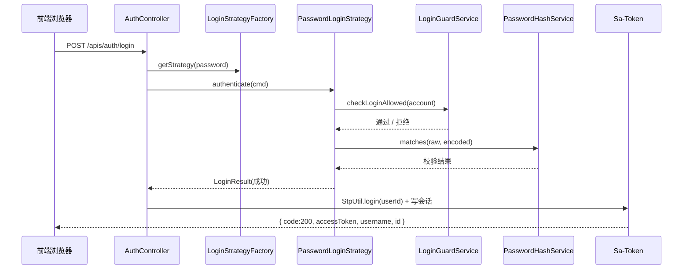
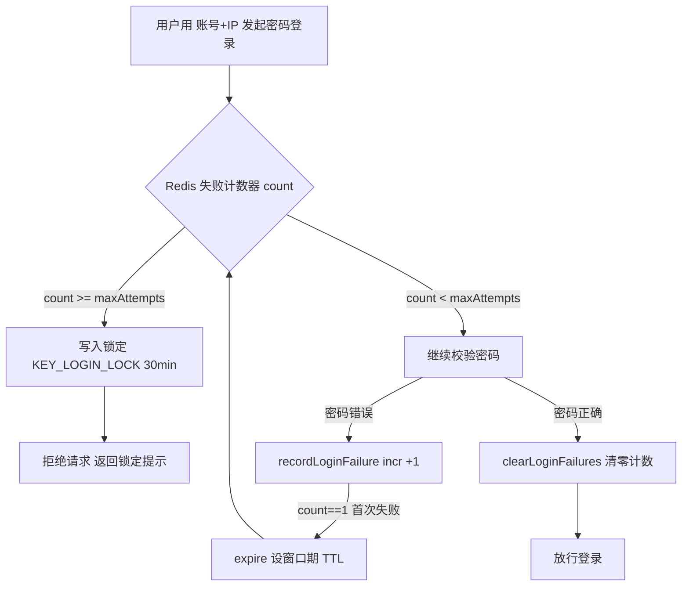

# GFS 认证与用户模块设计

> 面向读者：想理解 GFS 登录认证、防爆破、会话、权限模型与登录管理的开发者。
>
> 模块位于 `fs-modules/fs-system`。核心是"用 LoginStrategy 策略 + Sa-Token 会话 + Redis 会话存储 + 权限码模型"搭建一套可扩展、可防爆破、多端并存的认证系统。

---

## 1. 设计定位

认证模块解决五个问题：

1. **登录方式可扩展**：通过 `LoginStrategy` 策略接口，将来加短信/OAuth 登录不动主流程。
2. **口令安全**：BCrypt 存储，兼容旧 SHA-256 无感升级。
3. **防爆破**：Redis 计数，按"账号+IP"锁定。
4. **会话可管理**：Sa-Token 多端并发、可强制下线、Redis 持久会话（重启不掉线、多实例共享）。
5. **权限模型**：按角色（普通用户/超管）区分权限码，`@SaCheckPermission` 注解控制。

## 2. 组件全景

| 层 | 组件 | 位置 | 职责 |
| --- | --- | --- | --- |
| 入口 | `AuthController` | `fs-modules/fs-system/.../controller/AuthController.java` | `POST /apis/auth/login`、`/logout`；只回 `accessToken`，不下 Cookie |
| 编排 | `AuthServiceImpl` | `.../service/impl/AuthServiceImpl.java` | 策略分发 → 建立会话 → 写会话数据 → 更新登录时间 |
| 分发 | `LoginStrategyFactory` | `.../auth/LoginStrategyFactory.java` | 注入所有 `LoginStrategy`，按 `loginType` 路由 |
| 认证 | `PasswordLoginStrategy` | `.../auth/impl/PasswordLoginStrategy.java` | 用户名+密码认证 |
| 防爆破 | `LoginGuardService` | `.../auth/LoginGuardService.java` | Redis 计数，账号+IP 锁定 |
| 口令 | `PasswordHashService` | `.../auth/PasswordHashService.java` | BCrypt 存储 + SHA-256 兼容升级 |
| 权限源 | `StpInterfaceImpl` | `.../auth/StpInterfaceImpl.java` | 提供给 Sa-Token 的权限码/角色 |
| 会话 | Sa-Token `StpLogic` | 框架 | token 生成/校验/注销/存储 |
| 审计 | `LoginLogAspect` + `@LoginLog` | `.../aspect/LoginLogAspect.java` | 环绕 `doLogin` 采集登录信息异步落库 |
| 拦截链 | `WebMvcConfig` | `fs-admin/.../web/WebMvcConfig.java` | 注册登录校验、存储平台、预览拦截器 |

## 3. 登录时序

```
浏览器                     后端                                   存储
  │ POST /apis/auth/login   │
  ├────────────────────────►│ AuthController.doLogin
  │                         │  # 路径命中 security.excludes → 跳过登录校验
  │                         │  # @LoginLog 切面开始
  │                         │  LoginStrategyFactory.getStrategy(password)
  │                         │  └─ PasswordLoginStrategy.authenticate
  │                         │      ├─ LoginGuardService.checkLoginAllowed(account)
  │                         │      ├─ 按 username 查 sys_user
  │                         │      ├─ 用户不存在 → recordLoginFailure
  │                         │      ├─ 状态判定：DISABLED/PENDING_REVIEW/REJECTED → 业务拒绝
  │                         │      ├─ PasswordHashService.matches → 失败则 recordLoginFailure
  │                         │      ├─ clearLoginFailures + 遗留 SHA-256 → BCrypt 升级
  │                         │      └─ 更新 last_login_at
  │                         │  StpUtil.login(userId) ──────────────► Redis（写 token↔userId）
  │                         │  StpUtil.getSession().set("username", …)
  │  ◄── { code:200, data:{ accessToken, username, id } }
  │ 前端 saveToken(accessToken) → localStorage/sessionStorage
```

> 用 Mermaid 表达同一段密码登录时序，便于快速梳理调用关系：



## 4. 关键代码段

### 4.1 密码登录策略（`PasswordLoginStrategy.java`）

```java
@Override
public LoginResult authenticate(LoginCmd cmd) {
    String account = cmd.getAccount();
    String password = cmd.getPassword();
    // 防暴力：账号+IP 锁定期内直接拒绝
    loginGuardService.checkLoginAllowed(account);
    QueryWrapper queryWrapper = new QueryWrapper();
    queryWrapper.where(SYS_USER.USERNAME.eq(account));
    SysUser user = userMapper.selectOneByQuery(queryWrapper);
    if (user == null) {
        loginGuardService.recordLoginFailure(account);
        throw new BusinessException(I18nUtils.getMessage("user.account.or.password.incorrect"));
    }
    // 禁用/待审核/已拒绝均为业务拒绝，不计入密码试错次数
    if (user.getStatus() == UserStatus.DISABLED) {
        throw new BusinessException(I18nUtils.getMessage("user.disabled"));
    }
    ...
    if (!passwordHashService.matches(password, user.getPassword())) {
        loginGuardService.recordLoginFailure(account);
        throw new BusinessException(I18nUtils.getMessage("user.account.or.password.incorrect"));
    }
    loginGuardService.clearLoginFailures(account);
    if (passwordHashService.isLegacyHash(user.getPassword())) {
        user.setPassword(passwordHashService.encode(password));  // 遗留 SHA-256 → BCrypt 升级
    }
    ...
    return loginResult;
}
```

**为什么这么设计：**
- **用户不存在与密码错误返回同一文案**（`user.account.or.password.incorrect`）——防账号枚举。
- **禁用/待审核不计入试错**——管理员审核延迟不会把用户"锁死"。
- **登录成功即升级遗留哈希**——旧系统迁移来的 SHA-256 密码在首次登录时透明升级到 BCrypt，无需强迫用户改密。

### 4.2 防爆破守卫（`LoginGuardService.java`）

```java
public void recordLoginFailure(String account) {
    String key = KEY_LOGIN_FAIL + guardKey(account);
    Long count = redisRepository.incr(key, 1);
    if (count != null && count == 1) {
        redisRepository.expire(key, lockMinutes * 60L);   // 首次失败设窗口期
    }
    if (count != null && count >= maxAttempts) {
        redisRepository.setExpire(KEY_LOGIN_LOCK + guardKey(account), maxAttempts, lockMinutes * 60L);
        redisRepository.del(key);                          // 达到上限 → 锁定并清计数
    }
}

private String guardKey(String account) {
    return (account == null ? "" : account.trim()) + ":" + IpUtils.getIpAddr();
}
```

**为什么用"账号:IP"作为锁定维度？** 防爆破要同时防两种：纯账号爆破（固定账号反复试密码）与分布式 IP 爆破（多 IP 试同一账号）。用复合 key 既能针对单账号锁定，又不至于一个 IP 拖累其他账号；同时每个失败都重置窗口期，攻击者无法通过低频规避。

> 防爆破守卫的完整判定流程（Redis INCR + 首错设 TTL，达到阈值即锁定）：



### 4.3 口令哈希服务（`PasswordHashService.java`）

核心语义：`encode(raw)` 存 BCrypt；`matches(raw, encoded)` 根据已存哈希格式自动选 BCrypt 或 SHA-256 校验路径；`isLegacyHash(encoded)` 判断是否用的遗留算法。**口令绝不在数据库中明文存储**。

### 4.4 权限模型（`StpInterfaceImpl.java`）

```java
// 根据登录 ID 加载权限码与角色
List<String> getPermissionList(Object loginId, String loginType) {
    ...
    // 普通用户基础权限 + 超管附加权限
}
```

关键：**权限码唯一事实源**是 `fs-system/constant/UserPermissions.java`。新增权限时两处列表（普通权限 `BASE_PERMISSIONS`、管理员附加 `ADMIN_EXTRA_PERMISSIONS`）都要加。

### 4.5 登录编排（`AuthServiceImpl`）

认证成功后：
```java
StpUtil.login(userId, isRemember);               // 生成 token，写 Redis
StpUtil.getSession().set("username", user.getUsername());
```
`StpUtil.login` 底层由 Sa-Token 处理 token 生成、会话映射、多端并发（`is-concurrent`）。

## 5. 会话与凭证设计

| 维度 | 现行设计 | 说明 |
| --- | --- | --- |
| token 形态 | Sa-Token 普通模式，`token-style: random-128` | 不是 JWT；服务端可即时作废 |
| 有效性 | 每次请求回查 Redis `token↔userId` 映射 | 登出/踢人立即生效 |
| 会话存储 | Redis（`SaTokenDaoForRedisTemplate`） | 重启不掉线、多实例共享 |
| 绝对过期 | `timeout: 86400`（24h） | |
| 活跃冻结 | `active-timeout: 3600` | 1h 无请求冻结 |
| 携带方式 | 请求头 `Authorization: Bearer <token>` + 查询参数（下载/SSE） | 无 Cookie 通道 |
| 存储 | 记住我→localStorage；否则 sessionStorage | |
| 401 处理 | 前端清态 + 整页跳登录 | |

**为什么没有 Cookie 通道？** 历史教训：Sa-Token `token-prefix: Bearer` 要求值带前缀，而 Cookie 值不能含空格（`Bearer xxx` 的 `Bearer` 会被当成 token 一部分）、`cookie-auto-fill-prefix` 未生效，导致 Cookie 通道从未真正工作过。因此约定：**无法自定义请求头的场景一律用查询参数 `Authorization=Bearer <token>`**（配合 `is-read-body: true`）。

## 6. 多端登录的实现原理

Sa-Token 会话模型分层是"多端并存"的结构基础：

```
Account-Session（按 loginId 唯一，账号级共享）
 ├── terminalList：每个已登录终端一条记录
 │     ├── { deviceType:"DEF", tokenValue:<t1> }
 │     └── { deviceType:"DEF", tokenValue:<t2> }
Token-Session（按 tokenValue 唯一，端级私有）
```

- `is-concurrent: true`：每端登录新建独立 token，互不顶替。
- `is-share: false`：每端拿到**不同** token（`true` 则同设备复用）。
- `StpUtil.logout()`（无参）：只注销**当前 token** 对应的终端，A 端退出 B 端不受影响。

## 7. 配置项详解

`fs-admin/src/main/resources/application.yml` 的 Sa-Token 文档块：

| 配置项 | 值 | 含义 |
| --- | --- | --- |
| `token-name` | `Authorization` | 凭证名（头 + 查询参数） |
| `token-prefix` | `Bearer` | 凭证固定前缀 |
| `is-read-cookie` | `false` | 关闭 Cookie 读写 |
| `timeout` / `active-timeout` | `86400` / `3600` | 绝对过期 / 活跃冻结 |
| `is-concurrent` / `is-share` | `true` / `false` | 多端并存、各自独立 token |
| `is-read-body` | `true` | 允许从查询参数读 token（下载/SSE） |
| `token-style` | `random-128` | token 生成风格 |

`security` 文档块：

| 配置项 | 值 | 含义 |
| --- | --- | --- |
| `path-pattern` | `/apis/**` | 需登录校验的 URL 前缀 |
| `excludes` | 见下 | 免登录白名单 |
| `brute-force.max-attempts` | `3` | 连续失败锁定阈值 |
| `brute-force.lock-minutes` | `30` | 锁定分钟 |

`excludes` 白名单关键项：`/apis/auth/login`、`/apis/transfer/sse`（SSE 长连接）、`/apis/user/register`、`/apis/share/**`（匿名分享）、`/dav/**`（WebDAV 自有鉴权）。

## 8. 拦截器链（请求进入时的鉴权）

`WebMvcConfig` 注册顺序（order 越小越先执行）：

| 顺序 | 拦截器 | 职责 |
| --- | --- | --- |
| 1 | `SaInterceptor(handle -> StpUtil.checkLogin())` | 登录校验，未登录抛异常 |
| 1 | `WorkspaceInterceptor` | 解析 `X-Workspace-Id`，校验工作空间成员 |
| 2 | `StoragePlatformInterceptor` | 依 `X-Storage-Platform-Config-Id` 切换存储上下文 |
| 3 | `PreviewInterceptor` | 媒体流预览的 previewToken 防盗链 |

**两套白名单不要混淆：**
- `security.excludes`：免**登录**校验（匿名可访问）。
- `WorkspaceInterceptor.WHITELIST`：免**工作空间上下文**（仍需登录，如 `/apis/user/info`、`/apis/auth/logout`、`/apis/admin/**`）。

## 9. 登录管理（在线会话查看与强制下线）

管理员可在「设置 → 系统 → 登录管理」管理在线会话：

| 项 | 说明 |
| --- | --- |
| 接口 | `GET /apis/admin/sessions`、`DELETE .../{loginId}`（整账号）、`DELETE .../{loginId}/terminals/{index}`（单终端） |
| 权限 | Service 层 `assertSuperAdmin()`，非超管得 `code:403 + admin.forbidden` |
| 会话来源 | `StpUtil.searchTokenValue` 枚举 Redis 中的 token |
| 错踢保护 | 用 token 末 6 位做乐观校验，防止展示后列表已变踢错人 |
| 被踢端提示 | `kickoutByTokenValue` → 下次请求 `code:401 + auth.kick.out.token` |

## 10. 技术选型理由

- **Sa-Token vs Spring Security**：Sa-Token 轻量、注解式、多端并发会话实现直接，契合"自托管网盘"的中等复杂度安全需求；Spring Security 更重，适合复杂 OAuth/权限规则。
- **Redis 做会话存储**：让登录会话脱离 JVM，实现**重启不掉线、多实例共享、踢人全集群生效**；代价是 Redis 成为登录硬依赖（但系统本就用 Redis 做缓存，无新增运维前提）。
- **BCrypt**：内置 salt + 计算可调成本（cost=12），抗彩虹表和暴力破解，是口令存储的标准选择。

## 11. 安全与边界

- **防账号枚举**：用户不存在/密码错误同文案。
- **防爆破**：账号+IP 维度 Redis 锁定。
- **防会话伪造**：token 每次回查 Redis，服务端可控作废。
- **明确不做**：本项目**不用 JWT**（因为需要服务端主动失效的语义：登出/踢人/顶人）；不用 Cookie 通道（历史教训见 §5）。

## 12. 关键文件索引

| 关注点 | 文件 |
| --- | --- |
| 登录/登出接口 | `fs-modules/fs-system/.../controller/AuthController.java` |
| 登录编排 | `fs-modules/fs-system/.../service/impl/AuthServiceImpl.java` |
| 策略分发 | `fs-modules/fs-system/.../auth/LoginStrategyFactory.java` |
| 密码认证 | `fs-modules/fs-system/.../auth/impl/PasswordLoginStrategy.java` |
| 防爆破 | `fs-modules/fs-system/.../auth/LoginGuardService.java` |
| 口令哈希 | `fs-modules/fs-system/.../auth/PasswordHashService.java` |
| 权限模型 | `fs-modules/fs-system/.../auth/StpInterfaceImpl.java`、`constant/UserPermissions.java` |
| 登录管理 | `fs-modules/fs-system/.../controller/AdminSessionController.java`、`service/impl/SessionAdminServiceImpl.java` |
| 拦截器链 | `fs-admin/.../web/WebMvcConfig.java`、`interceptor/WorkspaceInterceptor.java` |
| Sa-Token 配置 | `fs-admin/src/main/resources/application.yml` |
| 前端登录态 | `fs-ui/src/utils/auth.ts`、`src/api/request.ts` |
| 登录页路由 | `fs-ui/src/router/index.tsx`（RootRedirect） |