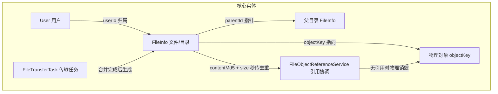

# 04 · 文件数据模型与目录设计

> 本文对应模块：`fs-file` 的**数据模型层**与**目录树层**。
> 定位：把「文件在 GFS 里到底是一行什么数据库记录」讲清楚。理解本模块是理解上传、下载、回收站、分享的前提。

---

## 0. 设计定位

文件系统最难的不是「上传/下载」，而是**数据模型的正确性**。GFS 的数据模型回答三个根本问题：

1. **一个文件在数据库里怎么表示** —— 答案：`file_info` 表的一行。
2. **目录树怎么组织** —— 答案：`parentId` 父子指针，本质是一棵**树**。
3. **逻辑文件 和 物理存储对象 怎么对应** —— 答案：通过 `objectKey` 建立的**引用关系**。

这个模型是 GFS 全系统的"地基"，上传、下载、分享、回收站、存储插件全部建立在其上。

---

## 1. 组件全景

| 层 | 组件 | 职责 |
|---|---|---|
| 实体 | `FileInfo` | 文件/目录的统一数据库记录（树的节点） |
| 实体 | `FileTransferTask` | 上传/下载传输任务（面向过程的状态机） |
| Service | `FileInfoService` / `FileInfoServiceImpl` | 文件 CRUD、目录树操作、重名处理 |
| Service | `FileObjectReferenceService` | 物理对象引用协调（去重、回收判定） |
| 门面 | `StorageServiceFacade` | 屏蔽底层存储插件，向文件层提供统一存储能力 |
| Query | `FileQry` 等 | 列目录、搜索的查询对象 |

### 1.1 两个核心实体

GFS 把「即时生效的树结构」和「进行中的传输过程」分开建模：

- **`file_info`（文件资源表）**：描述"结果"——这个文件/目录叫什么、在哪、属于谁、多大。传输一旦完成，就生成一行 `file_info` 并永久存在。
- **`file_transfer_task`（传输任务表）**：描述"过程"——上传分片数、进度、状态。任务完成后会被清理，不承担文件元数据职责。

> **为什么要分开？** 传输过程有大量中间状态（上传中/暂停/合并中）和高频更新（进度），如果塞进 `file_info` 会让"文件"这个稳定概念变得不稳定。分离后，`file_info` 只记录稳定的最终事实，`file_transfer_task` 只记录易变的进行中状态。

> 核心实体的关系（parentId 组成目录树 + 通过 objectKey 与引用协调关联物理对象）：



---

## 2. 文件资源表 `file_info` —— 数据模型详解

### 2.1 实体代码

```java
@Data
@Table("file_info")
public class FileInfo implements Serializable {

    @Id(keyType = KeyType.None)   // 主键不由数据库自增，业务方用 UUID 生成
    private String id;

    private String objectKey;       // 物理存储中的对象 key（逻辑名，非真实路径）
    private String originalName;    // 资源原始名称
    private String displayName;     // 资源显示名称（含去重后缀，如 photo(1).jpg）

    private String suffix;          // 后缀名（扩展名）
    private Long size;              // 大小（字节）
    private String mimeType;        // 标准 MIME 类型

    private Boolean isDir;          // 是否目录
    private String parentId;        // 父目录 ID（空 = 根目录）→ 目录树的指针
    private String userId;          // 用户 ID（数据归属）

    private String contentMd5;      // 内容 MD5（秒传 + 去重的依据）
    private String storagePlatformSettingId;  // 存储平台配置 ID（归属哪个存储）

    private LocalDateTime uploadTime;        // 上传时间
    private LocalDateTime updateTime;        // 修改时间
    private LocalDateTime lastAccessTime;    // 最后访问时间

    private Boolean isDeleted;      // 软删除标记：0=正常 1=回收站
    private LocalDateTime deletedTime;       // 删除时间
}
```

### 2.2 逐字段设计意图

| 字段 | 设计要点 |
|---|---|
| `id` | `KeyType.None` + UUID。**非自增主键**有深远影响：分片上传时前端可以先生成 fileId？否——实际上文件 ID 在合并时才生成。但选择非自增是为了**全局唯一、不泄露数据量、方便分布式**。 |
| `objectKey` | **逻辑存储名**，不是真实路径。它决定"物理对象放在存储的哪里"。默认格式为 `UUID + "." + suffix`；挂载式存储则为"相对路径"。请牢记：UI 上看到的 `displayName` 与存储里的 `objectKey` 是**两回事**。 |
| `originalName` vs `displayName` | `originalName` 是用户上传时的原始名；`displayName` 是加入目录后**处理过重名**的显示名（如 `photo(1).jpg`）。两者分离，让"文件真实名"和"目录显示名"互不干扰。 |
| `parentId` + `isDir` | 这对字段共同构成目录树。`isDir=true` 表示它是个目录节点，`parentId` 指向父节点；`isDir=false` 表示是文件节点。 |
| `contentMd5` | 内容去重与秒传的密钥。同一 MD5 + 大小 = 内容相同。 |
| `storagePlatformSettingId` | 归属哪个存储平台配置。**文件层不关心"物理存储怎么实现"，只记录"它属于哪份配置"**，真正的读写通过插件门面完成。 |
| `isDeleted` | **这套系统用软删除而非物理删除**。删除 = 置 `isDeleted=1`（文件进回收站）。后续回收站恢复 = 置回 0。物理对象的真正删除由引用计数器判断（见 `FileObjectReferenceService`）。 |

### 2.3 关键设计决策①：为什么用非自增主键？为什么树用 parentId？

- **主键**：文件 ID 全局唯一、与数据库分片无关。挂载式存储还可能涉及跨库场景，自增键会产生冲突。
- **目录树**：用 `parentId` 单向指针建树，而非 `Ltree`/闭包表。原因：
  - 绝大多数操作是「查某目录下的直接子节点」——`parentId = ?` 一条 SQL 搞定，索引命中率高；
  - 代价是"求完整祖先链/子孙集合"要递归。GFS 用**编码约定**规避：挂载式存储用 `objectKey` 的前缀天然表达层级；
  - 文件系统目录一般较浅（几层），递归代价可控，换来的是模型简单、维护成本低。

### 2.4 重名自动处理（`generateUniqueName`）

同名文件是文件系统高频场景。GFS 的策略是**自动加后缀**，而不是报错或覆盖：

```java
if (existingFiles.isEmpty()) {
    return desiredName;              // 没有重名，直接用原名
}
// 已存在 photo.jpg、photo(1).jpg → 下一个是 photo(2).jpg
do {
    suffixNum++;
    finalName = buildNameWithSuffix(nameWithoutExt, suffixNum, extension, isDir);
} while (usedSuffixes.contains(suffixNum));
```

> 应用价值：秒传、复制、分享"另存为"等场景反复触发重名，自动加 `(N)` 避免了大量"同名请换名"的错误提示。

---

## 3. 目录树核心操作（`FileInfoServiceImpl`）

### 3.1 创建目录 `createDirectory`

```java
public FileInfo createDirectory(CreateDirectoryCmd cmd) {
    String folderId = IdUtil.fastSimpleUUID();
    // 1. 校验父目录存在且确实是目录
    if (StrUtil.isNotBlank(cmd.getParentId())) {
        FileInfo parent = getAuthorizedFile(cmd.getParentId());
        if (!Boolean.TRUE.equals(parent.getIsDir())) {
            throw new BusinessException(I18nUtils.getMessage("file.target.dir.invalid"));
        }
    }
    // 2. 同级重名自动处理
    String finalName = generateUniqueName(userId, cmd.getParentId(),
                                          baseName, true, null, platformConfigId);
    // 3. 挂载式存储：先真实 mkdir，成功才落库
    if (isMountStorage(platformConfigId)) {
        // ... storageService.mkdirDirectory(dirKey) 在 MountLocks 内执行
    }
    // 4. 落库：目录只是一行 file_info（isDir=true），不占用物理对象
    FileInfo dirInfo = new FileInfo();
    dirInfo.setId(folderId);
    dirInfo.setIsDir(true);
    ...
    save(dirInfo);
    return dirInfo;
}
```

> **重点**：GFS 里**目录本身不占用存储空间**，它就是 `file_info` 里一行 `isDir=true` 的记录。真正占空间的是文件的物理对象。

### 3.2 挂载式存储的目录特殊处理

代码注释揭示了挂载式（如对接真实文件系统/SFTP WebDAV）目录的设计红线：

- 挂载式目录**先真实 `mkdir` 到物理存储**，成功后**才**插入 DB 记录；失败则不落库，保证 DB 与实际存储一致。
- 「根层只允许挂载点自身」，业务上禁止随意在根层建目录，避免破坏挂载映射。

### 3.3 树的权限边界：`getAuthorizedFile`

所有按 ID 取文件的入口都会过 `getAuthorizedFile`，它做两件事：

1. 文件必须存在；
2. 文件的 `userId` 必须等于当前登录用户（或用分享/集合等授权途径解析出 owner）。

> 这是**"越权读取"与"越权删除"的全系统防线**——任何 fileId 参数进来，先验归属，再谈操作。

---

## 4. 逻辑文件 ↔ 物理对象的引用关系（`FileObjectReferenceService`）

这是本模块**最核心、最容易被误解**的设计。核心思想：

> **`file_info` 是引用关系的唯一事实来源，不维护独立的引用计数。**

### 4.1 为什么不做"引用计数表"？

传统做法是存一个 `ref_count` 字段：谁引用就 +1，谁删就 -1。GFS 判断它`容易失真`：

- 并发下计数加减不是原子的，容易漂移；
- 一旦个别失败，计数残废，要么留下孤儿对象，要么误删还在用的对象。

因此 GFS 改用**「要不要删，实时 count 一下 file_info」**：

```java
/** 数据库中是否有任意用户记录（含回收站记录）引用该物理对象 */
public boolean hasReferences(FileInfo file) {
    QueryWrapper wrapper = new QueryWrapper()
            .where(FILE_INFO.OBJECT_KEY.eq(file.getObjectKey()));
    applyStorageSettingFilter(wrapper, file.getStoragePlatformSettingId());
    return fileInfoService.count(wrapper) > 0;
}

/** 仅在确认没有任何引用时，才删除物理对象 */
public void deletePhysicalFileIfUnreferenced(FileInfo file) {
    if (file == null || StrUtil.isBlank(file.getObjectKey()) || hasReferences(file)) {
        return; // 还有引用，或没有对象，什么都不删
    }
    IStorageOperationService storageService =
            storageServiceFacade.getStorageService(file.getStoragePlatformSettingId());
    storageService.deleteFile(file.getObjectKey());
}
```

> 从删除到物理销毁的判定流程（实时 count 引用，无引用才删）：

```mermaid
flowchart TD
    A[删除 file_info 置 isDeleted=1] --> B[文件进入回收站]
    B --> C[回收站彻底删除/清空]
    C --> D{hasReferences 实时 count(file_info by objectKey)}
    D -->|仍有引用| E[只删记录 保留物理对象]
    D -->|无任何引用| F[deletePhysicalFileIfUnreferenced]
    F --> G[storageService.deleteFile objectKey]
    G --> H[物理对象销毁 释放存储]
```

### 4.2 引用锁（`ReferenceLock`）：并发去重的关键

删除物理对象与"秒传拿去重"是并发互斥的：A 在删除，B 却想复用这个对象去重，就会误删 B 正在引用的对象。GFS 用 **Redis 分布式锁** 把"同一内容 / 同一对象"的删与建串行化：

```java
/** 内容锁：以 md5+size 为粒度，防止并发去重/删除同一内容 */
public ReferenceLock acquireContentLock(String storageSettingId, Long contentMd5, Long size) {
    return acquireLock("content:" + storageKey(storageSettingId) + ":" + contentMd5 + ":" + size);
}

/** 对象锁：以 objectKey 为粒度，防止并发删除/复用同一物理对象 */
public ReferenceLock acquireObjectLock(String storageSettingId, String objectKey) {
    return acquireLock("object:" + storageKey(storageSettingId) + ":" + objectKey);
}

private ReferenceLock acquireLock(String lockName) {
    // 用 setIfAbsent 实现"加锁"（原子），带 60s 自动过期防止死锁；
    // 拿不到就自旋重试到超时，抛"file.object.busy"
    Boolean locked = redisRepository.setIfAbsent(key, token, LOCK_EXPIRE_SECONDS);
    ...
}
```

锁在 `try-with-resources` 里使用，关闭时用 `compareAndDelete`（只删除自己的 token）避免误删别人的锁。

### 4.3 去重边界：落盘加密 / 挂载存储被"短路"

`findReusableFile` 开头就做了两个短路判断，这是细节里见功力的地方：

```java
if (isStorageEncrypted(storageSettingId)) {
    return null; // 落盘加密：密文受"写入口令"保护，二手对象可能解不开，禁止去重
}
```

- **落盘加密存储**：物理对象是按写入口令加密的密文，`contentMd5` 是明文哈希，与密文无关；复用旧对象在密钥变更后 = 「新记录指向解不开的对象」→ 直接禁止去重。
- **挂载式存储**：引用按 `platform + objectKey` 记账，复用 uuid 对象会摧毁路径映射 → 同样禁止秒传去重。

---

## 5. 传输任务表 `file_transfer_task`

```java
@Table("file_transfer_task")
public class FileTransferTask extends BaseEntity {
    private String taskId;               // 业务任务 ID（UUID，前端用它续传）
    private String uploadId;             // 存储插件返回的分片上传会话 ID
    private String userId;
    private String parentId;             // 落地目录
    private String objectKey;            // 目标对象 key
    private String fileName;
    private Long fileSize;
    private String fileMd5;
    private Integer totalChunks;         // 总分片数
    private Integer uploadedChunks;      // 已上传分片数
    private Long chunkSize;              // 分片大小（默认 5MB）
    private String storagePlatformSettingId;
    private TransferTaskStatus status;   // 状态机（见下）
    private String errorMsg;
    private LocalDateTime startTime;
    private LocalDateTime completeTime;
}
```

### 5.1 任务状态机

`TransferTaskStatus` 定义了任务的完整生命周期：

```
initialized → checking → uploading ⇄ paused
                          ↓ (全部分片完成)
                        merging → completed
                          ↓ (失败)
                        failed / canceled
```

| 状态 | 含义 |
|---|---|
| `initialized` | 任务已初始化（只登记了元数据，未做秒传检查） |
| `checking` | 正在做秒传/去重检查 |
| `uploading` | 正在逐分片上传 |
| `paused` / `resumed` | 可暂停续传 |
| `merging` | 正在合并分片 |
| `completed` | 完成，已生成 file_info |
| `failed` / `canceled` | 失败/取消 |

状态的合法迁移由 `validateStateTransition` 校验，禁止随意跳变，保证过程可审计。

---

## 6. 技术选型理由

| 决策 | 选型 | 理由 |
|---|---|---|
| 数据模型 | 父子指针 + 软删除 + 引用即事实 | 简单、可读、事务友好，避免引用计数漂移 |
| 主键 | UUID / 非自增 | 全局唯一、不泄露数量、适配多存储/分布式 |
| 分布式锁 | Redis `setIfAbsent` + 自旋 | 原子加锁 + 自动过期防死锁 + compareAndDelete 防误删 |
| ORM | MyBatis-Flex | 与全系统统一，`QueryWrapper` 强类型查询防拼串注入 |
| MD5 去重 | 明文 `contentMd5` | 秒传与全局去重共用同一哈希，一次计算多处受益 |

---

## 7. 关键文件索引

| 文件 | 说明 |
|---|---|
| `fs-filestruct/../file/domain/FileInfo.java` | 文件/目录统一实体 |
| `fs-modules/fs-file/.../FileTransferTask.java` | 传输任务实体 |
| `fs-modules/fs-file/.../service/impl/FileInfoServiceImpl.java` | 目录树 CRUD、重名处理 |
| `fs-modules/fs-file/.../service/FileObjectReferenceService.java` | 引用计数、删除判定、并发锁 |
| `fs-modules/fs-file/.../domain/qry/FileQry.java` | 列目录/搜索查询对象 |

---

## 8. 学习要点（小结）

1. **一行 `file_info` = 一个逻辑对象（文件或目录）**；目录不占空间，靠 `isDir` + `parentId` 组织成一棵树。
2. **`objectKey`（存储名）与 `displayName`（显示名）分离**，是"逻辑世界 vs 物理世界"解耦的核心。
3. **软删除 + 引用计数**：数据库不物理删，物理对象只在无引用时才删，且用 Redis 锁保证并发安全。
4. **加密/挂载两类存储主动放弃去重**，是"正确性优先于性能"的体现。

> 下一份文档 [05-上传链路设计](05-上传链路设计.md) 将详细展开：分片上传、秒传、合并、内容去重是如何调用这里的模型运转起来的。