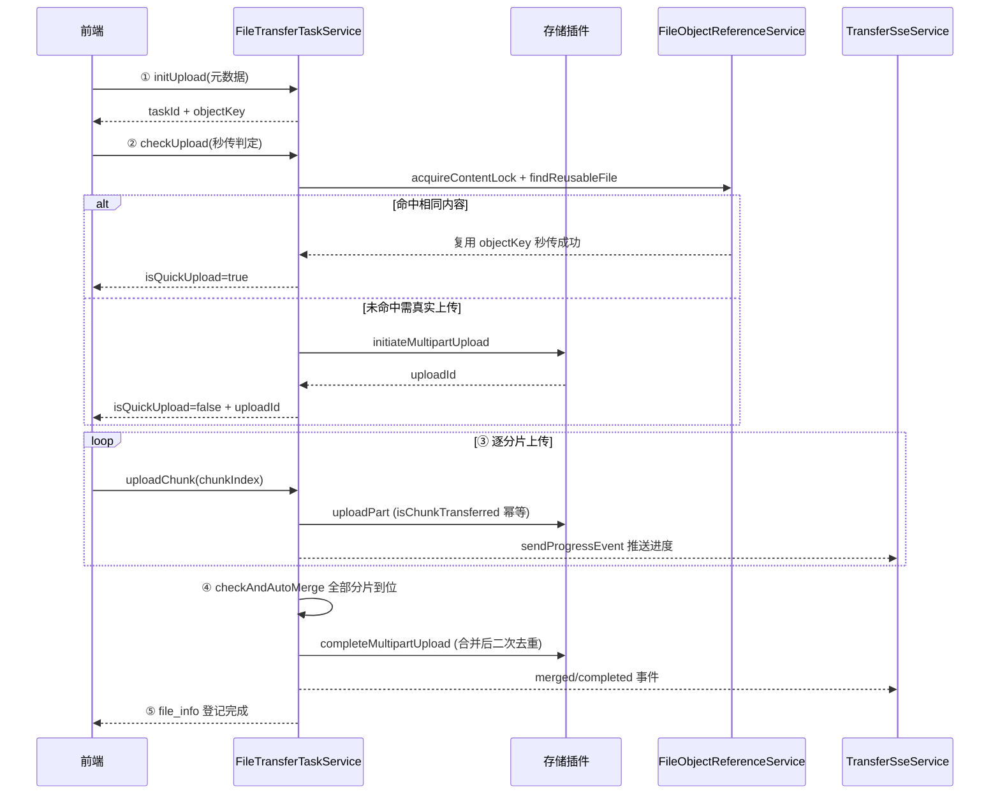
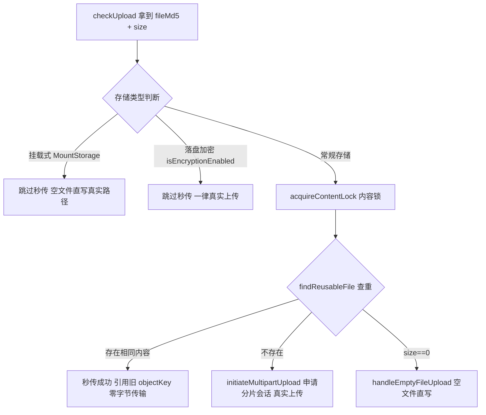

# 05 · 上传链路设计

> 本文对应模块：`fs-file` 的**传输服务层**（`FileTransferTaskService` / `TransferSseService`）。
> 定位：把「一个文件从浏览器到对象存储，到底经过哪几步」讲透。这是全系统最复杂的一条链路，也是面试官最可能追问的环节。

---

## 0. 设计定位

上传是"前重后重"的链路：前有文件切分、秒传、去重、进度推送；后有分片合并、物理对象登记、引用协调。

GFS 上传链路的目标：

1. **断点续传** —— 大文件拆成分片，随时可暂停/续传/取消；
2. **秒传** —— 相同内容不重复上传（省流量、省存储）；
3. **并发去重** —— 多个用户同时传相同文件也只保留一份物理对象；
4. **进度实时可见** —— 通过 SSE 把进度推给前端。

---

## 1. 五步主链路

上传不是一个接口，而是一组**有状态协调**的接口。主流程分五步：

```
① 初始化上传 initUpload
        ↓
② 校验/秒传 checkUpload
        ↓
③ 逐分片上传 uploadChunk（可反复调用 / 可并发）
        ↓
④ 自动合并 doMergeChunks（全部分片到位后触发）
        ↓
⑤ 登记 file_info + 清理任务（endpoint）
```

| 步骤 | 接口 | 目的 |
|---|---|---|
| ① | `initUpload` | 生成 `taskId`、`objectKey`、重名处理后登记传输任务 |
| ② | `checkUpload` | 秒传/去重判定；非秒传则向存储插件申请分片会话 `uploadId` |
| ③ | `uploadChunk` | 逐分片上传到对象存储，更新缓存进度，SSE 推送 |
| ④ | `doMergeChunks` | 分片齐全后合并，二次去重，生成 `file_info` |
| ⑤ | SSE | 全程把 initialized→checking→uploading→merging→completed 状态推给前端 |

> 用 Mermaid 表达五步主链路的时序与分工：



---

## 2. 步骤①：初始化上传 `initUpload`

前端拿到文件后第一步是「喂元数据，不传内容」。核心逻辑：

```java
public String initUpload(InitUploadCmd cmd) {
    String userId = StpUtil.getLoginIdAsString();
    String storagePlatformSettingId = StoragePlatformContextHolder.getConfigId();
    String taskId = IdUtil.fastSimpleUUID();
    String suffix = FileUtils.extName(cmd.getFileName());
    String tempFileName = IdUtil.fastSimpleUUID() + "." + suffix;
    // 对目标目录做"重名自动处理"，得到最终显示名
    String displayName = fileInfoService.generateUniqueName(
            userId, cmd.getParentId(), cmd.getFileName(), false, null,
            storagePlatformSettingId);

    // 生成 objectKey（存储内逻辑名）—— 关键差异点
    String objectKey;
    if (isMountStorage(storagePlatformSettingId)) {
        // 挂载式：objectKey = 挂载相对路径（不走 generateObjectKey 随机 UUID）
        String parentKey = mountPathResolver.resolveRelativeKey(parent, settingId);
        objectKey = parentKey.isEmpty() ? displayName : parentKey + "/" + displayName;
    } else {
        // 普通式：objectKey = uuid 随机名（对外不可见，避免泄露/冲突）
        objectKey = FileUtils.generateObjectKey(userId, tempFileName);
    }

    FileTransferTask task = new FileTransferTask();
    task.setTaskId(taskId);
    task.setObjectKey(objectKey);
    task.setTotalChunks(cmd.getTotalChunks());
    task.setStatus(TransferTaskStatus.initialized);   // 仅初始化，尚未检查
    ...
    this.save(task);
    transferSseService.sendStatusEvent(userId, taskId,
            TransferTaskStatus.initialized.name(), "初始化成功");
    return task.getTaskId();
}
```

> **要点**：
> - 这一步**不传字节**，只是"约定好身份"（taskId）和"目标位置"（objectKey）。
> - `objectKey` 的两种生成方式（随机 UUID vs 挂载相对路径）是"普通存储"与"挂载存储"最根本的分水岭。

---

## 3. 步骤②：校验与秒传 `checkUpload`

这是链路的"智能大脑"，决定这条文件是**直接复用**还是**真实上传**：

```java
public CheckUploadResultVO checkUpload(CheckUploadCmd cmd) {
    task = getAuthorizedTask(taskId);          // 校验任务归属，防越权
    updateTaskStatus(task, TransferTaskStatus.checking);
    ...
    if (isMountStorage(storagePlatformSettingId)) {
        // 挂载式安全底线：跳过秒传（引用按 platform+objectKey 记账，
        // 复用 uuid 对象会摧毁路径映射）。空文件直写真实路径。
        if (size == 0) return handleMountEmptyFileUpload(task, settingId);
    } else if (storageService.isEncryptionEnabled()) {
        // 落盘加密：密文受写入口令保护，秒传前提不成立，一律真实上传
        if (size == 0) return handleEmptyFileUpload(task, md5, settingId);
    } else {
        // ★ 常规路径：内容锁 + 去重查询 —— 这就是"秒传"
        try (ReferenceLock ignored = objectReferenceService.acquireContentLock(
                     settingId, cmd.getFileMd5(), task.getFileSize())) {
            FileInfo existFile = objectReferenceService.findReusableFile(
                    cmd.getFileMd5(), task.getFileSize(), settingId);
            if (existFile != null) {
                // 内容已存在！＝秒传成功，直接复用，零字节传输
                return handleQuickUpload(task, existFile, cmd.getFileMd5(), settingId);
            }
            if (size == 0) return handleEmptyFileUpload(task, cmd.getFileMd5(), settingId);
        }
    }
    // 走到底说明真的要上传：向存储插件申请分片会话
    IStorageOperationService storageService = storageServiceFacade.getStorageService(settingId);
    String uploadId = storageService.initiateMultipartUpload(task.getObjectKey(), task.getMimeType());
    task.setUploadId(uploadId);
    updateTaskStatus(task, TransferTaskStatus.uploading);
    return CheckUploadResultVO.builder().isQuickUpload(false).uploadId(uploadId).build();
}
```

> **秒传的本质**：`contentMd5 + size` 在整个存储平台里一查，发现**已经有人传过相同内容**，就把这条记录的 `objectKey` "引用"给当前用户 —— **根本不产生网络传输**。秒传和去重是同一个机制，一个在"上传前"用，一个在"合并后"兜底。

> 秒传判定分支（checkUpload 的关键决策）：



### 挂载式/加密式的"安全优先"

这套设计反复体现一个原则：**当去重会带来正确性风险时，宁可放弃性能**。加密存储和挂载存储都主动跳过秒传，正是为了保护数据安全与路径映射的完整性。

---

## 4. 步骤③：逐分片上传 `uploadChunk`

前端把文件切成 N 片，逐片调用，GFS **异步**处理并更新进度：

```java
public void uploadChunk(byte[] fileBytes, UploadChunkCmd cmd) {
    String taskId = cmd.getTaskId();
    Integer chunkIndex = cmd.getChunkIndex();
    getAuthorizedTask(taskId);
    // 异步上传，不阻塞请求线程
    CompletableFuture.runAsync(() -> {
        try {
            doUploadChunk(fileBytes, cmd);
            checkAndAutoMerge(taskId);   // 每片传完都检查是否该合并了
        } catch (Exception e) {
            exceptionHandler.handleChunkUploadFailed(taskId, chunkIndex, e.getMessage(), e);
        }
    }, chunkUploadExecutor);
}
```

真正的上传在 `doUploadChunk`：

```java
private void doUploadChunk(byte[] fileBytes, UploadChunkCmd cmd) throws IOException {
    // 1. 状态守卫：已取消/暂停/非法状态都直接停止
    if (task.getStatus() == canceled) return;
    if (task.getStatus() == paused)   return;
    if (!uploading.equals(status)) throw ...

    // 2. 分片幂等：同一片已传过就跳过（断点续传的基础）
    if (cacheManager.isChunkTransferred(taskId, chunkIndex)) {
        return;
    }

    // 3. 调用存储插件上传单片
    IStorageOperationService storageService =
            storageServiceFacade.getStorageService(task.getStoragePlatformSettingId());
    String eTag;
    try (ByteArrayInputStream bis = new ByteArrayInputStream(fileBytes)) {
        eTag = storageService.uploadPart(task.getObjectKey(), task.getUploadId(),
                                         chunkIndex, fileBytes.length, bis);
    }

    // 4. 记录进度（存入 Redis 缓存 + SSE 推送）
    cacheManager.addTransferredChunk(taskId, chunkIndex, eTag);
    cacheManager.recordTransferredBytes(taskId, fileBytes.length);
    transferSseService.sendProgressEvent(user.getUserId(), taskId,
            uploadedBytes, fileSize, uploadedChunks, totalChunks);
}
```

> **为什么用 `isChunkTransferred` 判重**：网络抖动会导致同一片被重复发送。用「已传分片集合」做幂等，"传过就不重传"，是**断点续传 + 高可靠**的关键。

---

## 5. 步骤④：自动合并 `doMergeChunks`

每片上传完都会调用 `checkAndAutoMerge`，一旦"已传分片数 == 总分片数"就触发合并：

```java
private void checkAndAutoMerge(String taskId) {
    FileTransferTask task = getTaskFromCacheOrDB(taskId);
    if (!uploading.equals(task.getStatus())) return;      // 双检：状态已变则跳过
    if (!uploadedCount.equals(task.getTotalChunks())) return;  // 分片还没齐

    // 分布式锁，防止"并发触发重复合并"
    String lockKey = "merge:lock:" + taskId;
    boolean locked = cacheManager.tryLock(lockKey, 300);
    if (!locked) return;
    // 异步执行合并，锁由合并任务自己释放
    CompletableFuture.runAsync(() -> {
        try { doMergeChunks(taskId); }
        finally { cacheManager.releaseLock(lockKey); }
    }, fileMergeExecutor);
}
```

合并主逻辑 `doMergeChunks`：

```java
public FileInfo doMergeChunks(String taskId) {
    // 1. 状态与分片完整性校验
    if (!uploading.equals(status)) throw ...;
    if (!uploadedCount.equals(totalChunks)) throw ...;   // 分片不完整拒绝合并
    updateTaskStatus(task, merging);

    // 2. 用每个分片的 ETag 调用存储插件完成"服务端合并"
    Map<Integer, String> chunkETags = cacheManager.getTransferredChunkList(taskId);
    List<Map<String, Object>> partETags = 组装(chunkETags);   // 校验数量/顺序
    storageService.completeMultipartUpload(task.getObjectKey(), task.getUploadId(), partETags);

    // 3. ★ 合并完成后再去重一次（兜底并发秒传漏网）
    //    若发现已有相同内容对象，就引用旧对象、删除刚合并出的新对象
    FileInfo fileInfo;
    if (isMountStorage(settingId)) {
        // 挂载式：跳过二次去重，直接登记
        fileInfo = buildUploadedFileInfo(task, uploadedObjectKey, completeTime);
        fileInfo.setContentMd5(null);
        fileInfoService.save(fileInfo);
    } else if (storageService.isEncryptionEnabled()) {
        // 加密式：同理直接登记
        fileInfo = buildUploadedFileInfo(task, uploadedObjectKey, completeTime);
        fileInfoService.save(fileInfo);
    } else {
        try (ReferenceLock ignored = objectReferenceService.acquireContentLock(
                     settingId, task.getFileMd5(), task.getFileSize())) {
            FileInfo reusableFile = objectReferenceService.findReusableFile(
                    task.getFileMd5(), task.getFileSize(), settingId);
            if (reusableFile != null) {
                fileInfo = buildUploadedFileInfo(task, reusableFile.getObjectKey(), completeTime);
            } else {
                fileInfo = buildUploadedFileInfo(task, uploadedObjectKey, completeTime);
            }
            fileInfoService.save(fileInfo);
        }
    }
    // 若复用了旧对象，删掉刚传出来的重复物理对象（失败只留孤立对象，不丢文件）
    if (!Objects.equals(uploadedObjectKey, fileInfo.getObjectKey())) {
        storageService.deleteFile(uploadedObjectKey);
    }

    task.setStatus(completed);
    this.updateById(task);
    operationLogService.recordSuccessAs(...UPLOAD...);
    cacheManager.cleanTask(taskId);          // 清理缓存任务
    transferSseService.sendCompleteEvent(user.getId(), taskId, fileInfo.getId(), ...);
    return fileInfo;
}
```

### 为什么要"合并后二次去重"？

秒传发生在**上传前**，但如果 A、B 同时上传同一个新文件，两人都走到"非秒传"分支、各自传了一份。合并后的二次去重就兜住了这个并发的缝隙：**两份都传完了，但只保留一份物理对象，另一份的 file_info 指向同一 objectKey**。配合 `FileObjectReferenceService` 的对象原子锁，删除/引用是串行的，不会误删。

### 关键点：`buildUploadedFileInfo` —— 把"传输过程"变成"文件事实"

合并完成后，用任务里的元数据拼出一行 `file_info`：

```java
private FileInfo buildUploadedFileInfo(FileTransferTask task, String objectKey, LocalDateTime completeTime) {
    FileInfo fi = new FileInfo();
    fi.setId(IdUtil.fastSimpleUUID());
    fi.setObjectKey(objectKey);
    fi.setOriginalName(task.getFileName());
    fi.setDisplayName(task.getFileName());
    fi.setSize(task.getFileSize());
    fi.setMimeType(task.getMimeType());
    fi.setIsDir(false);
    fi.setParentId(task.getParentId());
    fi.setUserId(task.getUserId());
    fi.setContentMd5(task.getFileMd5());
    fi.setStoragePlatformSettingId(task.getStoragePlatformSettingId());
    ...
    return fi;
}
```

> 这一步是**两个实体的"交接点"**：`file_info`（结果）诞生，`file_transfer_task`（过程）退场。

---

## 6. 进度与状态的实时推送（SSE）

前端怎么看到"传 47% 了"？答案在 `TransferSseService`。GFS 用 **SSE（Server-Sent Events）** 实现服务端 → 前端的单向实时推送：

```
初始化 → sendStatusEvent(initialized)
校验   → sendStatusEvent(checking)
开始传 → sendStatusEvent(uploading)
每片   → sendProgressEvent(bytes, total, chunks)
合并   → sendStatusEvent(merging)
完成   → sendCompleteEvent(fileId, name)
失败   → sendErrorEvent(code, msg)
```

选 SSE 而非 WebSocket 的原因：

| 维度 | SSE | WebSocket |
|---|---|---|
| 方向 | 单向下推，恰好够用 | 全双工，杀鸡用牛刀 |
| 协议 | 基于 HTTP，天然兼容代理/网关 | 独立的 ws 升级，需额外配置 |
| 断线重连 | 浏览器内置自动重连 | 需自己实现 |
| 复杂度 | 低 | 高 |

> 上传进度只需"服务端 → 客户端"单向，SSE 是复杂度与能力比最优的解。

---

## 7. 与数据模型的关系

上传链路把 [04-文件数据模型与目录设计](04-文件数据模型与目录设计.md) 里的模型用活了：

- `objectKey` 生成 → 数据模型里的"逻辑与物理解耦"；
- 秒传/去重 → `FileObjectReferenceService` 的内容锁 + `findReusableFile`；
- 合并后登记 → `buildUploadedFileInfo` 生成一行 `file_info`；
- 物理对象清理 → 引用计数判断。

---

## 8. 技术选型理由

| 决策 | 选型 | 理由 |
|---|---|---|
| 分片上传 | 存储插件 `initiateMultipartUpload` / `uploadPart` / `completeMultipartUpload` | 标准化 S3/OSS 协议，插件 SPI 统一封装 |
| 异步上传/合并 | `CompletableFuture` + 两个 `TaskExecutor` | 上传不阻塞请求线程，合并不阻塞上传线程 |
| 幂等 | Redis 已传分片集合 + `isChunkTransferred` | 抗网络重发，支撑断点续传 |
| 并发安全 | `merge:lock` 分布式锁 + 对象原子锁 | 防重复合并、防并发去重/删除互踩 |
| 进度推送 | SSE | 单向下推最匹配，复杂度低、天然重连 |
| 任务状态机 | 显式枚举 + `validateStateTransition` | 状态可审计，禁止非法跳变 |

---

## 9. 关键文件索引

| 文件 | 说明 |
|---|---|
| `fs-modules/fs-file/.../service/impl/FileTransferTaskServiceImpl.java` | 上传/下载全链路编排（initUpload/checkUpload/uploadChunk/doMergeChunks） |
| `fs-modules/fs-file/.../service/impl/TransferSseServiceImpl.java` | SSE 状态/进度/完成/错误推送 |
| `fs-modules/fs-file/.../service/FileObjectReferenceService.java` | 秒传去重 + 对象原子锁 |
| `fs-modules/fs-file/.../domain/dto/UploadChunkCmd.java` | 分片上传命令（taskId + chunkIndex + bytes） |
| `fs-modules/fs-file/.../domain/dto/MergeChunksCmd.java` | 合并命令 |

---

## 10. 学习要点（小结）

1. **上传是"五步有状态协商"**：初始化（登记）→ 校验（秒传决策）→ 分片上传（幂等）→ 自动合并（二次去重）→ 登记 file_info。
2. **秒传 = 上传前的全局去重**，靠 `contentMd5+size` 命中复用，零字节传输；**合并后二次去重**兜底并发缝隙。
3. **加密/挂载两类存储主动放弃去重** —— 正确性优先于性能的典范。
4. **异步 + 幂等 + 分布式锁** 三位一体，保证大文件传输的可靠与并发安全。
5. **SSE** 而非 WebSocket，用对技术、不炫技。

> 下一步：文件终于"存在"了，如何把它读出来？见 [06-下载与媒体预览设计](06-下载与媒体预览设计.md)。