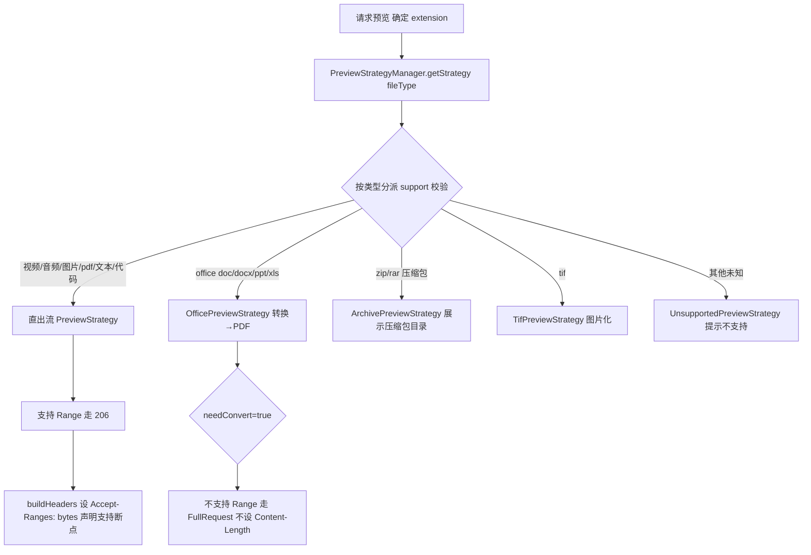
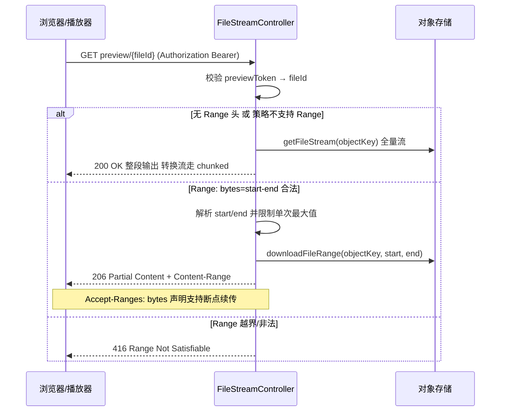

# 06 · 下载与媒体预览设计

> 本文对应：`fs-file` 的**流式下载**（`FileStreamController`）与`fs-framework/fs-preview` 的**预览策略体系**。
> 定位：把一个文件"读出来给前端"这件事拆成两个能力——**下载（整段/分片）**与**预览（按类型转换）**，并且都要支持断点续传与防盗链。

---

## 0. 设计定位

下载与预览是两个常用的读操作，但它们的诉求截然不同：

| 诉求 | 下载 | 预览 |
|---|---|---|
| 语义 | 把文件完整交给用户保管 | 在浏览器里"看"一下 |
| 断点 | 视频可拖拽 → 要 Range | 图片/视频/音频也要 Range |
| 转换 | 不需要，原样给字节 | 需要（Doc/PPT → PDF） |
| 权限 | 必须是归属用户 | 分页/分享场景都能看 |

GFS 把它们统一放在 **`/api/file/stream/preview/{fileId}`** 一个端点里，用**可插拔的 PreviewStrategy 策略**分派，用 **HTTP Range** 支撑断点。设计上有两个杀手级思想：

1. **权限通过"短时 previewToken"下放** —— 流接口不直接吃 Sa-Token，而是吃一个短暂的 token（避免文件被长期可访问）。
2. **Range 与"流转换"不能同时用** —— 需要转换的流（如 docx→pdf）无法支持 Range，代码里做了显式短路。

---

## 1. 组件全景

```
浏览器
  │  POST /preview/token/{fileId}      → 换一个短时预览 Token
  ▼
FilePreviewController（发 token、渲染模板、错误页）
  ▼
GET /api/file/stream/preview/{fileId}  ← 关键：流端点
  ▼
FileStreamController.handleRangeRequest / handleFullRequest
  ├─ StorageServiceFacade.getFileStream / downloadFileRange  → 从对象存储读流
  └─ PreviewStrategyManager.getStrategy(fileType)  → 按类型选预览策略
       ├─ processStream(源流, 后缀)      → 转换/直出
       └─ buildHeaders(...)             → Range/Content-Type/防盗链
```

### 1.1 PreviewStrategy —— 策略模式的核心

每种文件类型都有自己的预览策略，统一实现同一个接口：

```java
public interface PreviewStrategy {
    boolean support(FileTypeEnum type);           // 吃下什么类型
    String getTemplatePath();                     // 前端模板（如视频播放器页）
    IConverter getConverter();                    // 需要的转换器（如 Office→PDF），没有则 null
    boolean supportRange();                       // 是否支持 Range（视频/图片=是，转换流=否）
    default boolean needConvert() { return getConverter() != null; }
    InputStream processStream(InputStream sourceStream, String extension); // 处理后的流
    void fillModel(PreviewContext context, Model model);                   // 填充模板数据
    String getResponseExtension(String originalExtension);                 // 响应扩展名
}
```

**策略清单**（按文件类型分派，都在 `fs-preview/strategy/impl` 下）：

| 策略 | 支持类型 | Range | 转换 |
|---|---|---|---|
| `VideoPreviewStrategy` | mp4/webm/... | ✅ | 否 |
| `AudioPreviewStrategy` | mp3/wav/... | ✅ | 否 |
| `ImagePreviewStrategy` | jpg/png/gif/... | ✅ | 否 |
| `PdfPreviewStrategy` | pdf | ✅ | 否 |
| `TextPreviewStrategy` / `CodePreviewStrategy` / `MarkdownPreviewStrategy` | 文本/代码 | ✅ | 否 |
| `ExcelPreviewStrategy` / `DrawioPreviewStrategy` | xls/svg 等 | 视情况 | 可能 |
| `OfficePreviewStrategy` | doc/docx/ppt/xls | ❌ | ✅ → PDF |
| `ArchivePreviewStrategy` | zip/rar 等 | 部分 | 展示压缩包目录 |
| `TifPreviewStrategy` | tif | — | 图片化 |
| `UnsupportedPreviewStrategy` | 兜底 | ❌ | 提示不支持 |

> 按文件类型分派的预览策略流程：



> **核心观察**：`needConvert()` 的策略（Office）无法支持 Range，因为 PDF 是即时转换出来的、长度未知。所以 `handleFullRequest` 对这类请求不设 `Content-Length`、走 `chunked` 输出。

---

## 2. 流端点：Range 处理（看视频拖拽的核心）

`FileStreamController.preview` 是下载/预览的枢纽。它的一段代码决定了**视频能不能拖动**：

```java
// 修复逻辑：如果策略不支持 Range（如 Docx→PDF 的转换流），则强制走 FullRequest。
// 即使前端传了 Range 头也不处理，防止截断。
if (!strategy.supportRange() || rangeHeader == null || !rangeHeader.startsWith("bytes=")) {
    return handleFullRequest(storage, fileInfo, strategy);
}
return handleRangeRequest(storage, fileInfo, strategy, rangeHeader);
```

### 2.1 `handleRangeRequest` —— 206 Partial Content

```java
private ResponseEntity<StreamingResponseBody> handleRangeRequest(
        IStorageOperationService storage, FileInfo fileInfo, PreviewStrategy strategy, String rangeHeader) {
    long fileSize = fileInfo.getSize();
    long start = 0, end = fileSize - 1;
    // 解析 "bytes=start-end"
    Matcher matcher = RANGE_PATTERN.matcher(rangeHeader);
    if (matcher.matches()) { ...start/end... }

    // ★ 防御：限制单次 Range 的最大长度（防止超大 range 耗尽内存/带宽）
    long maxRangeSize = previewConfig.getMaxRangeSize();
    if (end - start + 1 > maxRangeSize) {
        end = start + maxRangeSize - 1;
    }
    long contentLength = finalEnd - finalStart + 1;

    StreamingResponseBody stream = outputStream -> {
        try (InputStream inputStream = storage.downloadFileRange(
                fileInfo.getObjectKey(), finalStart, finalEnd)) {
            copyStreamLimited(inputStream, outputStream, contentLength);
        }
    };

    HttpHeaders headers = buildHeaders(fileInfo, strategy, contentLength, true);
    headers.add(HttpHeaders.CONTENT_RANGE,
            String.format("bytes %d-%d/%d", finalStart, finalEnd, fileSize));
    return ResponseEntity.status(HttpStatus.PARTIAL_CONTENT).headers(headers).body(stream);  // 206
}
```

> **标准流程**：浏览器/播放器发 `Range: bytes=start-end` → 服务端解析 → 从存储读那一段流（`storage.downloadFileRange`）→ 返回 `206 Partial Content` + `Content-Range`。
> 正确地实现后，**视频拖动进度条、音频快进、图片渐进加载**全部天然工作。这也是为什么 GFS 承接的是标准 HTTP 语义而非自造协议。

> Range 请求的分流时序（有/无/非法 Range → 206/200/416）：



### 2.2 handleFullRequest` —— 200 整段（用于转换流）

```java
StreamingResponseBody stream = outputStream -> {
    try (InputStream sourceStream = storage.getFileStream(fileInfo.getObjectKey());
         InputStream processedStream = strategy.processStream(sourceStream, fileInfo.getSuffix())) {
        copyStream(processedStream, outputStream);   // 流式拷贝，不落内存
    }
};
HttpHeaders headers = buildHeaders(fileInfo, strategy, fileInfo.getSize(), false);
return ResponseEntity.ok().headers(headers).body(stream);  // 200
```

> 转换流（docx→pdf）在这里**逐块流式**转写，不一次性读入内存，对超大 Office 文件友好。

### 2.3 智能响应头 `buildHeaders`

```java
private HttpHeaders buildHeaders(FileInfo file, PreviewStrategy strategy, long visibleLength, boolean isRange) {
    String responseExtension = strategy.getResponseExtension(file.getSuffix());
    String fileName = changeExtension(file.getDisplayName(), responseExtension);
    headers.setContentType(MediaTypeFactory.getMediaType(fileName)
            .orElse(MediaType.APPLICATION_OCTET_STREAM));

    // ★ 转换流不设 Content-Length（长度未知）；Range 必须设
    if (isRange || !strategy.needConvert()) {
        headers.setContentLength(visibleLength);
    }
    headers.set(HttpHeaders.CONTENT_DISPOSITION, "inline; filename*=UTF-8''" + encodeFileName(fileName));

    if (strategy.supportRange()) {
        headers.set(HttpHeaders.ACCEPT_RANGES, "bytes");          // 声明支持 Range
        headers.setCacheControl("public, max-age=604800");        // 可缓存 7 天
    } else {
        headers.set(HttpHeaders.ACCEPT_RANGES, "none");
        headers.setCacheControl("no-cache");                       // 转换流禁止缓存
    }
    return headers;
}
```

> 三处细节体现工程严谨：
> - `changeExtension`：流式交付时后端可按转换/改名结果改写响应文件名后缀，并用**改写后的扩展名**推断 `Content-Type`（而非文件原类型）；
> - `MediaTypeFactory.getMediaType`：按**响应扩展名**推断 `Content-Type`（而不是文件原类型）；
> - `Accept-Ranges: bytes` + 长缓存：让浏览器/播放器知道"我可以做 Range 请求"。

---

## 3. 防盗链与权限下放：previewToken

**痛点**：流端点 `preview/{fileId}` 如果直接用 fileId，那么只要拿到 fileId 就能无限下载，等于永久白嫖。

**解法**：**换个 token 才给看**。`FilePreviewController.previewToken`：

```java
@PostMapping("/preview/token/{fileId}")
public Result<String> previewToken(@PathVariable String fileId) {
    fileInfoService.getAuthorizedFile(fileId);   // 先校验归属权限
    String token = UUID.randomUUID().toString().replace("-", "");
    redisRepository.setExpire(
            RedisKey.getPreviewTokenKey(token),  // Redis: preview:token:{token} -> fileId
            fileId,
            RedisKey.PREVIEW_TOKEN_EXPIRE);      // 短时过期
    return Result.ok(token);
}
```

**工作流**：
1. 用户先登录，调 `previewToken` 拿一个**短时 token**；
2. 前端拿 token 去访问流端点（token ↔ fileId 映射存在 Redis，短时有效）；
3. token 过期 → 需重新换取 → 每个预览都是"证明你有权限"的瞬时授权。

> **它解决什么问题**：流端点不直接暴露长期 fileId 能力；即使 token 泄露，也只在过期时间内生效。这是"权限下放"的经典模式——**用短时效代价换走访问凭证**。

---

## 4. 压缩包内文件预览（`previewArchiveInner`）

`preview/archive/inner/{tempId}` 是特殊场景：**用户想预览 zip 内部某个文件**。

```java
byte[] fileContent = archiveFilePreviewService.getCachedInnerFile(tempId); // 从缓存取压缩包内文件
String displayName = archiveFilePreviewService.getCachedInnerFileName(tempId);
// 按内部文件的真实后缀再次走 PreviewStrategy 分派，得到正确的预览策略
FileTypeEnum fileType = FileTypeEnum.fromFileName(displayName);
PreviewStrategy strategy = strategyManager.getStrategy(fileType);
```

> 即：**"压缩包内文件"也是一个可预览对象**，把解压出来的零字节用同样的策略管线处理。缓存用 `tempId`（短时）而非 fileId，防止越权。

---

## 5. 与下载的关系：断点续传下载

除了在线预览，还有"真正下载保存"的链路，核心用同一套 Range 能力：

- `downloadFile` / `initDownload`：生成 `taskId`、`totalChunks`、`chunkSize`，返回**已下载分片集合** `downloadedChunks`（断点续传的"进度记忆"）；
- 配合 **SSE**（见 `InitDownloadResultVO` 与下载任务）把分片下载进度推到前端。

> 下载与预览**共用 `StorageServiceFacade` 的流式读接口**（`getFileStream` / `downloadFileRange`），证明"读一条流"是抽象在存储插件层的高复用能力。

---

## 6. 技术选型理由

| 决策 | 选型 | 理由 |
|---|---|---|
| 断点续传 | HTTP Range + 206 | 标准协议，播放器/浏览器原生支持，无需自造协议 |
| 预览分派 | 策略模式 `PreviewStrategy` + `PreviewStrategyManager` | 新增文件类型=新增一个策略类，开闭原则 |
| Office 预览 | ~~JodConverter + LibreOffice~~（已移除） | 服务端实时转 PDF 成本高、价值有限，word/ppt 不再浏览器内预览，直接下载 |
| 鉴权下放 | 短时 previewToken（Redis 存映射） | 防 fileId 泄露被白嫖，权限瞬时化 |
| 流式处理 | `StreamingResponseBody` + 分块拷贝 | 不整文件入内存，大文件友好 |

---

## 7. 关键文件索引

| 文件 | 说明 |
|---|---|
| `fs-modules/fs-file/.../controller/FileStreamController.java` | Range/全量流端点、响应头构建 |
| `fs-modules/fs-file/.../controller/FilePreviewController.java` | previewToken 下发、模板渲染、错误页 |
| `fs-framework/fs-preview/.../core/PreviewStrategy.java` | 预览策略接口（SPI 契约） |
| `fs-framework/fs-preview/.../factory/PreviewStrategyManager.java` | 按 FileTypeEnum 选策略 |
| `fs-framework/fs-preview/.../strategy/impl/*` | 各类型策略实现 |
| `fs-modules/fs-file/.../service/impl/FileTransferTaskServiceImpl.java` | 下载任务 / 断点续传 |

---

## 8. 学习要点（小结）

1. **一个流端点 + 策略分派**承载了"下载"与"预览"，关键在 `strategy.supportRange()` 决定走 206 还是 200。
2. **Range 是断点续传的灵魂**：视频拖拽、音频快进、图片渐进全是 HTTP 标准语义，`Accept-Ranges: bytes` + `Content-Range` + `206` 三者缺一不可。
3. **转换流（Office）无法 Range**：原因是输出长度未知，代码显式短路到 FullRequest，不设 Content-Length。
4. **previewToken 短时授权**是防盗链的关键一招——文件 ID 不直接等于可访问凭证。
5. **策略模式** 让"加一种可预览的文件类型"变成"加一个类"。

> 下一步：别人想看你的文件怎么办？见 [07-文件分享与直链设计](07-文件分享与直链设计.md)。

---

## 9. 交付管道统一：FileServingPipeline（交付段收敛）

上面 0~8 节描述的 `handleRangeRequest / handleFullRequest / buildHeaders` 手写交付逻辑，在后续演进中被统一收敛到一个可复用的交付组件 **`FileServingPipeline`** 里。它把一个 HTTP 流出口里重复的「Range 解析 → 开源流 → 响应头构建 → 流式拷贝」四个步骤抽到一处，控制器只负责表达「这次要交付什么」。

### 9.1 边界约定：管道只做"鉴权之后的交付段"

GFS 有多个流出口，它们的**凭证语义完全不同**，不能用一个抽象硬套：

| 出口 | 端点 | 凭证语义 |
|---|---|---|
| 媒体预览 | `/api/file/stream/preview/{fileId}` | 登录态 / previewToken |
| 分享直链 | `/apis/share/{shareId}/raw/{fileId}` | 公开访问（shareId 有效 + fileId 在分享内） |
| 压缩包 zip | `/apis/transfer/folder-download/tasks/{taskId}/file` | 任务归属（owner） |
| 压缩包内预览 | `/api/file/stream/preview/archive/inner/{tempId}` | 短时 tempId 缓存 |

因此**鉴权留在各控制器/服务层**，管道只统一鉴权之后的交付段。控制器用 `Request` 描述交付意图，管道产出最终 `ResponseEntity<StreamingResponseBody>`。

### 9.2 Request：一次交付的"意图描述"

```java
Request.inline(fileName, size, streamOpener)              // 内联媒体，自带安全类型判断
Request.attachment(fileName, size, streamOpener)          // 强制下载（zip 等）
    .withRangeAllowed(boolean)     // 是否允许 Range（zip 附件一般关）
    .withMaxRangeSize(long)        // 单次 Range 上限（默认 10MB）
    .withResponseExtension(String) // 转换流后缀重写，如 docx→pdf
    .withCacheControl(String)      // 覆盖默认缓存策略
```

`streamOpener` 是唯一的"数据来源抽象"：`InputStream open(long start, long end)`（闭区间）。管道会传入解析后的 Range 边界，控制器/服务层决定如何开流——**存储侧原生裁剪**（`downloadFileRange`）或**全量 + 策略加工**。

### 9.3 管道统一沉淀的能力

1. **Range 三形态** `N-M / N- / -N` 全支持，越界 → `416` + `bytes */size`。
2. **maxRangeSize 守卫**：单次 Range 超限自动截断，防大范围恶意 seek。
3. **206 / Content-Range / Accept-Ranges**：Range 命中返回 `206 Partial Content` + `bytes start-end/size`。
4. **inline 安全白名单**：图片（排除 svg）/ 视频 / 音频 / PDF / 文本 / JSON，文本自动补 UTF-8 charset；非安全类型自动回退 `attachment`（原控制器手写的 `isSafeInlineType` 因此删除）。
5. **nosniff + filename\*=UTF-8''**：防 MIME 嗅探、标准 RFC 5987 文件名编码。
6. **缓存策略**：inline 媒体 `public, max-age=604800`，附件/转换流 `no-cache`。

### 9.4 接入样例：分享直链（本次修复直链视频无法拖进度条）

直链之前直接返回 `InputStreamResource`，**没有 Range**，导致视频 seek 只能整段重下。接入管道后：

```java
// FileShareController.rawShareFile
FileDownloadVO meta = fileShareService.getShareFileMeta(shareId, fileId);
FileServingPipeline.Request request = FileServingPipeline.Request
        .inline(meta.getFileName(), meta.getFileSize(),
                (start, end) -> fileShareService.openShareFileRange(shareId, fileId, start, end))
        .withMaxRangeSize(previewConfig.getMaxRangeSize());
return servingPipeline.serve(request, rangeHeader);
```

配合服务层新增的 `openShareFileRange(shareId, fileId, start, end)`：

```java
// FileShareServiceImpl：全量走 downloadFile，Range 走存储侧裁剪
boolean full = fileInfo.getSize() == null || end == -1
        || (start == 0 && end >= fileInfo.getSize() - 1);
return full ? storage.downloadFile(objectKey)
            : storage.downloadFileRange(objectKey, start, end);
```

直链视频现在带 `Range: bytes=N-` 即可返回 `206` 并正常拖进度条；svg/html 等不安全类型仍自动回退为附件下载。

> 相关组件：`fs-file/.../serving/FileServingPipeline.java`、`FileStreamController`、`FileShareController`。
> 下一步：分享与直链详见 [07-文件分享与直链设计](07-文件分享与直链设计.md)。