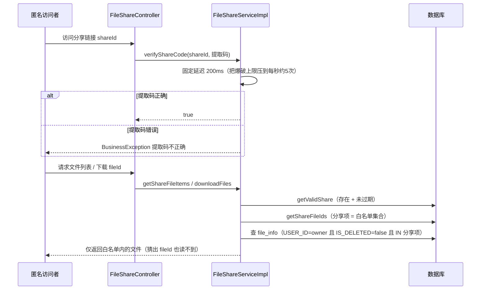
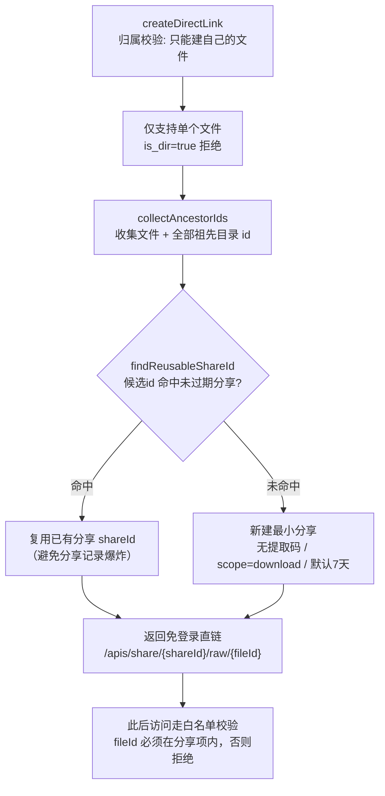

# 07 · 文件分享与直链设计

> 本文对应：`fs-file` 的**分享域**（`FileShare` / `FileShareItem` / `FileShareServiceImpl` / 分享 Controller）。
> 定位：把"把文件共享给另一个可能没账号的人"这件事的权限模型、匿名访问、打包下载、直链讲清楚。

---

## 0. 设计定位

分享的本质是**在鉴权体系之外开一个"带范围的缺口"**：

- 正常访问：走了 Sa-Token —— 必须登录，必须是归属用户（`getAuthorizedFile`）。
- 分享访问：**不走登录**，而是凭借 shareId + 可选提取码。

这是一个**轻量级、可撤销、可限次、带过期**的授权通道。设计目标是让"陌生人"也能力便被授权，但授权又可完全控制。

GFS 分享域的两大能力：

1. **分享**（share）：多人/多文件夹，可选提取码、过期时间、查看/下载次数上限、权限范围（preview/download）。
2. **直链**（direct link）：最小化的免登录下载链接，系统自动复用已有分享、自动过期。

---

## 1. 数据模型

### 1.1 `file_shares` —— 分享主表

```java
@Table("file_shares")
public class FileShare extends BaseEntity {
    @Id(keyType = KeyType.Generator, value = KeyGenerators.ulid)
    private String id;              // 分享ID（分享链接的核心）
    private String userId;          // 分享人
    private String shareName;       // 分享名称（默认取第一个文件名）
    private String shareCode;       // 提取码（可选，4位随机）
    private LocalDateTime expireTime;// 过期时间（null=永久）
    private String scope;           // 权限范围: preview,download（逗号分隔）
    private Integer viewCount;      // 查看次数
    private Integer downloadCount;  // 下载次数
    private Integer maxViewCount;   // 最大查看次数（null=无限）
    private Integer maxDownloadCount;// 最大下载次数（null=无限）
}
```

### 1.2 `file_share_item` —— 分享明细表

一条分享可以装**多个文件/文件夹**，通过 `shareId` 关联的多行 `file_share_item` 记录 `fileId`。这是"分享占用列表"：

```
file_shares(id=shareId, userId, ...)
     └── file_share_item(shareId, fileId)   ← 分享项（一对多）
```

---

## 2. 创建分享 `createShare`

```java
public FileShareVO createShare(CreateShareCmd cmd) {
    String userId = StpUtil.getLoginIdAsString();
    FileShare share = new FileShare();
    share.setUserId(userId);
    share.setViewCount(0);
    share.setDownloadCount(0);

    // 1. 每个被分享文件都要做归属校验（getAuthorizedFile）——防越权分享他人文件
    List<FileInfo> authorizedFiles = cmd.getFileIds().stream()
            .distinct()
            .map(fileInfoService::getAuthorizedFile)
            .toList();

    // 2. 生成分享名（多文件：第一个文件名 + "等N个文件"）
    share.setShareName(...);

    // 3. 过期时间
    if (cmd.getExpireType() == 4) share.setExpireTime(null);              // 永久
    else if (cmd.getExpireType() == 3) share.setExpireTime(cmd.getExpireTime());
    else share.setExpireTime(calculateExpireTime(cmd.getExpireType()));    // 1=7天 2=30天

    // 4. 提取码（4位随机）
    if (cmd.getNeedShareCode()) share.setShareCode(RandomUtil.randomString(4));

    share.setScope(StrUtil.blankToDefault(cmd.getScope(), "download"));    // 默认可下载
    share.setMaxViewCount(cmd.getMaxViewCount());
    share.setMaxDownloadCount(cmd.getMaxDownloadCount());
    this.save(share);

    // 5. 写分享明细（shareId → 多个 fileId）
    fileShareItemService.saveShareItems(share.getId(), cmd.getFileIds());
    return buildShareVO(share);
}
```

> **要点**：分享"权限范围"（preview/download）、"次数上限"、"过期"都是**可配置的软配额**，真正访问时逐项校验。

---

## 3. 匿名访问：校验 + 解码分享项

分享访问是**不走登录**的独立入口。关键在"分享项如何映射到真实文件"：

### 3.1 提取码校验（防爆破）

```java
public boolean verifyShareCode(VerifyShareCodeCmd cmd) {
    // ★ 故意延迟 200ms：增加暴力破解成本（提取码只有4位，若不加延迟可被秒破）
    try { Thread.sleep(200); } catch (InterruptedException e) { Thread.currentThread().interrupt(); }

    FileShareVO share = this.getDetail(cmd.getShareId());
    if (!share.getShareCode().equals(cmd.getShareCode())) {
        throw new BusinessException(I18nUtils.getMessage("share.code.incorrect"));
    }
    return true;
}
```

> **细节见功力**：提取码只有 4 位（10000 种组合），如果接口瞬间响应，攻击者可毫秒级爆破。**固定 200ms 延迟**把每秒尝试上限压到 5 次，让爆破不可行。

### 3.2 解码分享项 → 真实文件（关键安全校验）

```java
public List<FileVO> getShareFileItems(String shareId, String parentId) {
    FileShare fileShare = getValidShare(shareId);        // 校验存在、未过期
    List<String> shareFileIds = fileShareItemService.getShareFileIds(shareId);

    if (StringUtils.isNotEmpty(parentId)) {
        // 进入分享的某个子目录
        FileInfo parent = getShareAccessibleFile(fileShare, shareFileIds, parentId);
        fileInfos = fileInfoService.list(WHERE PARENT_ID = parentId AND USER_ID = share.getUserId() ...);
    } else {
        // 分享根：只列出"分享项里"的那些文件
        fileInfos = fileInfoService.list(WHERE ID IN shareFileIds AND USER_ID = share.getUserId() AND IS_DELETED = false);
    }
    ...
    return converter.convert(fileInfos, FileVO.class);
}
```

> **安全红线**：`getShareAccessibleFile` / 查询恒带 `IS_DELETED = false` + `USER_ID = share.getUserId()`。
> 也就是说，**匿名访问者只能看到"分享人自己、未删除、且确实在分享项内"的文件**。即使攻击者猜出别人的 fileId，只要不在分享项里也读不到 —— 分享成为一道**白名单**，而不是"能看全部"的口子。

### 3.3 下载分享文件 `downloadFiles`

```java
public FileDownloadVO downloadFiles(String shareId, String fileId) {
    FileShare fileShare = getValidShare(shareId);
    List<String> shareFileIds = fileShareItemService.getShareFileIds(shareId);
    // fileId 必须在分享项内，否则拒绝 —— 白名单机制
    ...
}
```

与预览同源：**先校验 fileId ∈ 分享项集合**，再从存储取流。这样"分享"与"越权下载"彻底隔离。

#### 匿名访问整体时序（提取码校验 + 白名单防越权）



---

## 4. 直链（Direct Link）：最小化免登录下载

直链是"分享的极简形态"：**没提取码、范围=download、默认过期**，专门给"一键下载"场景。

```java
public DirectLinkVO createDirectLink(CreateDirectLinkCmd cmd) {
    // 1. 归属校验：只能给自己的文件建直链
    FileInfo fileInfo = fileInfoService.getOne(WHERE ID=fileId AND USER_ID=userId AND IS_DELETED=FALSE);
    if (fileInfo == null) throw ...("file.not.exist");
    if (fileInfo.getIsDir()) throw ...("file.not.file");   // 只支持单个文件

    // 2. 收集"文件本身 + 其所有祖先目录id"（覆盖两种被分享途径）
    Set<String> candidateIds = new HashSet<>();
    collectAncestorIds(fileInfo, candidateIds);

    // 3. ★ 复用已有的未过期分享，优先于新建（避免分享堆积）
    String shareId = findReusableShareId(userId, candidateIds);
    if (shareId == null) {
        // 4. 复用失败才对单个文件建"最小分享"
        shareId = createShare(...).getId();  // 无提取码、scope=download、默认7天
    }

    vo.setShareId(shareId);
    vo.setDirectUrl("/apis/share/" + shareId + "/raw/" + fileId);   // 免登录下载入口
    return vo;
}
```

### 4.1 `collectAncestorIds` —— 处理"文件在分享文件夹内部"的情形

直链有个隐蔽需求：**如果文件位于一个"已被分享的文件夹"里，直链该复用那个分享，而非新建**。

```java
private void collectAncestorIds(FileInfo fileInfo, Set<String> ids) {
    FileInfo current = fileInfo;
    Set<String> visited = new HashSet<>();
    while (current != null && visited.add(current.getId())) {
        ids.add(current.getId());               // 加入自身
        if (StringUtils.isEmpty(current.getParentId())) break;
        current = fileInfoService.getOne(WHERE ID = current.getParentId() AND USER_ID = current.getUserId() AND IS_DELETED = FALSE);
    }                                            // 沿 parentId 一路上溯
}
```

> 为何要收集祖先？因为"分享文件夹"的行为是：**整个文件夹内所有文件都算被分享**。直链判断是否可直接"复用该文件夹分享"时，要把文件及所有祖先目录的 id 都作为候选，命中即复用 —— 避免同一个文件被反复创建新的分享记录。

### 4.2 `findReusableShareId` —— 复用而非新建

```java
private String findReusableShareId(String userId, Set<String> candidateIds) {
    // 找到所有"分享项命中候选文件id"的 shareId
    List<FileShareItem> matchItems = fileShareItemService.list(FILE_ID IN candidateIds);
    if (CollUtil.isEmpty(matchItems)) return null;
    // 在这些分享里，取"属于当前用户、未过期、最近创建"的一条复用
    FileShare reusable = this.getOne(WHERE ID IN shareIdSet AND USER_ID=userId
            AND (EXPIRE_TIME IS NULL OR EXPIRE_TIME > NOW()) ORDER BY CREATED_AT DESC);
    return reusable?.getId();
}
```

> **设计收益**：直链大量同文件反复请求时，**复用已有分享**，避免"每次直链都建一条分享"造成数据爆炸。

#### 直链复用判定流程



---

## 5. 访问控制完整性（汇总）

| 维度 | 校验点 | 说明 |
|---|---|---|
| 创建权限 | `getAuthorizedFile` | 只能分享自己的文件 |
| 匿名有效性 | `getValidShare` | 必须存在 + 未过期 |
| 提取码 | 校验 + 200ms 延迟 | 防爆破 |
| 可见范围 | `USER_ID = owner AND IS_DELETED = false` | 只看到分享人的活文件 |
| 文件白名单 | `getShareAccessibleFile` / `IN (shareFileIds)` | 只读分享项内文件，防猜 fileId |
| 次数配额 | `maxViewCount` / `maxDownloadCount` | 软限制，超限失效 |

每项都体现一句话：**分享是"有边界的临时授权"，不是"放开一道门"**。

---

## 6. 技术选型理由

| 决策 | 选型 | 理由 |
|---|---|---|
| 分享ID | ULID（`KeyGenerators.ulid`） | 全局唯一、有时间序、URL 友好 |
| 提取码 | 4位随机 + 200ms 延迟 | 极小猜测空间，用延迟换取暴力破解免疫 |
| 分享项建模 | 主表 + 明细表一对多 | 一个分享装多个文件，扩展自然 |
| 直链 | 复用已有分享 | 避免分享记录爆炸，URL 语义清晰 |
| 匿名访问 | 白名单思路 | 只暴露分享项内文件，杜绝越权 |

---

## 7. 关键文件索引

| 文件 | 说明 |
|---|---|
| `fs-modules/fs-file/.../domain/FileShare.java` | 分享主表实体 |
| `fs-modules/fs-file/.../domain/FileShareItem.java` | 分享明细实体 |
| `fs-modules/fs-file/.../service/impl/FileShareServiceImpl.java` | 创建/校验/直链/复用 |
| `fs-modules/fs-file/.../controller/FileShareController.java` | 匿名分享入口（含 raw 下载） |
| `fs-modules/fs-file/.../domain/dto/CreateDirectLinkCmd.java` | 直链命令 |

---

## 8. 学习要点（小结）

1. **分享是鉴权体系外的"带范围临时缺口"**：不登录即可访问，但每一个维度（过期/次数/范围/白名单）都可控。
2. **白名单 > 黑名单**：匿名访问只读"分享项内"的文件，即使猜到 fileId 也读不到别人的东西。
3. **提取码 + 200ms 延迟** = 用极轻成本免疫爆破。
4. **直链复用已有分享**，避免分享记录膨胀，也顺带处理"文件在被分享文件夹内"的复杂情形。
5. **ULID 作分享 ID**，全局唯一且有语义。

> 接下来了解删除后去哪：见 [08-回收站收藏与合集设计](08-回收站收藏与合集设计.md)。