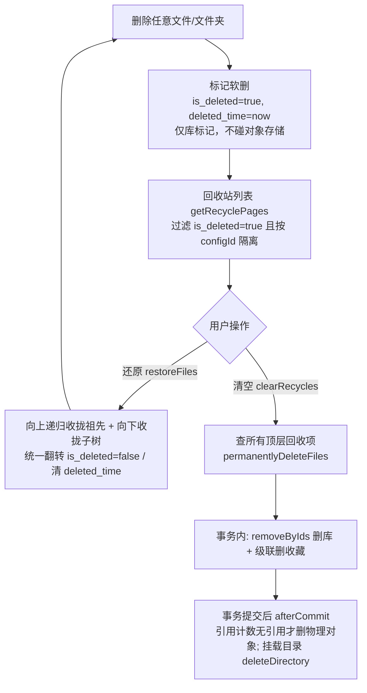
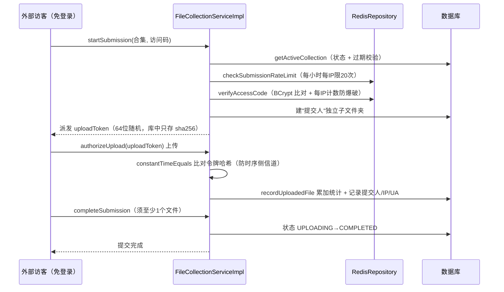

# GFS 回收站 / 收藏 / 文件合集设计

> 面向读者：想搞懂文件软删除、回收站还原与清空、用户收藏、以及面向外部的「文件合集（收集）」模块设计的开发者。
>
> 前提知识：`04-文件数据模型与目录设计`（file_info 树、引用计数）、`05-上传链路设计`（分片与任务）。
>
> 本文档把三个看似无关、实则共享同一套「软删除 + 审计 + 反刷」基础设施的功能放在一起讲，读者能体会到 GFS 在**资源生命周期管理**上的统一手法。

---

## 1. 设计定位

- **回收站**：`file_info.is_deleted` 软删除标志。删除不碰物理对象，还原只是翻标志，清空才真正删除物理文件。核心难点是**目录的层级还原**与**清空时递归收拢整棵子树**。
- **收藏**：一张用户-文件 `FileUserFavorites` 关联表，本质是一个「快捷入口」。删除文件时**级联清理收藏记录**，避免脏引用。
- **文件合集（收集）**：面向外部人员的文件**收集**能力——创建者把一个文件夹变成一个「收件箱」，外部访客（无需登录）用访问码进入、按规则（大小/类型限制）上传。这里有大量**防滥用**逻辑：上传令牌、访问码防爆破、提交限流、匿名身份审计。

它们的共性设计原则：

```
软删除（标记）　≠　物理删除（销毁）
→ 标记先做，销毁后做（事务 afterCommit）
→ 销毁走引用计数，无引用才动对象存储
→ 涉及 IP / 访问码 / 令牌的入口一律 Redis 计数防刷
```

---

## 2. 组件全景

| 层 | 组件 | 位置 | 职责 |
| --- | --- | --- | --- |
| 业务 | `FileRecycleService` | `fs-file/.../service/impl/FileRecycleServiceImpl.java` | 回收站分页、还原、永久删除、清空 |
| 业务 | `FileUserFavoritesService` | `fs-file/.../service/impl/FileUserFavoritesServiceImpl.java` | 收藏/取消收藏/计数/级联清理 |
| 业务 | `FileCollectionService` | `fs-file/.../service/impl/FileCollectionServiceImpl.java` | 合集的创建、状态、提交会话、上传鉴权 |
| 数据 | `FileInfo` | `fs-file/domain/FileInfo.java` | `is_deleted`、`deleted_time`、`parent_id`、`object_key` |
| 数据 | `FileUserFavorites` | `fs-file/domain/FileUserFavorites.java` | 用户-文件收藏关联 |
| 数据 | `FileCollection` / `FileCollectionSubmission` | `fs-file/domain/` | 合集头信息 + 每次提交会话 |
| 框架 | `FileObjectReferenceService` | `fs-file/.../service/` | 引用计数 + Redis 锁销毁物理对象 |
| 框架 | `RedisRepository` | `fs-redis/.../RedisRepository.java` | INCR/EXPIRE 防刷计数 |
| 框架 | `StorageServiceFacade` | `fs-storage/.../facade/` | 获取存储插件实例执行物理删除 |

---

## 3. 核心链路

### 3.1 回收站：删除 → 还原 → 清空

```
删除任意文件/文件夹
  │ fileInfoService → is_deleted=true, deleted_time=now  （仅库标记，不碰对象存储）
  ▼
回收站列表 getRecyclePages
  │ 过滤 is_deleted=true ∧ 用户匹配；再按「存储平台」过滤（configId）
  ▼
还原 restoreFiles
  │ 递归收拢：被选文件 + 回收站中的祖先目录 → 统一翻转 is_deleted=false
  ▼
清空 clearRecycles
  │ 查出所有"顶层回收项" → permanentlyDeleteFiles
  ▼
永久删除 doPermanentDelete
  │ removeByIds 删库 → 级联删收藏
  │ afterCommit → 引用计数无引用才删物理对象；挂载目录直接 deleteDirectory
```

> 补充一张流程对比：把「**标记（软删）**」与「**物理销毁**」分开看，前者只动库翻转标志、快；后者走事务 `afterCommit` + 引用计数，慢且不可逆。



### 3.2 收藏

```
收藏 favoritesFile
  │ 断言 file_info 存在且未删除 → 过滤已收藏 → saveBatch 关联记录 → 更新文件 lastAccessTime
取消收藏 unFavoritesFile → 删关联 + 更新 lastAccessTime
永久删除文件时 → removeByFileIds(fileIds, userId) 级联清理
```

### 3.3 文件合集（收集）：对外免登录上传

```
创建者 createCollection
  │ 校验目标目录 → 写 FileCollection（访问码只存 SHA 哈希，明文仅在创建时返回一次）
  ▼
外部访客 startSubmission（免登录）
  │ getActiveCollection（状态+过期校验）→ 限流 checkSubmissionRateLimit
  │ → 访问码校验 verifyAccessCode（Redis 防爆破）→ 建"提交人"子文件夹 → 发 uploadToken
  ▼
上传（复用上传链路）→ authorizeUpload(uploadToken 校验) → recordUploadedFile 累加统计
  ▼
完成 completeSubmission → 状态 UPLOADING→COMPLETED（须至少 1 个文件）
```

> 免登录合集的提交会话是「访问码 → 上传令牌」两级凭证的时序图：



---

## 4. 关键代码段

### 4.1 回收站「顶层项」判断：`notExists` 子查询找回收站里的根

回收站列表只显示「回收站内的顶层项」，即 `parent_id 为空`，或**父目录已被删除**（父在回收站）。用 `notExists` 表达「不存在一个仍然活跃的相关父 id」最简洁：

```java
FileInfoTableDef t1 = FILE_INFO.as("t1");
FileInfoTableDef t2 = FILE_INFO.as("t2");

queryWrapper.and(
        t1.PARENT_ID.isNull()
                .or(
                        // 不存在一个 is_deleted=true 的父节点（父不在回收站）
                        notExists(
                                QueryWrapper.create()
                                        .select(t2.ID)
                                        .from(t2)
                                        .where(t2.ID.eq(t1.PARENT_ID))
                                        .and(t2.IS_DELETED.eq(true))
                        )
                )
);
```

> **为什么用 `or(notExists(...))`？** 「显示顶层项」=「没有父」**或**「父不在回收站」。第二层语义要取反（父不在回收站 = 不存在 is_deleted=true 的父），正合适用 `NOT EXISTS`。若直接 `parent_id not in (回收站里的id)`，遇到 `parent_id is null` 的 NULL 比较会恒假，仍需 OR 分支，写法反而不直观。

### 4.2 还原时向上递归收集祖先：保证还原「可用」

还原一个子目录时，若它的上层目录还在回收站里，只翻转自身会得到一个「孤儿」——上层仍被软删，导致访不到。因此要**向上**找出所有在回收站中的祖先一并还原：

```java
private Set<String> collectParentIdsInRecycle(List<String> currentIds, String userId) {
    Set<String> allParentIds = new HashSet<>();
    List<String> runnerIds = new ArrayList<>(currentIds);
    // 逐层向上找父，直到没有"在回收站里的父"为止
    while (CollUtil.isNotEmpty(runnerIds)) {
        List<String> pIds = fileInfoService.queryChain()
                .select(FILE_INFO.PARENT_ID)
                .where(FILE_INFO.ID.in(runnerIds))
                .and(FILE_INFO.PARENT_ID.isNotNull())
                .and(FILE_INFO.USER_ID.eq(userId))
                .listAs(String.class).stream()
                .filter(StrUtil::isNotBlank).distinct().collect(Collectors.toList());
        if (CollUtil.isEmpty(pIds)) break;

        List<String> deletedParents = fileInfoService.queryChain()
                .select(FILE_INFO.ID)
                .where(FILE_INFO.ID.in(pIds))
                .and(FILE_INFO.IS_DELETED.eq(true))   // 只在回收站里的父
                .listAs(String.class);
        if (CollUtil.isEmpty(deletedParents)) break;

        allParentIds.addAll(deletedParents);
        runnerIds = deletedParents;   // 继续往更上层找
    }
    return allParentIds;
}
```

还原时 `allIdsToRestore = 向下递归收拢 + 向上祖先集合`，一次 `UpdateChain` 全部翻标志：

```java
UpdateChain.of(FileInfo.class)
        .set(FileInfo::getIsDeleted, false)
        .set(FileInfo::getDeletedTime, null)
        .where(FILE_INFO.ID.in(allIdsToRestore))
        .and(FILE_INFO.USER_ID.eq(userId))   // 归属必须是自己，防越权
        .update();
```

### 4.3 永久删除：库先删、物理货 afterCommit 再销毁

删除要「快且稳」：先删数据库行并返回（含事务回滚能力），**物理对象销毁放到事务提交后**，避免删除数据库成功后、销毁对象存储失败导致回滚时对象状态不一致。且物理销毁走引用计数，无引用才真正删。

```java
fileInfoService.removeByIds(allFileIds);                    // 1. 删库
fileUserFavoritesService.removeByFileIds(allFileIds, userId); // 2. 级联删收藏
TransactionSynchronizationManager.registerSynchronization(
        new TransactionSynchronization() {
            @Override
            public void afterCommit() {
                for (FileInfo file : physicalObjectsFinal) {
                    try {
                        objectReferenceService.deletePhysicalFileIfUnreferencedWithLock(file);
                    } catch (Exception e) {
                        log.error("删除无引用物理文件失败: {}", file.getObjectKey(), e);
                    }
                }
                // 挂载式目录：不经过引用计数，直接删真实目录树（幂等）
                for (Map.Entry<String, List<FileInfo>> entry : mountDirDeletesFinal.entrySet()) {
                    storageServiceFacade.getStorageService(entry.getKey())
                            .deleteDirectory(dir.getObjectKey());
                }
            }
        }
);
```

`physicalObjects` 用 `storagePlatformSettingId|objectKey` 作为 Map key 去重，作用是**同一物理对象被多份记录引用时只销毁一次**。

> **关键**：只有 `object_key` 非空的记录才需要销毁物理对象；目录记录分两类处理——普通目录走引用计数，**挂载式存储目录**（`isMountMode()`）不走引用计数，直接在 afterCommit 里 `deleteDirectory` 清真实目录树（幂等，目录不存在时静默通过）。

### 4.4 收藏：级联清理防脏引用

文件软删除/永久删除后，收藏记录若残留就会指向不存在的文件。永久删除调用 `removeByFileIds(allFileIds, userId)` 做级联清理；查询计数时也 join `file_info.is_deleted=false` 过滤：

```java
// getFavoritesCount：收藏数只统计"文件仍存活的收藏"
QueryWrapper queryWrapper = new QueryWrapper()
        .from(FILE_USER_FAVORITES)
        .leftJoin(FILE_INFO).on(FILE_USER_FAVORITES.FILE_ID.eq(FILE_INFO.ID))
        .where(FILE_USER_FAVORITES.USER_ID.eq(userId))
        .and(FILE_INFO.IS_DELETED.eq(false));
// 本地存储 configId 为 null 需用 IS NULL 匹配（同回收站的 applyStoragePlatformFilter 手法）
if (storagePlatformSettingId == null || storagePlatformSettingId.isBlank()) {
    queryWrapper.and(FILE_INFO.STORAGE_PLATFORM_SETTING_ID.isNull());
} else {
    queryWrapper.and(FILE_INFO.STORAGE_PLATFORM_SETTING_ID.eq(storagePlatformSettingId));
}
```

### 4.5 合集：访问码只存哈希 + Redis 防爆破

访问码（提取码）不能明文落库，存的是 BCrypt 哈希；明文仅在创建时返回给创建者一次。校验时限流并按 IP 计数防爆破：

```java
private void verifyAccessCode(FileCollection collection, String accessCode, String ip) {
    if (StrUtil.isBlank(collection.getAccessCodeHash())) {
        return;   // 未设置访问码则放行
    }
    String key = "file-collection:code-attempt:" + collection.getId() + ":" + ip;
    Long attempts = redisRepository.incr(key, 1);
    if (attempts != null && attempts == 1) {
        redisRepository.expire(key, 10 * 60);   // 首次计数时设置 10 分钟 TTL
    }
    if (attempts != null && attempts > MAX_CODE_ATTEMPTS_PER_TEN_MINUTES) {
        throw new BusinessException(429, "访问码尝试次数过多，请稍后再试");
    }
    // 用 BCrypt matches 校验（哈希比对），而非明文
    if (StrUtil.isBlank(accessCode)
            || !passwordHashService.matches(accessCode.trim(), collection.getAccessCodeHash())) {
        throw new BusinessException(400, "访问码不正确");
    }
    redisRepository.del(key);   // 校验通过清除计数
}
```

> **设计动机**：`incr` 返回 1 表示该 key 首次出现才设 TTL——这样每个 IP 的 10 分钟窗口独立计时，**内存/键膨胀可控**，且无需额外的「查询是否已存在」两步操作。同样手法用在 `checkSubmissionRateLimit`（每小时每 IP 最多 20 次提交会话）上。

### 4.6 合集：上传令牌与匿名审计

每次提交会话派发明文 `uploadToken`（64 位随机串），库中只存 `sha256(uploadToken)`。上传与完成提交都必须持令牌鉴权，令牌比对用**常量时间比较**防时序侧信道：

```java
private FileCollectionUploadContext authorizeToken(
        String collectionId, String submissionId, String uploadToken,
        boolean requireActiveCollection, boolean allowCompletedSubmission) {
    ...
    String providedHash = SaSecureUtil.sha256(uploadToken);
    // MessageDigest.isEqual：长度不同也常数时间返回，防 timing attack
    if (!constantTimeEquals(providedHash, submission.getUploadTokenHash())) {
        throw new BusinessException(401, "上传凭证无效");
    }
    ...
}

private boolean constantTimeEquals(String left, String right) {
    if (left == null || right == null) return false;
    return MessageDigest.isEqual(
            left.getBytes(StandardCharsets.UTF_8),
            right.getBytes(StandardCharsets.UTF_8));
}
```

提交会话还会记录**提交人姓名、来源 IP、User-Agent**，并生成「`提交人名-yyyyMMdd-HHmmss`」的独立子文件夹（文件名经 `generateUniqueName` 去重），保证匿名上传的**可审计、不覆盖、归属清晰**。

---

## 5. 技术选型理由

| 设计点 | 方案 | 为什么 |
| --- | --- | --- |
| 软删除标志 | `is_deleted` 字段而非物理删行 | 还原代价低（一次 UPDATE）、可被回收站查询直接复用、保留审计痕迹；物理删除才触碰对象存储 |
| 递归收集子树 | 内存递归（逐层 `list`）而非 SQL 递归 CTE | 树深度可控、逻辑直观、与 MyBatis-Flex 无递归方言依赖，便于复用 `filter` 复用回收站条件 |
| 顶层项判定 | `NOT EXISTS` 子查询 | 语义精确表达「父不在回收站」，避免 NULL 比较陷阱 |
| 物理销毁时机 | 事务 `afterCommit` | 数据库操作回滚时不会留下「半删」的对象存储状态；销毁失败只记日志不回滚业务 |
| 物理销毁去重 | 引用计数 + `(settingId\|objectKey)` 去重 | 同一物理对象多引用时只删一次，配合 Redis 锁防并发重复销毁 |
| 访问码/令牌 | 只存哈希、明文仅一次返回 | 存储层泄密也不泄露凭证；令牌比对用常数时间比较防侧信道 |
| 防刷 | Redis INCR + 首次设 TTL | 7 字节/键的低成本方案、自动过期、无后台任务；10 分钟/小时窗口独立统计 |
| 匿名合规 | 记录 IP + UA + 提交人 + 独立文件夹 | 免登录不等于免审计，发生后可追溯、可隔离、不串写 |

---

## 6. 安全与边界

**已做防护**
- 所有查询/更新都带 `USER_ID` 条件，跨用户操作抛 404/403（逻辑上「查无此物」）。
- 回收站/收藏/合集的数量与筛选均按 `StoragePlatformContextHolder.getConfigId()` 隔离存储平台，本地存储 `null` 用 `IS NULL` 匹配。
- 访问码、上传令牌只存哈希；上传令牌 `sha256` 存储 + 常数时间比对。
- 每 IP 访问码 10 分钟 10 次、提交会话每小时 20 次 Redis 限流。
- 汇编：`updateStatus` 重新开启合集要求 `file:write` 权限；扩展名校验白名单（`[a-z0-9]{1,20}`、上限 50 种）；提交人姓名做控制字符与首尾点/空格清洗。
- 永久删除挂载目录用 `deleteDirectory`，目录已不存在时静默通过（幂等）。

**明确不做**
- 回收站不做定时自动清空（过期策略交由上层/人工），软删记录不设 TTL。
- 合集删除不触碰已上传的 `FileInfo` 与对象存储（仅清理元数据），仍进行中的传输任务交给定时清理，避免与分片/合并线程竞争。
- 不提供「按内容相似度去重收藏」——收藏就是用户显式快捷键，不做智能推断。

---

## 7. 关键文件索引

| 关注点 | 文件 |
| --- | --- |
| 回收站实现 | `fs-modules/fs-file/.../service/impl/FileRecycleServiceImpl.java` |
| 收藏实现 | `fs-modules/fs-file/.../service/impl/FileUserFavoritesServiceImpl.java` |
| 合集实现 | `fs-modules/fs-file/.../service/impl/FileCollectionServiceImpl.java` |
| 引用计数销毁 | `fs-modules/fs-file/.../service/FileObjectReferenceService.java` |
| 对象存储销毁门面 | `fs-modules/fs-storage/.../facade/StorageServiceFacade.java` |
| 防刷计数封装 | `fs-framework/fs-redis/.../RedisRepository.java` |
| 存储上下文 | `fs-framework/fs-storage-plugin/.../context/StoragePlatformContextHolder.java` |
| 表结构 | `sql/mysql/gfs.sql`、`sql/postgresql/gfs_pg.sql`（table: file_user_favorites / file_collection / file_collection_submission） |

---

## 8. 学习要点小结

- **软删除的三阶段**：标记（快）→ 事务后销毁（afterCommit 保一致性）→ 引用计数无引用才删（去重防误删）。
- **树操作的两个递归方向**：向下递归收拢子树（清空/永久删），向上递归收拢祖先（还原）；上层软删会让下层变成「孤儿」，还原必须一并处理。
- **NULL 陷阱**：`eq(null)` 会生成 `= NULL` 恒假子句，本地存储的 `configId=null` 一律显式 `IS NULL` 处理。
- **免登录 ≠ 无防护**：合集用「哈希凭证 + 常数时间比对 + Redis 限流计数 + IP/UA 审计」把匿名上传约束在可控范围。
- **级联一致性**：物理删除文件必须级联清收藏，否则产生脆引用；查询计数同样要 join 存活过滤。

下一份进入**存储侧**：`09-存储插件体系设计`——看 `StorageServiceFacade` 背后，插件如何通过 SPI 加载、注册、按需分发。