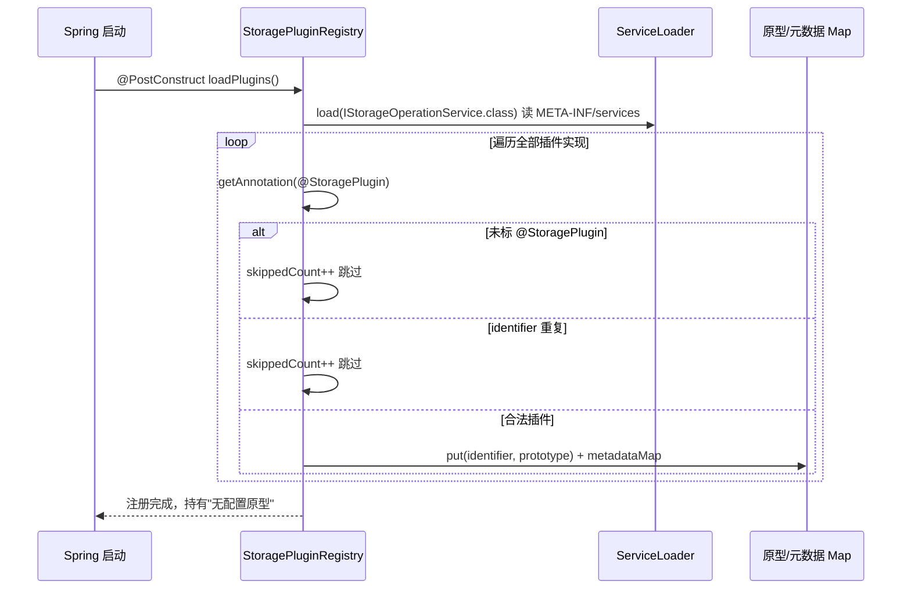
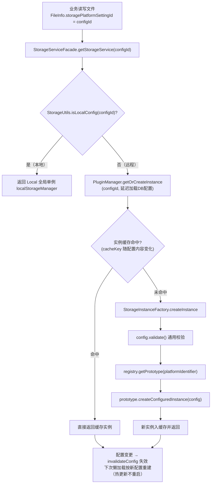

# GFS 存储插件体系设计

> 面向读者：想理解 GFS 如何做到「一套上层业务，接入无限多种存储后端」的开发者。
>
> 前提知识：`04-文件数据模型与目录设计`（file_info 的 object_key / storagePlatformSettingId）。
>
> 本文档回答：存储插件**如何被定义、如何被加载、如何被拉起来、如何被按需分发**，以及分片上传如何在不同协议间复用同一套本地合并逻辑。

---

## 1. 设计定位

GFS 要支持本地磁盘、SMB、WebDAV、SFTP、FTP、阿里云 OSS、MinIO、RustFS 等**异构存储**。如果每个存储都塞进上层业务，`FileInfoService` / `StorageServiceFacade` 就会堆满 `if(platform==SMB)` 分支，新增存储必然大规模改动老代码。

因此抽出一层**存储插件 SPI + 注册 + 实例管理**：

```
上层业务（fs-file / fs-service）
   │ 只依赖 IStorageOperationService 接口 + StorageServiceFacade
   ▼
StorageServiceFacade（门面）—— 隐藏语义：本地 vs 远程、缓存、延迟加载
   ▼
StoragePluginManager（实例管理）—— 从 prototype 工厂化、缓存、失效
   ▼
StoragePluginRegistry（注册器）—— SPI + @StoragePlugin 加载出「原型」
   ▼
storage-plugin-{core,boot,local,localmount,smb,webdav,sftp,ftp,aliyunoss,minio,rustfs}
```

堵点一个：`fs-file` 不能反向依赖 `fs-storage` 去调存储，否则依赖方向反了。方向是 **业务「向下」依赖插件体系**，门面 `StorageServiceFacade` 因此在 `fs-modules/fs-storage` 里，被上层 `fs-file` 依赖。

---

## 2. 组件全景

| 层/模块 | 组件 | 位置 | 职责 |
| --- | --- | --- | --- |
| 核心 SPI | `IStorageOperationService` | `storage-plugin-core` | 存储平台的统一操作契约（上传/下载/列表/分片/加密/挂载能力位） |
| 核心 | `StoragePlugin` 注解 | `storage-plugin-core/.../annotation` | 声明插件元数据（identifier/name/configSchema 等） |
| 核心 | `AbstractStorageOperationService` | `storage-plugin-core` | 共性实现：原型态保护、配置态、日志前缀 |
| 核心 | `AbstractTempChunkStorageService` | `storage-plugin-core/.../chunk` | 远程协议分片「先落本地 temp，complete 合并再写远程」公共基类 |
| 核心 | `StorageUtils` / `StorageConfig` | `storage-plugin-core` | 本地判定 / 消费配置、cacheKey、validate |
| Boot | `StoragePluginRegistry` | `storage-plugin-boot` | `@PostConstruct` 时 ServiceLoader 加载全部插件，建 prototype + 元数据 |
| Boot | `StorageInstanceFactory` | `storage-plugin-boot` | `prototype.createConfiguredInstance(config)` 工厂化 |
| Boot | `StorageInstanceCache` | `storage-plugin-boot` | 按 cacheKey 缓存已配置实例，失效/批量失效 |
| Boot | `LocalStorageManager` | `storage-plugin-boot` | Local 全局单例生命周期 |
| 门面 | `StorageServiceFacade` | `fs-modules/fs-storage/.../facade` | 上下文 configId + DB 配置加载 + 实例获取/刷新/移除 |
| 各插件 | `Local/Smb/Webdav/Sftp/Ftp/AliyunOss/Minio/RustFs ...` | `storage-plugin-*` | 每种协议各自实现 SPI 的方法 |

---

## 3. 核心链路

### 3.1 启动期：SPI 加载 → 注册

```
Spring 启动
  ▼ @PostConstruct StoragePluginRegistry.loadPlugins()
ServiceLoader<IStorageOperationService>（读 META-INF/services 里的实现类）
  ├─ 未标 @StoragePlugin → 跳过
  ├─ identifier 重复 → 跳过
  └─ 合法 → 存 prototype + metadata 到两个 ConcurrentHashMap
```

> 启动期 SPI → 注解校验 → 原型注册的时序：



### 3.2 运行期：按 configId 取存储实例

```
业务需要读写某个文件（FileInfo.storagePlatformSettingId = configId）
  ▼ StorageServiceFacade.getStorageService(configId)
├─ StorageUtils.isLocalConfig(configId) → 返回 Local 全局单例
└─ 否则 → PluginManager.getOrCreateInstance(configId, ()->loadConfigFromDatabase(configId))
       ├─ 缓存命中 → 直接返回
       └─ 未命中 → StorageInstanceFactory.createInstance
              ├─ config.validate() 通用校验
              ├─ registry.getPrototype(platformIdentifier)
              └─ prototype.createConfiguredInstance(config)  → 新实例入缓存
```

> 按 configId 取实例的完整决策：先特判「本地/远程」，远程再走「缓存命中 → 工厂创建」：



### 3.3 远程协议分片上传：先本地暂存，再合并写远程

```
initiateMultipartUpload → 建本地 temp 任务目录（uploadId 即目录名）
uploadPart → 分片落 temp/part-{n}，etag = length_lastModified（与 Local 一致）
listParts → 扫 temp 目录里的 part-* 文件名
completeMultipartUpload → 按分片号排序合并成临时文件 → writeMerged(subclass 写远程) → finally 清 temp
```

---

## 4. 关键代码段

### 4.1 统一操作契约：能力位默认方法

`IStorageOperationService extends Closeable`。除了上传/下载/删除/rename/GetUrl/分片等**必修**方法，还定义了一批**能力位 default 方法**，让「可选能力」不用破坏所有实现的编译：

```java
/** 是否为挂载式存储（目录树镜像真实文件系统），LocalMount 与 SMB 返回 true */
default boolean isMountMode() { return false; }

/** 是否开启落盘加密：开启后秒传/去重必须关闭，加解密对插件调用方透明 */
default boolean isEncryptionEnabled() { return false; }

/** 创建目录（含逐级父链）。仅挂载式实现 */
default void mkdirDirectory(String dirKey) {
    throw new StorageOperationException("当前存储平台不支持创建目录");
}

/** 列举一层目录内容（挂载同步器用）。仅挂载式实现 */
default List<StorageObjectEntry> listObjects(String dirKey) {
    throw new StorageOperationException("当前存储平台不支持目录列举");
}
```

> **设计动机**：用「能力位 default」而非「抽象方法」。抽象方法会强迫所有插件实现不想要的能力（比如普通网盘存储不需要建目录），而两条硬规则写进注释与文档：
> - 判断挂载能力**一律 `isMountMode()`**，**禁止比较 identifier 字符串**（字符串会随平台名变化而腐烂）；
> - 落盘加密开启后，**秒传/去重复用逻辑必须关闭**，因为物理对象是密文、etag/内容比对不再成立。

### 4.2 插件声明：`@StoragePlugin` 注解

```java
@Target(ElementType.TYPE)
@Retention(RetentionPolicy.RUNTIME)
public @interface StoragePlugin {
    String identifier();      // 平台唯一标识：Local / AliyunOSS / RustFS
    String name();            // 显示名：本地存储 / 阿里云OSS
    String description() default "";
    String icon() default "icon-storage";
    String isDefault() default "false";
    String configSchema() default "";   // 配置 Schema JSON（前端动态渲染配置表单）
    String schemaResource() default ""; // 或 classpath:xxx.json
}
```

> 实际源码里 `isDefault` 是 `boolean`，这里示意其用途。`configSchema` 最关键——前端靠它**动态生成「配置这个存储平台需要哪些字段」的表单**，让「注册新存储 = 新增一个 jar，不用改前端」。

### 4.3 SPI 加载：注册器扫描原型

```java
@PostConstruct
public void loadPlugins() {
    ServiceLoader<IStorageOperationService> loader =
            ServiceLoader.load(IStorageOperationService.class);
    for (IStorageOperationService prototype : loader) {
        StoragePlugin annotation = prototype.getClass().getAnnotation(StoragePlugin.class);
        if (annotation == null) {                  // 三个失效兜底
            skippedCount++; continue;
        }
        String identifier = annotation.identifier();
        if (prototypes.containsKey(identifier)) {  // identifier 重复
            skippedCount++; continue;
        }
        StoragePluginMetadata metadata = StoragePluginMetadata.fromPluginClass(prototype.getClass());
        prototypes.put(identifier, prototype);     // 原型缓存
        metadataMap.put(identifier, metadata);
    }
}
```

> **为什么「接口 + SPI + 注解」三件套**？`ServiceLoader` 解决「有哪些插件实现」，`@StoragePlugin` 解决「这个实现的元信息与合法校验」，接口解决「调用方只认一种类型」。三者互补，新增一个插件 = 写一个实现类 + 标注解 + 在 `META-INF/services` 加一行。

### 4.4 实例管理：原型 → 工厂 → 缓存

注册器只持有**原型**（无配置、不可用于读写），真正干活的实例由工厂按配置创建、缓存复用：

```java
// StorageInstanceFactory
public IStorageOperationService createInstance(StorageConfig config) {
    config.validate();   // 通用参数校验
    IStorageOperationService prototype = pluginRegistry.getPrototype(config.getPlatformIdentifier());
    return prototype.createConfiguredInstance(config);   // 工厂方法
}

// StoragePluginManager —— 缓存协调中心
public IStorageOperationService getOrCreateInstance(String configId, Supplier<StorageConfig> configLoader) {
    if (StorageUtils.isLocalConfig(configId)) {
        return localStorageManager.getLocalInstance();       // Local 全局单例
    }
    StorageConfig config = configLoader.get();
    String cacheKey = config.getCacheKey();                  // 配置内容变化 → cacheKey 变 → 命中新实例
    return instanceCache.getOrCreate(cacheKey,
            () -> instanceFactory.createInstance(config));    // 未命中才创建
}

// 配置变更后使缓存失效，下次访问自动按新配置重建
public void invalidateConfig(String configId) {
    if (StorageUtils.isLocalConfig(configId)) return;        // Local 单例不支持失效
    instanceCache.invalidateByConfigId(configId);
}
```

> **为什么分 registry / factory / cache / manager 四层**？职责单一：注册器负责「有哪些插件」，工厂负责「怎么造一个」，缓存负责「造过的别重造」，管理器负责「API 编排 + 失效」。配置变更走 `invalidateConfig` → 下次懒加载新实例，**配置热更新无需重启、无需提前加载连接**。

### 4.5 门面：屏蔽「本地 vs 远程」等语义

`StorageServiceFacade` 是上层唯一入口，隐藏 ThreadLocal 上下文与 DB 配置加载：

```java
public IStorageOperationService getStorageService(String configId) {
    if (StorageUtils.isLocalConfig(configId)) {        // 本地
        return pluginManager.getLocalInstance();
    }
    return pluginManager.getOrCreateInstance(          // 远程：带缓存 + 延迟加载
            configId, () -> loadConfigFromDatabase(configId));
}

private StorageConfig loadConfigFromDatabase(String configId) {
    StorageSetting settings = storageSettingMapper.selectOneById(configId);
    if (settings == null)           throw new BusinessException(i18n("storage.config.not.found"));
    if (settings.getDeleted() == 1) throw new BusinessException(i18n("storage.config.deleted"));
    if (settings.getEnabled() == 0) throw new BusinessException(i18n("storage.config.disabled"));
    // configData 是 JSON 字符串 → 反序列化成 properties → StorageConfig.builder()...
}
```

> **为什么这样设计**：`getCurrentStorageService()` 依赖 ThreadLocal（适合普通请求线程），而 `getStorageService(configId)` **不依赖上下文**，显式传 `FileInfo.storagePlatformSettingId`——这使它天然适配**异步任务与多线程**场景，这也是代码注释强调「推荐使用」的原因。

### 4.6 远程协议分片复用：`AbstractTempChunkStorageService`

SMB/WebDAV/SFTP/FTP 这些远程协议**没有天然的多段上传**，GFS 的做法是「分片先落本地临时目录，complete 时合并再一次性写远程」——把差异收敛到子类的一个抽象方法 `writeMerged`：

```java
public abstract class AbstractTempChunkStorageService extends AbstractStorageOperationService {
    protected abstract String getTempRoot();                    // 分片 temp 根目录
    protected abstract void writeMerged(Path mergedFile, String objectKey); // 子类写远程

    @Override
    public String initiateMultipartUpload(String objectKey, String mimeType) {
        String uploadId = IdUtil.simpleUUID();
        Path tempDir = Paths.get(getTempRoot(), uploadId);
        Files.createDirectories(tempDir);                        // 幂等创建
        return uploadId;
    }

    @Override
    public void completeMultipartUpload(String objectKey, String uploadId, List<Map<String, Object>> partETags) {
        // 入参 partETags 忽略：本地分片没有真实 etag，以 temp 目录里的分片文件为准
        Path tempDir = Paths.get(getTempRoot(), uploadId);
        // 1. 收 temp 里所有 part-*，按分片号排序
        List<Integer> partNumbers = collectSortedParts(tempDir);
        // 2. 依次合并到 merged 临时文件
        Path mergedFile = tempDir.resolve("merged-" + IdUtil.fastSimpleUUID());
        try (FileOutputStream fos = new FileOutputStream(mergedFile.toFile())) {
            for (int n : partNumbers) {
                try (FileInputStream fis = new FileInputStream(tempDir.resolve("part-" + n).toFile())) {
                    fis.transferTo(fos);
                }
            }
        }
        // 3. 交给子类写远程
        writeMerged(mergedFile, objectKey);
        // 4. finally 里无论成败都清理 temp 任务目录
    }
}
```

> **设计要点**：
> - 分片的 `etag = length + "_" + lastModified`，与 Local 插件一致，保证「合并前端二次去重」口径统一（细节见 `05-上传链路设计`）。
> - 目录一律用 `Files.createDirectories`（**幂等**），注释明确禁止 `exists()+mkdirs()`（**并发竞态**会丢目录）。
> - 分片号顺序 = 合并顺序，`partETags` 入参被**显式忽略**，因为本地分片没有可信 etag，一切以 temp 目录事实为准——这是「协议无能力时用本地暂存降级」的代表作。

---

## 5. 技术选型理由

| 设计点 | 方案 | 为什么 |
| --- | --- | --- |
| 插件契约 | `IStorageOperationService extends Closeable` | 一个接口覆盖全部存储，Closeable 保证连接资源可统一释放 |
| 插件发现 | Java SPI（`ServiceLoader`） | 零配置、符合 JAR 生态、新增协议只加一个依赖不碰主代码；相比 Spring Factories 更平台中立 |
| 插件元信息 | `@StoragePlugin` 注解 + `configSchema` | 注解声明式；Schema 驱动前端动态表单，注册新存储不改前端 |
| 能力位 | default 方法返回 boolean | 让可选能力无需所有实现实现；用能力位判断而非 identifier 字符串，防字符串腐烂 |
| 实例管理 | prototype + factory + cache | 原型轻量可复用；实例按配置懒加载复用、配置变更仅失效缓存即热更新 |
| 本地 vs 远程 | `StorageUtils.isLocalConfig` 特判 | Local 全局单例，语义与「每配置一实例」的远程不同，特判最清晰 |
| 门面封装 | `StorageServiceFacade` | 上层只依赖门面，本地/远程/DB加载/缓存细节全部内聚；提供不依赖 ThreadLocal 的重载适配异步 |
| 远程分片 | 本地 temp 暂存 + 合并写远程 | 复用同一套分片编排（init/part/list/complete/abort），各协议只实现 `writeMerged` 一个差异点 |

---

## 6. 安全与边界

**已做防护**
- 配置加载三连校验：`not found` / `deleted` / `disabled`，任一不满足即抛业务异常，杜绝使用失效配置。
- 实例工厂 `config.validate()` 通用校验 + 异常统一转 `StorageOperationException` 并携带 platform 与配置ID，便于定位。
- 能力位判断（`isMountMode` / `isEncryptionEnabled`）替换字符串判断——加密开启时禁用秒传/去重。
- prototype 态保护：分片/上传方法入口 `ensureNotPrototype()`，防止把无配置的原型误当可用实例写入数据。

**明确不做**
- 不做「自动故障转移/多副本」：插件体系只管「单平台连接与操作」，高可用由部署层保证。
- 不做「配置迁移/校验值真实性」：`properties` 校验限于结构层面，连接能否建立到首次使用才暴露。
- 分片本地暂存依赖 `java.io.tmpdir` 磁盘空间，超大并发时可能打满临时盘——属于部署预留项，非插件内置治理。

---

## 7. 关键文件索引

| 关注点 | 文件 |
| --- | --- |
| SPI 契约 | `fs-framework/fs-storage-plugin/storage-plugin-core/.../core/IStorageOperationService.java` |
| 插件注解 | `storage-plugin-core/.../core/annotation/StoragePlugin.java` |
| 分片公共基类 | `storage-plugin-core/.../core/chunk/AbstractTempChunkStorageService.java` |
| SPI 注册 | `storage-plugin-boot/.../boot/StoragePluginRegistry.java` |
| 实例编排 | `storage-plugin-boot/.../boot/StoragePluginManager.java` |
| 实例工厂 | `storage-plugin-boot/.../boot/StorageInstanceFactory.java` |
| 缓存/失效 | `storage-plugin-boot/.../boot/StorageInstanceCache.java` |
| 门面 | `fs-modules/fs-storage/.../facade/StorageServiceFacade.java` |
| 插件清单 | `storage-plugin-{local,localmount,smb,webdav,sftp,ftp,aliyunoss,minio,rustfs}/` |
| SPI 注册文件 | 各 `storage-plugin-*/src/main/resources/META-INF/services/com.guanghe.fs.storage.plugin.core.IStorageOperationService` |

---

## 8. 学习要点小结

- **插件化的三层切分**：接口（契约）→ 注册（发现）→ 管理（工厂+缓存+门面）。隔离点越多，新增存储的改动面越小。
- **原型 vs 实例**：注册器只存无配置原型，实例由工厂按配置创建并缓存——「模板」与「实例」分开，避免共享可变状态。
- **能力位 + default**：用布尔 default 表达「可选能力」，并**统一走能力位判断、禁用字符串比较**。
- **热更新而不重启**：配置变更 = 失效缓存 = 下次懒加载按新 config 重建，cacheKey 随配置内容变化自动 r分化实例。
- **降级复用**：远程协议没法原生分片，就「本地暂存 + complete 合并 + writeMerged」把差异收敛到一个点——这是可扩展插件库的通用手法。
- **门面隔离依赖方向**：上层只依赖 `StorageServiceFacade`，既封住实现也守住「业务不反向依赖存储」的架构纪律。

下一份进入存储的业务侧：`10-存储平台与配置设计`——看 `StorageServiceFacade` 背后，`StorageSetting` 如何建模、如何多平台共存、以及挂载式存储的目录树如何与 file_info 双向同步。