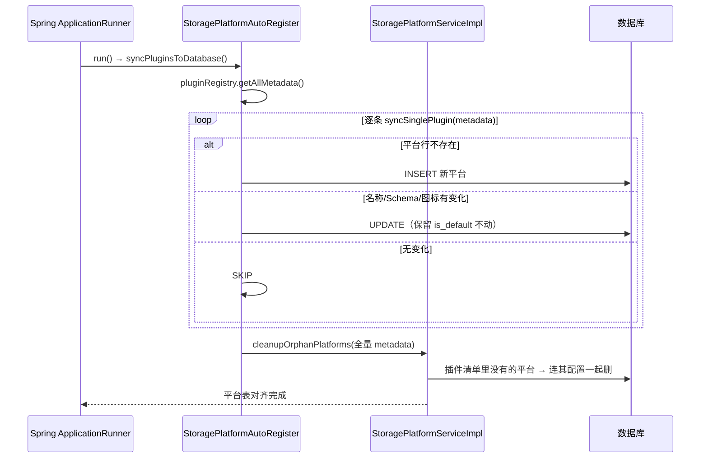
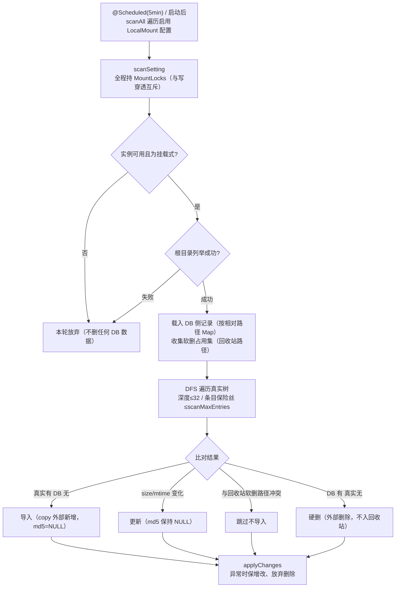

# GFS 存储平台与配置设计

> 面向读者：想理解 GFS 的「存储平台 / 存储配置 / 挂载式存储」三层数据模型，以及挂载目录树与真实文件系统如何双向同步的开发者。
>
> 前提知识：`09-存储插件体系设计`（SPI/注册/实例管理/挂载能力位）。
>
> 本文档是插件体系的「业务侧」：插件只是「实现的原料」，这里的 `StoragePlatform`（平台有哪些）、`StorageSetting`（每个平台的配置实例）、`MountScanService`（挂载式存储的目录同步）才是真正把它们组织起来的层。

---

## 1. 设计定位

- **平台 vs 配置**：`StoragePlatform` 描述「系统支持哪些存储类型及其配置 Schema」（源于代码插件，启动时自动同步）；`StorageSetting` 描述「用户配置的一条具体存储」（`configData` 为 JSON，含连接参数）。
- **多激活**：允许多个存储配置**同时启用**，文件可分散在不同存储平台上（`FileInfo.storagePlatformSettingId` 指向具体配置）。
- **内置本地存储**：固定 `id="Local"` 的配置行恒存在、恒启用、禁删禁禁、固定首位——是「开箱即用」的默认存储。
- **挂载式存储（LocalMount）**：一种特例。它不是「网盘向存储搬文件」，而是**把真实文件系统镜像成网盘的目录树**：`MountScanService` 定时扫描真实目录，双向比对后把变化同步回 `file_info`（新增导入、变化更新、消失硬删）。

安全红线贯穿同步逻辑：**宁可多留、不可误删**。

---

## 2. 组件全景

| 层/模块 | 组件 | 位置 | 职责 |
| --- | --- | --- | --- |
| 业务 | `StoragePlatformServiceImpl` | `fs-storage/.../service/impl` | 平台列表（按 `platformDisplayOrder` 排序）、按 identifier 查询 |
| 业务 | `StorageSettingServiceImpl` | `fs-storage/.../service/impl` | 配置的查/增/删/改、多激活、启停、敏感字段掩码、连接测试、缓存失效 |
| 启动 | `StoragePlatformAutoRegister` | `fs-storage/.../service` | `ApplicationRunner` 启动时把插件清单同步进 `StoragePlatform` 表，并清理孤儿平台 |
| 门面 | `StorageServiceFacade` | `fs-storage/.../facade` | 配置加载/实例获取/刷新/移除（见 09） |
| 挂载 | `MountScanService` | `fs-file/.../mount` | 定时扫描真实目录 → 同步 file_info（新增/更新/硬删） |
| 挂载 | `MountPathResolver` | `fs-file/.../mount` | 把 file_info 目录记录还原为真实相对路径（posix） |
| 挂载 | `MountManager` / `MountLocks` | `fs-file/.../mount` | 单例持有锁表、合法路径段校验 |
| 数据 | `StoragePlatform` | `fs-storage/domain` | 平台清单（identifier/name/configScheme 等） |
| 数据 | `StorageSetting` | `fs-storage/domain` | 配置实例（platformIdentifier/configData/enabled 等） |
| 数据 | `FileInfo` | `fs-file/domain` | 文件索引；`storagePlatformSettingId` 指向某条配置 |

---

## 3. 核心链路

### 3.1 启动：插件 → 平台表

```
ApplicationRunner StoragePlatformAutoRegister.run
  ▼ pluginRegistry.getAllMetadata()
  逐条 syncSinglePlugin(metadata)
    ├─ 平台行不存在 → INSERT
    ├─ 名称/Schema/图标等变化 → UPDATE（保留 is_default 不动）
    └─ 无变化 → SKIP
  最后 cleanupOrphanPlatforms：插件清单里没有的平台 → 连其配置一起删
```

> 启动时平台表与代码插件清单对齐的时序：



### 3.2 配置 CRUD 与「真实连接测试」

```
addStorageSetting
  │ checkDuplicateConfig（JSON 规范化后比对 → 拒绝重复配置）
  │ testStorageConnection（原型工厂建连，失败即抛异常拒绝保存，DB 无残留）
  ▼ save（新配置默认 enabled=0）
editStorageSetting
  │ 敏感字段合并（提交掩码/空值 → 回填 DB 旧值）
  │ 查重（排除自身）→ 连接测试
  ▼ 更新 + refreshInstance（热更新缓存）
deleteStorageSettingById
  │ 内置 Local 禁删 / configInUse 禁删 / 该配置下仍有文件索引禁删
  ▼ 删行 + removeInstance + （LocalMount 触发挂载卸载回调）
```

### 3.3 挂载同步：真实目录 → file_info

```
@Scheduled(5min) / 启动后  MountScanService.scanAll
  ▼ 遍历所有启用 LocalMount 配置 → scanSetting（全程持 MountLocks，与写穿透互斥）
  ├─ 实例不可用 / 非挂载 → 本轮放弃
  ├─ 根目录列举失败 → 本轮放弃（绝不误删）
  ▼ 载 DB 侧记录（按相对路径建 Map）；收集软删占用集（回收站路径）
  ▼ DFS visit 真实树（深度≤32，保险丝 ≤ scanMaxEntries）
    ├─ 真实存在而 DB 没有 → 导入（copy 外部新增；md5=NULL）
    ├─ 变化（size/mtime 不一致）→ 更新（md5 保持 NULL）
    ├─ 与回收站软删路径冲突 → 跳过不导入
    └─ DB 有而真实树没有 → 硬删（外部删除，不入回收站）
  ▼ applyChanges（异常时保增改、放弃删除）
```

> 挂载同步的完整扫描链，标注了各条「宁可多留、不可误删」的安全红线：



---

## 4. 关键代码段

### 4.1 平台自动同步 + 孤儿清理

平台表的**唯一事实源是代码里的插件清单**，启动时自动对齐数据库，插件下线则连配置一起清掉：

```java
@Override
public void run(ApplicationArguments args) {
    syncPluginsToDatabase();
}

private void syncSinglePlugin(StoragePluginMetadata metadata) {
    if (existing == null) {
        ...  // INSERT 新平台
    }
    if (needsUpdate(existing, metadata)) {
        existing.setName(metadata.getName());
        existing.setConfigScheme(validateSchema(metadata.getConfigSchema()));
        // 注意：不更新 is_default，保留管理员设置
        storagePlatformMapper.update(existing);
    }
}

// 平台行真相来自代码：插件被移除 → 残留平台行及其配置一并清理
private void cleanupOrphanPlatforms(Collection<StoragePluginMetadata> allMetadata) {
    for (StoragePlatform row : allPlatforms) {
        if (LOCAL_PLATFORM_IDENTIFIER.equals(row.getIdentifier())
                || activeIdentifiers.contains(row.getIdentifier())) continue;
        // 先删配置（避免 VO 组装 NPE），再删平台行
        storageSettingService.removeById(setting.getId());
        storagePlatformMapper.deleteById(row.getId());
    }
}
```

> **设计动机**：Schema 存放进数据库，前端就能**动态渲染配置表单**；而事实源绑定代码插件，保证「能选中的一定是已部署的插件」，不会因为数据库残留而出现「配置了一个不存在协议的存储」。

### 4.2 多激活 + 内置本地存储恒首位

允许**多个配置同时启用**（`enabled=1` 全部返回），不再是「同平台只能有一个」；内置 Local 单独组装并固定首位：

```java
@Cacheable(value = "storageActivePlatforms", key = "'global'")
public List<StorageActivePlatformsVO> getActiveStoragePlatforms() {
    List<StorageActivePlatformsVO> result = new ArrayList<>();
    // 内置本地存储恒可用，固定首位
    result.add(localInstance);
    // 多激活：全部启用行一并返回
    List<StorageSetting> enabledSettings = this.list(
        new QueryWrapper().where(STORAGE_SETTING.ENABLED.eq(CommonConstant.Y)));
    for (StorageSetting s : enabledSettings) {
        if (LOCAL_PLATFORM_IDENTIFIER.equals(s.getId())) continue;
        result.add(vo);
    }
    // 统一按平台权重排序（内置 Local 权重最小，恒为首位）
    result.sort(Comparator.comparingInt(vo -> platformDisplayOrder(vo.getPlatformIdentifier())));
    return result;
}
```

### 4.3 敏感字段掩码 + 编辑时「空=不变」合并

`configData` 里含密码/密钥等敏感字段。**展示**时打掩码，**编辑**时提交掩码/空值则自动回填 DB 旧值，避免「读一次再存回去把密码存成掩码」：

```java
private String maskSensitiveConfig(String configData) {
    Map<String, Object> config = parseConfig(configData);
    config.replaceAll((key, value) ->
            isSensitiveKey(key) && value != null ? SECRET_MASK : value);
    return JsonUtils.toJsonString(config);
}

private String mergeSensitiveConfig(String existingConfigData, String incomingConfigData) {
    Map<String, Object> existing = parseConfig(existingConfigData);
    Map<String, Object> incoming = parseConfig(incomingConfigData);
    existing.forEach((key, value) -> {
        Object incomingValue = incoming.get(key);
        if (isSensitiveKey(key)
                && (incomingValue == null || String.valueOf(incomingValue).isBlank()
                    || SECRET_MASK.equals(String.valueOf(incomingValue)))) {
            incoming.put(key, value);   // 掩码/空 → 回填旧值
        }
    });
    return JsonUtils.toJsonString(incoming);
}

private boolean isSensitiveKey(String key) {
    String n = key.toLowerCase(Locale.ROOT);
    return n.contains("secret") || n.contains("password") || n.contains("token")
            || (n.contains("access") && n.contains("key"));
}
```

### 4.4 「保存前真实连接测试」

配置校验不仅是结构校验，还要**真实建连**；`configId` 传 `null` 避免测试实例进入缓存，Local 的 `initialize` 会真实建根目录兼作目录可写校验：

```java
@Transactional(rollbackFor = Exception.class)
public void addStorageSetting(StorageSettingAddCmd cmd) {
    if (checkDuplicateConfig(cmd.getPlatformIdentifier(), cmd.getConfigData()))
        throw new BusinessException("storage.config.duplicate");
    testStorageConnection(cmd.getPlatformIdentifier(), cmd.getConfigData()); // 失败即拒存，DB 无残留
    ... this.save(storageSetting);  // 默认 enabled=0
}

private void testStorageConnection(String platformIdentifier, String configData) {
    StorageConfig cfg = StorageConfig.builder()
            .configId(null)   // 不进入缓存
            .platformIdentifier(platformIdentifier)
            .properties(parseConfig(configData)).build();
    IStorageOperationService instance = null;
    try {
        instance = storagePluginRegistry.getPrototype(platformIdentifier)
                .createConfiguredInstance(cfg);
    } catch (Exception e) {
        throw new BusinessException("storage.config.test.failed", ...);
    } finally {
        if (instance != null) { try { instance.close(); } catch (Exception ignore) {} }
    }
}
```

### 4.5 挂载路径解析：file_info 树 → 真实相对路径

核心方向（网盘 → 真实 FS）是「逆向递归拼路径」，遇挂载点为止，并对长度/名字/深度做三重保护：

```java
public String resolveRelativeKey(FileInfo file, String mountSettingId) {
    LinkedList<String> segments = new LinkedList<>();
    FileInfo current = file;
    int depthGuard = 0;
    while (current != null) {
        if (isMountPoint(current, mountSettingId)) {   // is_dir=1 ∧ parent_id IS NULL ∧ settingId 匹配
            String joined = String.join("/", segments);
            if (joined.length() > MAX_KEY_LENGTH) throw new BusinessException("mount.key.too.long");
            return joined;
        }
        String name = current.getDisplayName();
        if (StrUtil.isEmpty(name) || name.contains("/") || name.contains("\\"))
            throw new BusinessException("mount.invalid.name");   // 含 / \ 会破坏路径还原
        segments.addFirst(name);
        if (StrUtil.isEmpty(current.getParentId()))
            throw new BusinessException("mount.not.in.scope");   // 到根都没遇挂载点
        current = queryById(current.getParentId());
        if (++depthGuard > 64)
            throw new BusinessException("mount.not.in.scope");   // 脏数据成环保护
    }
    throw new BusinessException("mount.not.in.scope");
}

private boolean isMountPoint(FileInfo file, String mountSettingId) {
    return Boolean.TRUE.equals(file.getIsDir())
            && StrUtil.isEmpty(file.getParentId())
            && mountSettingId != null
            && mountSettingId.equals(file.getStoragePlatformSettingId());
}
```

### 4.6 挂载同步的安全红线（核心代码）

这段体现「宁可多留、不可误删」的全部手段：

```java
// 1. 根目录列举失败 → 本轮放弃（不删任何 DB 数据）
List<StorageObjectEntry> rootEntries = instance.listObjects("");
// 2. 解析失败、树外记录不参与比对（宁多留勿误删）
try { path = mountPathResolver.resolveRelativeKey(record, settingId); }
catch (Exception e) { log.warn("...本轮跳过"); continue; }
// 3. 与回收站软删记录路径冲突 → 跳过不导入（⑥）
if (ctx.softDeletedPaths.contains(rel)) { ctx.seenPaths.add(rel); continue; }
// 4. DFS 异常 → 保增改、放弃删除
catch (Exception e) { log.warn("扫描 DFS 异常，放弃本轮删除段", e); applyChanges(ctx, false); return; }
// 5. 深度/条目保险丝
if (depth > MAX_DEPTH) return;
if (ctx.inserts.size() + ctx.deleteIds.size() > scanMaxEntries)
    throw new IllegalStateException("单轮扫描条目超过上限 " + scanMaxEntries);
```

> **三条铁律**：
> 1. 根列举失败即放弃 → 网络抖动不触发雪崩式误删；
> 2. 外部删除场景**硬删、不入回收站**（内容已没了，进回收站会误导用户以为能恢复）；
> 3. 异常时「保增改、弃删除」+ 深度/条目双保险丝，收敛单轮影响面。

---

## 5. 技术选型理由

| 设计点 | 方案 | 为什么 |
| --- | --- | --- |
| 平台/配置两表 | `StoragePlatform` + `StorageSetting` | 平台是「能力与 Schema」（一变全变），配置是「一条实例」（每行独立）；分开避免每个配置重复存 Schema |
| 平台事实源 | 插件代码（启动同步 + 清理孤儿） | 前端可选平台永远与已部署插件一致；清理孤儿防「下线平台残留」 |
| 多激活 | `enabled=1` 全部返回 | 让多存储并行、按文件分散；互斥的旧做法限制灵活度 |
| 配置校验 | 保存前真实建连，`configId=null` | 配置即验即得，不落脏数据；测试实例不进缓存 |
| 敏感字段 | 掩码 + 空值合并回填 | 不泄露密钥到前端，且避免「掩码覆盖真实值」 |
| 挂载同步 | 定时全量 DFS 比对 + 深度/条目保险丝 | 结构简单可直接防错；保险丝把单轮影响面钉死 |
| 同步安全 | 「宁多留、勿误删」策略 | 误删不可逆，宁保留冗余记录等下轮自愈 |
| 缓存 | `@Cacheable` global + 增删改后 `@Caching.evict` | 列表类高频查询走缓存；写操作统一失效，避免 TTL 内旧数据 |

---

## 6. 安全与边界

**已做防护**
- 内置 Local：禁删、禁禁、重复启用幂等；`basePath` 必填、根目录可写测试。
- 删除拦截三重：`not exist` / 当前上下文 `in.use` / 该配置下**仍有文件索引**（`storageInUseChecker`）→ 防止文件失联。
- 挂载平台删除：先 `removeInstance`，再触发 `mountUnmountConsumer` 清理网盘索引（仅清索引，**绝不碰真实文件**）。
- 挂载扫描：根列举失败放弃、深度≤32、单轮条目标；含 `/ \` 非法名跳过导入。

**明确不做**
- 不做「配置值校验真实性」之外的安全加密存储——`configData` 只做掩码展示，DB 内仍存明文 JSON（密钥安全依赖数据库自身防护）。
- 不做挂载的**反向推送**：同步是单向的「真实 FS → file_info」，网盘侧改名/删除**写穿透**到真实 FS 属另一条链（`MountLocks` 与其互斥），不在本扫描器职责内。
- 不做增量同步/事件监听：用全量扫描 + 保险丝换取实现简单与高可靠。

---

## 7. 关键文件索引

| 关注点 | 文件 |
| --- | --- |
| 平台服务 | `fs-modules/fs-storage/.../service/impl/StoragePlatformServiceImpl.java` |
| 配置服务 | `fs-modules/fs-storage/.../service/impl/StorageSettingServiceImpl.java` |
| 启动同步/孤儿清理 | `fs-modules/fs-storage/.../service/StoragePlatformAutoRegister.java` |
| 门面 | `fs-modules/fs-storage/.../facade/StorageServiceFacade.java` |
| 挂载同步器 | `fs-modules/fs-file/.../mount/MountScanService.java` |
| 路径解析 | `fs-modules/fs-file/.../mount/MountPathResolver.java` |
| 锁/段校验 | `fs-modules/fs-file/.../mount/MountManager.java`、`MountLocks.java` |
| 数据模型 | `fs-modules/fs-storage/.../domain/StoragePlatform.java`、`StorageSetting.java` |
| 表结构 | `sql/mysql/gfs.sql`（storage_platform / storage_setting）、`sql/postgresql/gfs_pg.sql` |

---

## 8. 学习要点小结

- **两表分工**：平台 = 能力模板（Schema），配置 = 具体实例（JSON）；事实源在代码，启动自动对齐并清理孤儿。
- **配置即验即得**：新增/编辑前真实建连、查重、敏感字段掩码与合并，杜绝脏配置与密钥泄漏。
- **多激活**：多存储并行分散，`FileInfo.storagePlatformSettingId` 指向具体配置，语义干净。
- **挂载同步是「镜像」而非「搬移」**：对象键即真实相对路径，扫描把真实 FS 的变化反映到网盘索引；md5 保持 NULL（内容去重不适用于挂载）。
- **安全红线统一**：宁可多留勿误删——根列举失败放弃、深度/条目保险丝、异常弃删除段，全部围绕「不可逆操作最小化」。
- **缓存治理**：列表类 `@Cacheable` + 写操作 `@CacheEvict`，保证变更即时生效。

下一份进入**对外能力**：`11-对外文件服务设计`——看 `fs-service` 如何用 WebDAV / SFTP 把网盘暴露给标准客户端，以及协议线程与 Sa-Token 上下文如何桥接。