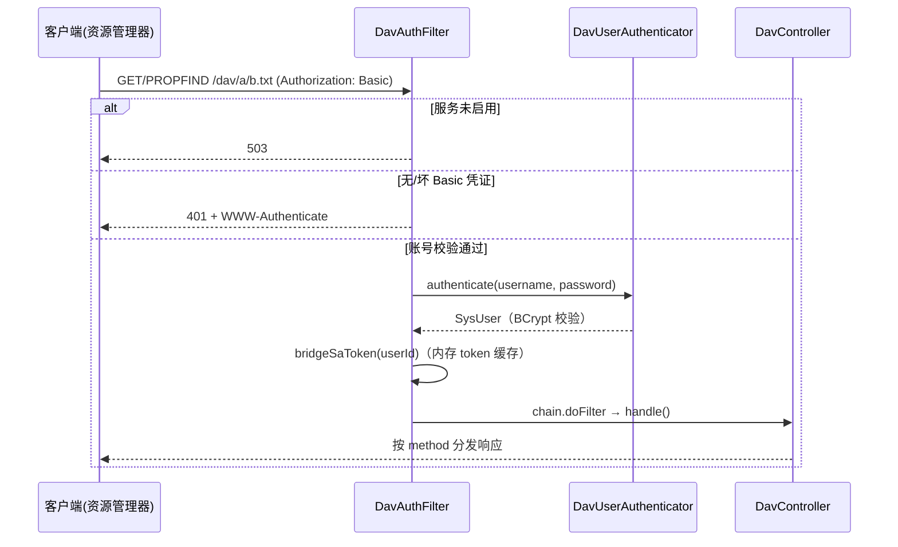
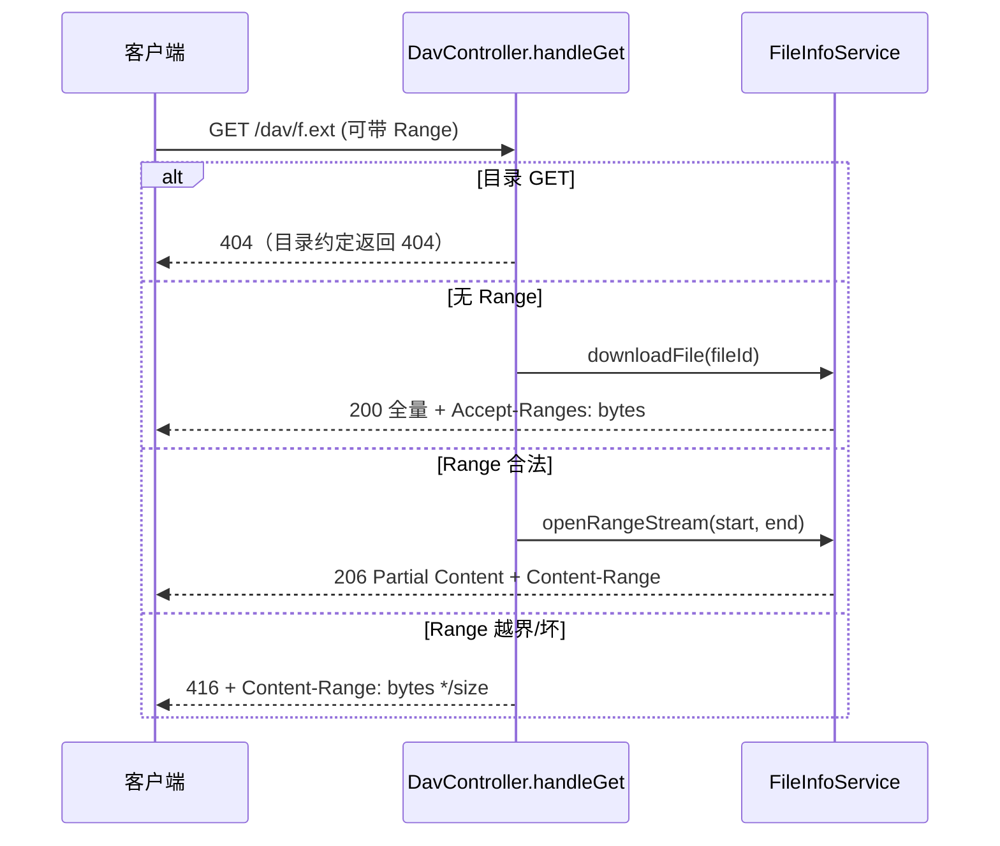
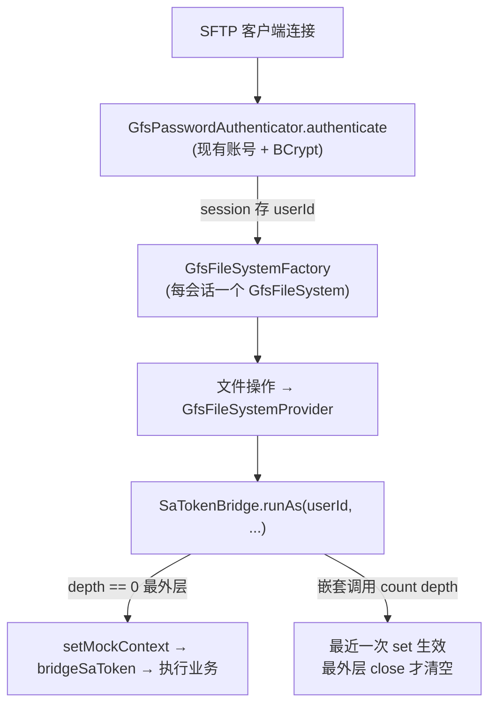

# GFS 对外文件服务设计（WebDAV / SFTP / FTP，SPI 插件式）

> 面向读者：想理解 GFS 如何把私有网盘暴露为标准协议（WebDAV / SFTP / FTP），以及如何以 **SPI 插件方式新增协议**的开发者。
>
> 前提知识：`04-文件数据模型与目录设计`、`06-下载与媒体预览设计`（Range 流）、`03-认证与用户模块设计`（Sa-Token / 账号体系）。

---

## 1. 设计定位

网盘的价值在于「标准协议开放」。GFS 的做法是：

- **WebDAV**：运行在 `/dav/**`，用一个控制器按 **HTTP method** 分发（PROPFIND/GET/PUT/MKCOL/DELETE/MOVE/COPY…），复用 `FileInfoService` 业务方法。
- **SFTP**：内嵌一个 Apache MINA `sshd` 服务器，把网盘包装成 **Java NIO 文件系统（`FileSystemProvider`）**，标准 SFTP 客户端即可浏览/上传/下载。
- **FTP**：内嵌一个 Apache FtpServer 服务器，`UserManager`/`FtpFile` 两个 SPI 直接落在 GFS 文件树桥上，被动端口 50000-50100，下载支持断点续传。
- **SPI 插件式架构**：与存储插件同一思想 —— 所有协议实现 `ExternalFileService` 接口自注册，`ProtocolServiceManager`/`ServiceSettingController` 按注册表分发，**新增协议零改动管理器**。

**核心思想的复用**：两条协议都不重写文件逻辑，而是「**协议线程 → Sa-Token 上下文**」的桥接 + 复用业务 Service。这也决定了设计重心是「认证桥接」与「协议映射」，而非业务实现。

**渐进示例（Duration）**：WebDAV 边用边改，从最初只支持 PROPFIND/GET 的最小实现，演进到支持 Range 断点续传、MOVE/COPY、回收站语义等。

---

## 2. 组件全景

| 模块/层 | 组件 | 位置 | 职责 |
| --- | --- | --- | --- |
| WebDAV | `DavController` | `fs-service/.../webdav` | `/dav/**` 单控制器，按 method 分发到 handle* |
| WebDAV | `DavAuthFilter` | `fs-service/.../webdav` | 服务启用开关 + Basic 认证 + Sa-Token 桥接 |
| WebDAV | `DavUserAuthenticator` | `fs-service/.../webdav` | 现有账号 + BCrypt 校验；内存 token 缓存 |
| WebDAV | `DavPathResolver` | `fs-service/.../webdav` | URL 相对路径 → file_info 记录（含父/名/是否已存在） |
| WebDAV | `PropfindXmlWriter` | `fs-service/.../webdav` | 生成 `<multistatus>` 207 XML 响应 |
| WebDAV | `WebDavFilterConfig` | `fs-service/.../web` | 过滤器注册顺序（DavAuthFilter 最前） |
| SFTP | `SftpServerHolder` | `fs-service/.../sftp` | 内嵌 sshd 生命周期 |
| SFTP | `GfsPasswordAuthenticator` | `fs-service/.../sftp` | 密码认证（同 WebDAV）→ session 存 userId |
| SFTP | `GfsFileSystem` / `GfsFileSystemProvider` | `fs-service/.../sftp/nio` | 把网盘实现为 NIO 文件系统 |
| SFTP | `SaTokenBridge` | `fs-service/.../sftp` | NIO 线程桥接 Sa-Token mock 上下文（可重入） |
| FTP | `FtpExternalService` | `fs-service/.../ftp` | 内嵌 FtpServer 生命周期（默认 9021，被动 50000-50100） |
| FTP | `GfsFtpBridge` | `fs-service/.../ftp` | UserManager（认证）+ FtpFile 虚拟文件 → FileInfoService |
| SPI | `ExternalFileService` / `Registry` | `fs-service/.../spi` | 协议插件接口 + 类型注册表（新增协议零改管理器） |
| Generic | `ServiceSetting` | `fs-service/.../domain` | 协议开关/配置（每协议一行，种子数据随发行包初始化） |
| 复用 | `FileInfoService` | `fs-file` | 下载/上传/建目录/回收站/复制/改名/移动 |

---

## 3. 核心链路

### 3.1 WebDAV 请求入口

```
客户端 → /dav/a/b.txt
  ▼ DavAuthFilter（最前）
    ├─ 服务未启用 → 503
    ├─ 无/坏 Basic → 401 + WWW-Authenticate
    └─ 账号校验通过 → authenticator.bridgeSaToken(userId)
  ▼ DavController.handle()
    ├─ method → switch(OPTIONS/PROPFIND/PROPPATCH/GET/HEAD/PUT/MKCOL/DELETE/MOVE/COPY…)
    └─ Method 无对应分支 → 405 + Allow
```

**图：WebDAV 请求入口与认证时序**



### 3.2 PROPFIND 目录列举

```
PROPFIND /dav/dir  (Depth:0/1)
  ▼ resolveQuietly → ResolvedPath(file,parent,name,existed)
  ├─ 根路径 "" → 虚拟根节点 + (Depth!=0) 首层子项
  └─ 子路径 → 自身条目 + (Depth!=0 且是目录) 一层子项
  ▼ PropfindXmlWriter.wrapMultistatus → 207 XML
```

### 3.3 GET 下载（Range 断点续传）

```
GET /dav/f.ext   (可带 Range)
  ├─ 是目录 → 404（约定：目录 GET 返回 404）
  ├─ 无 Range → 200 全量 + Accept-Ranges: bytes
  ├─ Range 合法 → 206 Partial Content + Content-Range
  └─ Range 越界/坏 → 416 + Content-Range: bytes */size
```

**图：GET 下载（Range 断点续传）时序**



### 3.4 SFTP 会话

```
SFTP 客户端连接
  ▼ GfsPasswordAuthenticator.authenticate（现有账号+BCrypt）→ session 存 userId
  ▼ GfsFileSystemFactory → 每会话一个 GfsFileSystem（挂载随机 key）
  ▼ 文件操作 → GfsFileSystemProvider → SaTokenBridge.runAs(userId, ...)
     ├─ 最外层 setMockContext → bridgeSaToken → 执行业务
     └─ 嵌套调用 count depth，避免重复 set/clear
```

### 3.5 协议 SPI：生命周期编排（新增协议的接入点）

```
ServiceSettingController (PUT /{type}/config, POST /{type}/{action})
  ▼ 不再 if/else 分发
ExternalFileServiceRegistry.get(type)          ← Spring 容器收集全部 ExternalFileService 实现
  ▼ apply(setting) / stop() / isRunning()
ProtocolServiceManager                          ← SmartLifecycle：启动拉起 enabled=1 的服务、
                                                   热生效、失败置 error、状态内存态
```

**新增一个协议（如 FTP）只需要三件事**：

1. 写一个 `XxxExternalService implements ExternalFileService`（type/端口/启停/幂等 apply）；
2. 写协议线程的认证桥（复用 `DavUserAuthenticator`）与文件桥（复用 `GfsPathResolver` + `SaTokenBridge`）；
3. `service_settings` 加一行种子数据 + i18n 名称 + 前端卡片（socket 型自动带端口表单）。

管理器与控制器零改动。

**图：SFTP 会话与 SaTokenBridge 嵌套桥接**



---

## 4. 关键代码段

### 4.1 单控制器 + 非标准 method 分发

WebDAV 的 `PROPFIND/PROPPATCH/REPORT` 不在 Spring 的 `RequestMethod` 枚举里，所以用**一个 `@RequestMapping("/**")` + 方法名 switch**，而非 method 属性：

```java
@RequestMapping("/**")
public void handle(HttpServletRequest request, HttpServletResponse response) throws IOException {
    String method = request.getMethod().toUpperCase();
    String relativePath = extractRelativePath(request);
    switch (method) {
        case "OPTIONS"  -> handleOptions(response);
        case "PROPFIND" -> handlePropfind(request, response, relativePath);
        case "GET", "HEAD" -> handleGet(request, response, relativePath);
        case "PUT"      -> handlePut(request, response, relativePath);
        case "MKCOL"    -> handleMkcol(response, relativePath);
        case "DELETE"   -> handleDelete(response, relativePath);
        case "MOVE"     -> handleMove(response, relativePath, request.getHeader("Destination"), false);
        case "COPY"     -> handleMove(response, relativePath, request.getHeader("Destination"), true);
        case "LOCK"     -> handleLock(request, response, relativePath);
        case "UNLOCK"   -> handleUnlock(request, response, relativePath);
        default -> { response.setStatus(405); response.setHeader("Allow", ALLOW); }
    }
}
```

> **语义约定（行为边界）**：`DELETE` = 进回收站（可恢复，与 Web 端一致）；`PUT` 同名 = 覆盖；`LOCK/UNLOCK` = 内存写锁（RFC 4918，宕机/重启失效，写路径对「他人独占锁」返回 423）；`PROPPATCH` 返回 207 空 multistatus（Windows Explorer 兼容）。

### 4.2 目录列举：Depth / 根 / 207 multistatus

```java
String depth = StrUtil.blankToDefault(request.getHeader("Depth"), "1");
StringBuilder responses = new StringBuilder();
if (StrUtil.isEmpty(relativePath)) {
    // 根目录：虚拟节点
    responses.append(PropfindXmlWriter.writeResponse(href(""), "", true, null,
            LocalDateTime.now(), null));
    if (!"0".equals(depth)) {
        for (FileVO vo : pathResolver.listChildren(null)) {
            responses.append(PropfindXmlWriter.writeResponse(href(vo.getDisplayName()),
                    vo.getDisplayName(), Boolean.TRUE.equals(vo.getIsDir()),
                    vo.getSize(), vo.getUploadTime(), vo.getMimeType()));
        }
    }
} else {
    // 子路径：自身 + (Depth!=0 且目录)一层子项
    ...
}
byte[] body = PropfindXmlWriter.wrapMultistatus(responses.toString()).getBytes(UTF_8);
response.setStatus(207);          // 207 = multi-status
response.setContentType("application/xml; charset=UTF-8");
response.getWriter().write(new String(body));  // （示意，实际走 OutputStream）
```

### 4.3 Range 断点续传（GET）

```java
response.setHeader("Accept-Ranges", "bytes");   // 声明支持 Range

// 解析 Range 头（仅 GET 生效；HEAD 恒全量元数据）
if (!head && StrUtil.isNotBlank(rangeHeader) && rangeHeader.startsWith("bytes=")) {
    range = parseRange(rangeHeader, size);
    if (range == null || range.start >= size || range.start > range.end) {
        response.setStatus(416);                       // 范围不可满足
        response.setHeader("Content-Range", "bytes */" + size);
        return;
    }
    long end = Math.min(range.end, size - 1);
    response.setStatus(206);                           // Partial Content
    response.setHeader("Content-Range", "bytes " + range.start + "-" + end + "/" + size);
    response.setContentLengthLong(end - range.start + 1);
}
// 流式输出：带 Range 走 openRangeStream（读取源侧也做了裁剪），否则 downloadFile
try (InputStream in = (rangeHeader != null && !head)
        ? fileInfoService.openRangeStream(file.getId(), range.start, Math.min(range.end, size - 1))
        : fileInfoService.downloadFile(file.getId());
     OutputStream out = response.getOutputStream()) {
    in.transferTo(out);
    out.flush();
}
```

> `parseRange` 用正则 `bytes=(\d*)-(\d*)` 支持三种形态：`N-M`（闭区间）、`N-`（到尾部）、`-N`（末尾 N 字节）。坏格式/多余范围返回 `null` → 按 416 处理。这正是视频拖动进度条、断点续传能工作的关键。

### 4.4 MOVE = 改名/移动，COPY = 只加引用

```java
private void handleMove(...) {
    // 目标已存在 → 先移入回收站（保持覆盖语义）
    if (dest.existed()) fileInfoService.moveFilesToRecycleBin(List.of(dest.file().getId()));
    if (copy) {
        fileInfoService.copyFiles(new CopyFileCmd(...));   // 复制：只加引用，不复制物理对象
    } else {
        boolean sameDir = Objects.equals(resolved.file().getParentId(),
                dest.parent() == null ? null : dest.parent().getId());
        if (sameDir) {
            fileInfoService.renameFile(fileId, new RenameFileCmd(dest.name())); // 同目录=改名
        } else {
            fileInfoService.moveFile(new MoveFileCmd(...));  // 跨目录=移动
            if (!dest.name().equals(...getDisplayName()))
                fileInfoService.renameFile(...);             // moveFile 不改名，补一次改名
        }
    }
}
```

> **注意** `Destination` 可能是绝对 URL 或绝对路径，`extractRelative` 统一 strip 掉 `://host` 与 `/dav` 前缀，再交给 `DavPathResolver.normalize` 规范化。

### 4.5 WebDAV 认证 + Token 桥接

```java
public void doFilter(...) {
    // 服务开关
    if (!enabled) { resp.setStatus(503); ...; return; }
    // Basic 解析
    String decoded = new String(Base64.decode(header.substring(6)), UTF_8);
    int idx = decoded.indexOf(':');  // idx<=0 → 401
    String username = decoded.substring(0, idx), password = decoded.substring(idx + 1);
    var user = authenticator.authenticate(username, password);
    if (user == null) { unauthorized(resp); return; }
    // 桥接当前用户：后续 service 层 StpUtil.getLoginIdAsString() 正常工作
    authenticator.bridgeSaToken(user.getId());
    chain.doFilter(request, response);
}
```

> 关键点：**协议的 Basic 凭证 → Sa-Token 上下文**由 `bridgeSaToken(userId)` 完成。它带**内存 token 缓存**，避免每个请求重复 `login` 堆积会话。

### 4.6 SFTP 读取通道：真随机读（`GfsReadChannel`）

SFTP 协议的 READ 请求自带偏移量，MINA sshd 会把它翻译成 `SeekableByteChannel.position(offset)`。`GfsReadChannel` 的实现要点：

- **`position()` 只记录偏移，不建连接**：变更位置时仅关闭旧流，下次 `read()` 才按 `[position, size-1]` 调 `FileInfoService.openRangeStream` 直接定位开流——本地明文走 `RandomAccessFile.seek`、本地加密走 AES-CTR 计数器重定位、远程插件走原生 Range 读，全部 O(1) 定位；
- **顺序读零回归**：目标偏移等于当前位置时不重开流，顺序下载全程只建一次存储连接，64KB 缓冲；
- **EOF 语义**：偏移越界不开流，`read` 返回 -1。

> 早期实现是「重开全文件流 + skip 丢弃」模拟 seek：远程存储拖进度条要把目标位置前的数据全部下载后扔掉，非 faststart 视频读尾部 moov 元数据要转圈很久。改为真随机读后，单次 seek 稳定在 10ms 量级（明文/加密一致），VLC/PotPlayer 走 `sftp://` 拖进度条秒级响应。

### 4.7 SFTP 线程的 Sa-Token 桥接（可重入）

MINA 的 NIO/会话线程**没有 HTTP 请求上下文**，Sa-Token 的 `StpUtil` 会取不到 token。解法是 mock 上下文，且要处理**嵌套调用**：

```java
public <T> T runAs(String userId, Supplier<T> action) {
    int depth = MOCK_DEPTH.get();          // ThreadLocal 深度计数
    if (depth == 0) {
        // 最外层：建立 mock 上下文
        return SaTokenContextMockUtil.setMockContext(() -> {
            try {
                doRunAs(userId, false);
                return action.get();
            } finally {
                MOCK_DEPTH.remove(); TOKEN_SET.remove();
                SaTokenContextMockUtil.clearContext();   // 最外层才清空
            }
        });
    } else {
        // 嵌套调用：mock 已存在，只补 token，避免覆盖前一层
        doRunAs(userId, TOKEN_SET.get());
        return action.get();
    }
}
```

> **为什么显式 depth 计数**：sa-token-core 1.45.0 的 `setMockContext` 是「覆盖式」mock，嵌套 set 会把外层 mock 顶掉并在其 finally 清空。用 `MOCK_DEPTH` + `TOKEN_SET` 保证同一线程上**最近一次 set 生效、最外层 close 才清空**，嵌套操作不会把外层身份弄丢。

### 4.8 SFTP 密码认证（principle 复用同一认证器）

```java
public boolean authenticate(String username, String password, ServerSession session) {
    SysUser user = authenticator.authenticate(username, password);  // 与 WebDAV 同一套：现有账号+BCrypt
    if (user == null) { return false; }
    session.setAttribute(USER_ID_KEY, user.getId());   // 供 FileSystemFactory 取 userId
    return true;
}
```

---

## 5. 技术选型理由

| 设计点 | 方案 | 为什么 |
| --- | --- | --- |
| WebDAV 实现 | 单 `@RestController("/dav/**")` + method switch | Spring RequestMethod 无 PROPFIND；复用既有 MVC/拦截器/Servlet 栈 |
| 认证 | Basic（现有 sys_user + BCrypt） | 标准协议客户端只认 Basic/Bearer，复用账号体系无需另建身份源 |
| 身份桥接 | `bridgeSaToken(userId)` + 内存 token 缓存 | 让协议层零改造直接复用 Sa-Token 鉴权逻辑；token 缓存避免会话堆积 |
| SFTP 实现 | 内嵌 MINA sshd + 自实现 NIO FileSystem | Apache SSHD 提供协议层，自己补文件系统工厂与 Provider，复用业务 |
| 上下文桥接 | `SaTokenContextMockUtil` + depth 计数 | 解决 NIO/异步线程无 HTTP 上下文，且可重入不破坏嵌套身份 |
| 断点续传 | 复用 `FileInfoService.openRangeStream` | WebDAV 的 Range 语义和下载源裁剪复用同一套（见 06 文档） |
| 目录列举 | 手动拼 `multistatus` 207 XML | 协议就是 XML，手动拼灵活、可控、无需额外序列化依赖 |
| 复用而非重写 | 全部落到 `FileInfoService` | 回收站/去重/加密/挂载的既有语义自动继承，协议层只是翻译器 |

---

## 6. 安全与边界

**已做防护**
- 认证复用**现有账号体系 + BCrypt**（`sys_user`），不存在「协议专用弱口令」。
- `/dav/**` 认证过滤器 `order` 最前，未认证返回 401 + `WWW-Authenticate`。
- 服务级开关：WebDAV/SFTP 未启用 → 接口返回 503（不卸载映射，逻辑内拒止）。
- Range 越界/损坏 → 416；目录 GET → 404（文档化约定）；非法请求方法 → 405 + `Allow`。
- `Destination` 跨主机（非本服务）→ 400/502 拒绝。

**明确不做**
- **`LOCK/UNLOCK` 为最小内存实现**：锁存在进程内、不持久化，重启/多实例即失效——单实例部署满足 Office 在线编辑即可，跨进程分布式写锁不在范围。
- **FTP/SFTP 无协议级文件锁**：`LOCK` 是 WebDAV（RFC 4918）特有的 HTTP 层概念，FTP（RFC 959）与 SFTP 请求集里根本没有 lock/unlock 请求，Office 在两者上走「下载-改-上传」整份回写模型、不发送锁请求，因此**不存在需实现的 LOCK**。其并发语义为 **last-writer-wins（后写覆盖）**——多人同时编辑同一文件可能丢更新，这是协议固有局限而非缺陷，文档明确写出作为预期行为。
- 不做 `PROPPATCH` 属性持久化（返回 207 空 multistatus，仅 Explorer 兼容）——自定义 WebDAV 属性不落地。
- WebDAV 协议始终走**默认存储**（见 `DavAuthFilter` 注释），不做按目录切换存储。
- **SFTP 明文路径**只认证不加密的可选项不在范围；远程对象存储类配置（非挂载/本地）不做 SFTP 直读直写适配的完整语义保证（依赖插件能力位）。

> 部署知识（供 Windows 挂载）：HTTP（非 HTTPS）WebDAV 需将客户端 `BasicAuthLevel` 设为 2；Windows 原生客户端对 **HTTP + localhost loopback + Basic** 组合兼容性差，遇到凭证「看似失败」时排查该点。

---

## 7. 关键文件索引

| 关注点 | 文件 |
| --- | --- |
| WebDAV 控制器 | `fs-modules/fs-service/.../webdav/DavController.java` |
| WebDAV 认证 | `fs-modules/fs-service/.../webdav/DavAuthFilter.java`、`DavUserAuthenticator.java` |
| 路径解析 | `fs-modules/fs-service/.../webdav/DavPathResolver.java` |
| XML 响应 | `fs-modules/fs-service/.../webdav/PropfindXmlWriter.java` |
| 过滤器注册 | `fs-modules/fs-service/.../web/WebDavFilterConfig.java` |
| SFTP 服务器 | `fs-modules/fs-service/.../sftp/SftpServerHolder.java` |
| 认证/桥接 | `fs-modules/fs-service/.../sftp/GfsPasswordAuthenticator.java`、`SaTokenBridge.java` |
| NIO 文件系统 | `fs-modules/fs-service/.../sftp/nio/GfsFileSystem.java`、`GfsFileSystemProvider.java` 等 |
| FTP 服务器 | `fs-modules/fs-service/.../ftp/FtpExternalService.java` |
| FTP 桥 | `fs-modules/fs-service/.../ftp/GfsFtpBridge.java`、`GfsFtpFile.java` |
| 协议 SPI | `fs-modules/fs-service/.../spi/ExternalFileService.java`、`ExternalFileServiceRegistry.java` |
| 生命周期管理 | `fs-modules/fs-service/.../manager/ProtocolServiceManager.java` |
| 服务开关 | `fs-modules/fs-service/.../domain/ServiceSetting.java`、`ServiceSettingServiceImpl.java` |
| 事件挂载代理 `getByType` | `fs-modules/fs-service/.../webdav/DavAuthFilter.java` |

---

## 8. 学习要点小结

- **协议即翻译器**：WebDAV/SFTP/FTP 都只是把「协议请求」翻译成对 `FileInfoService` 的业务调用，不重写业务，天然继承回收站/去重/加密/挂载语义。
- **SPI 插件式协议**：`ExternalFileService` 自声明 type/socket 能力，注册表分发；新增协议零改管理器与控制器，与存储插件 `IStorageOperationService` 同构。
- **认证桥接是最大难点**：Basic/SSH/FTP 会话没有 HTTP 上下文，用 `bridgeSaToken`（HTTP 线程）与 `SaTokenContextMockUtil + depth 计数`（NIO 线程）两种方式让 `StpUtil` 正常工作。
- **范围语义**：GET 支持 `Range` 三种形态，越界 416，目录 GET 404，`Accept-Ranges: bytes` 声明支持；与 06 文档的下载链路共用 `openRangeStream`。
- **渐进演进**：控制器从最小 PROPFIND/GET 演进到 Range、MOVE/COPY、回收站语义，读代码可看到每一步按需补齐。
- **诚实的能力边界**：LOCK 只做到「最小内存写锁」（不持久化/不跨实例），`PROPPATCH` 属性、跨存储协议切换不予实现，文档明确写出而非假装支持——这对协议类代码很重要。

下一份进入**治理层**：`12-日志与审计模块设计`——看登录日志、操作日志与日志切面如何在 `fs-log` 里实现统一审计。