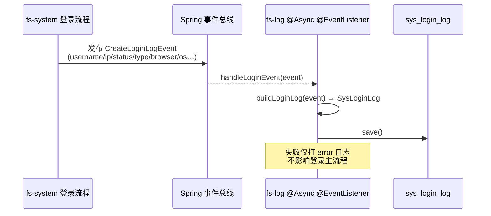
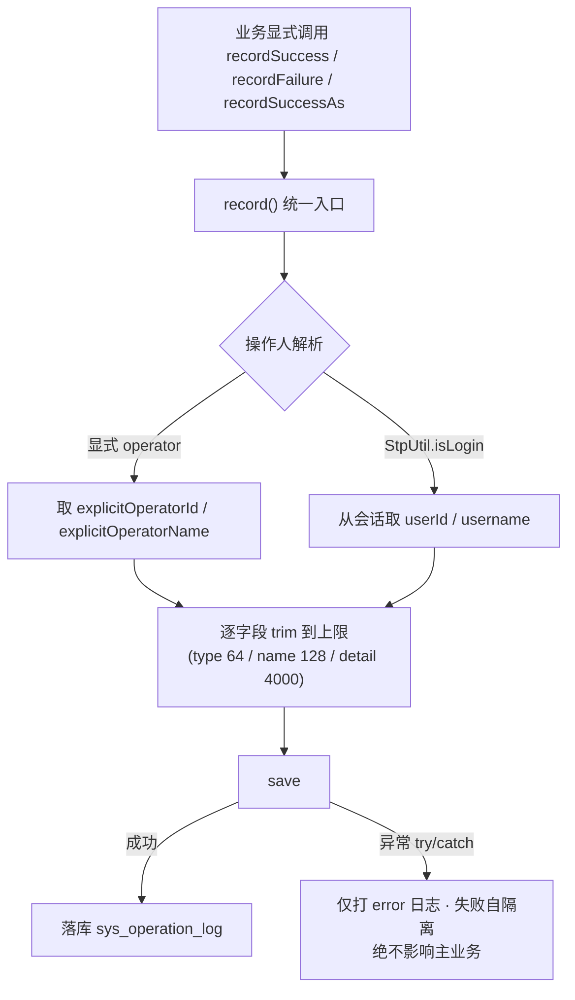

# GFS 日志与审计模块设计

> 面向读者：想理解 GFS 如何做**登录审计**与**操作审计**两套日志，以及它们如何被「解耦 + 异步」地落到 `fs-log` 的开发者。
>
> 前提知识：`03-认证与用户模块设计`（登录事件源）、`01-总体架构`（模块依赖，fs-log 只依赖框架层）。

---

## 1. 设计定位

审计是安全的重要组成。GFS 提供两条日志线：

- **登录日志**（`sys_login_log`）：记录每次登录的成败、IP、UA、浏览器/OS —— 主要用于**登录行为监控**与**防爆破溯源**。
- **操作日志**（`sys_operation_log`）：记录「谁、在哪个对象上、做了什么、结果如何」——覆盖上传/下载/删除/分享/合集/存储/用户管理等关键动作。

共性设计原则：

```
审计不侵入业务：
  登录：业务发出事件，日志模块以监听者身份异步写入
  操作：业务显式调用 recordXxx()，日志模块自管成败与字段裁剪
日志失败绝不影响主流程（try/catch 吞掉 + error 日志）
```

> 依赖方向：`fs-log` 只依赖框架层；登录日志通过 **Spring 事件解耦**（fs-system 发 `CreateLoginLogEvent`，fs-log 用 `@EventListener` 监听），因此 fs-system 不依赖 fs-log，保证模块单向依赖。

---

## 2. 组件全景

| 层/模块 | 组件 | 位置 | 职责 |
| --- | --- | --- | --- |
| fs-log | `LoginEventListener` | `fs-log/.../listener` | `@Async + @EventListener` 异步把登录事件落库 |
| fs-log | `SysLoginLogService` / `Impl` | `fs-log/.../service` | 登录日志 CRUD/分页 |
| fs-log | `SysOperationLogService` / `Impl` | `fs-log/.../service` | 操作日志记录与分页（recordSuccess/recordFailure 等） |
| fs-log | `OperationType` | `fs-log/.../constant` | 操作类型常量（字符串枚举） |
| fs-log | `LogController` | `fs-log/.../controller` | 两类日志的分页查询接口（`log:read` 权限限定管理员） |
| fs-log | `SysLoginLog` / `SysOperationLog` | `fs-log/.../domain` | 日志实体 |
| 事件 | `CreateLoginLogEvent` | `fs-log/.../domain/event` | 登录事件载体（由 fs-system 发布） |
| 复用 | `IpUtils` | `fs-common-core` | 取 IP、UA |
| 复用 | `PageResult` | `fs-common-core` | 统一分页返回 |

---

## 3. 核心链路

### 3.1 登录日志（事件 + 异步）

```
fs-system 登录流程
  ▼ 发布 CreateLoginLogEvent（username/ip/status/msg/type/browser/os…）
  ▼ fs-log @Async @EventListener handleLoginEvent
     ├─ buildLoginLog(event) → SysLoginLog
     └─ sysLoginLogService.save()   失败仅 error 日志，不影响登录
```

**图：登录日志（事件解耦 + 异步落库）时序**



### 3.2 操作日志（显式调用）

```
业务代码（如：分享创建、回收站永久删除、合集创建）
  ▼ sysOperationLogService.recordSuccess(operationType, operationName, targetType, targetId, targetName, detail)
     或 recordFailure(... errorMessage) / recordSuccessAs(operatorId, operatorName, ...)
  ▼ record() 统一入口
     ├─ 操作人解析：显式 operator → 否则从 StpUtil 会话取 userId/username
     ├─ 剩余字段全字段裁剪到上限（防超长撑表）
     └─ save()；异常吞掉只打 error（日志不拖垮业务）
```

**图：操作日志（显式调用）流程**



### 3.3 分页查询

```
LogController（log:read 权限限定系统管理员）
  ├─ /login-logs   → SysLoginLogService.getPages(LoginLogPageQry)
  └─ /operation-logs → SysOperationLogService.getPages(OperationLogPageQry)
  关键词模糊 + 类型/状态过滤 + 时间倒序
```

---

## 4. 关键代码段

### 4.1 登录事件异步监听

```java
@Async                          // 异步线程执行，不阻塞登录主流程
@EventListener                  // 订阅 CreateLoginLogEvent
public void handleLoginEvent(CreateLoginLogEvent event) {
    try {
        SysLoginLog loginLog = buildLoginLog(event);
        sysLoginLogService.save(loginLog);
        log.info("登录日志记录成功: 用户[{}], IP[{}], 状态[{}{}]", ...);
    } catch (Exception e) {
        log.error("记录登录日志失败: 用户[{}], IP[{}]", event.getUsername(), event.getLoginIp(), e);
    }
}
```

> **为什么用事件而非直接调用 Service**：登录逻辑在 `fs-system`，日志落库在 `fs-log`。用 Spring 事件发布/监听，`fs-system` 只依赖「发事件」这一轻量抽象，**不反向依赖 fs-log**，保持模块单向依赖且登录吞吐不被日志落库拖慢（`@Async`）。

### 4.2 操作日志统一入口与操作人解析

```java
public void recordSuccessAs(String operatorId, String operatorName, ... 其他字段, String detail) {
    record(operationType, operationName, targetType, targetId, targetName, detail,
            STATUS_SUCCESS, null, operatorId, operatorName);
}

private void record(..., int status, String errorMessage,
                    String explicitOperatorId, String explicitOperatorName) {
    try {
        SysOperationLog operationLog = new SysOperationLog();
        if (StrUtil.isNotBlank(explicitOperatorId)) {
            // 显式操作人（如：外部协议 / 系统任务指定的归属）
            operationLog.setOperatorId(explicitOperatorId);
            operationLog.setOperatorName(StrUtil.blankToDefault(explicitOperatorName, explicitOperatorId));
        } else if (StpUtil.isLogin()) {
            // 默认取当前登录用户
            String operatorId = StpUtil.getLoginIdAsString();
            operationLog.setOperatorId(operatorId);
            Object username = StpUtil.getSession().get("username");
            operationLog.setOperatorName(username == null ? operatorId : String.valueOf(username));
        }
        // 全字段裁剪到上限，防超长内容撑表
        operationLog.setOperationType(trim(operationType, 64));
        operationLog.setOperationName(trim(operationName, 128));
        operationLog.setTargetId(trim(targetId, 128));
        operationLog.setTargetName(trim(targetName, 255));
        operationLog.setDetail(trim(detail, 4000));
        operationLog.setOperationIp(trim(IpUtils.getIpAddr(), 50));
        operationLog.setUserAgent(trim(IpUtils.getUserAgent(), 512));
        operationLog.setErrorMessage(trim(errorMessage, 512));
        operationLog.setOperationTime(LocalDateTime.now());
        this.save(operationLog);
    } catch (Exception e) {
        // 日志记录失败不能影响正常业务操作。
        log.error("记录操作日志失败: type={}, targetId={}", operationType, targetId, e);
    }
}
```

> **关键设计点**：
> - 提供 `recordSuccess`（取当前登录人）与 **`recordSuccessAs(operatorId, operatorName)`**（显式指定归属）两个入口——后者服务**非登录线程**场景（如 WebDAV/SFTP 协议线程、异步任务），审计不能因为「当前线程没登录」就丢操作主体。
> - 每个字段 `trim` 到上限（detail 最大 4000），**硬编码限制**防超长文本把表/索引撑爆。
> - 整体 try/catch：**日志是附加品，绝不能成为业务失败的原因**。

### 4.3 操作类型常量

用不可实例化的常量类集中定义（字符串枚举，便于入库与检索）：

```java
public final class OperationType {
    public static final String UPLOAD = "UPLOAD";
    public static final String DOWNLOAD = "DOWNLOAD";
    public static final String DELETE = "DELETE";
    public static final String RESTORE = "RESTORE";
    public static final String PERMANENT_DELETE = "PERMANENT_DELETE";
    public static final String CREATE_SHARE = "CREATE_SHARE";
    public static final String CREATE_COLLECTION = "CREATE_COLLECTION";
    public static final String ADD_STORAGE = "ADD_STORAGE";
    public static final String APPROVE_USER = "APPROVE_USER";
    public static final String KICKOUT_SESSION = "KICKOUT_SESSION";
    // ...
}
```

### 4.4 分页查询（管理员限定）

```java
public PageResult<SysOperationLogVO> getPages(OperationLogPageQry qry) {
    // 日志接口已由 log:read 权限限定为系统管理员可见，无需再按归属过滤
    QueryWrapper wrapper = new QueryWrapper();
    if (StrUtil.isNotBlank(qry.getKeyword())) {
        String keyword = "%" + qry.getKeyword().trim() + "%";
        wrapper.and(OPERATOR_NAME.like(keyword).or(OPERATOR_ID.like(keyword))
                .or(OPERATION_NAME.like(keyword)).or(TARGET_NAME.like(keyword))
                .or(DETAIL.like(keyword)).or(OPERATION_IP.like(keyword)));
    }
    if (StrUtil.isNotBlank(qry.getOperationType()))
        wrapper.and(SYS_OPERATION_LOG.OPERATION_TYPE.eq(qry.getOperationType()));
    if (qry.getStatus() != null)
        wrapper.and(SYS_OPERATION_LOG.STATUS.eq(qry.getStatus()));
    wrapper.orderBy(SYS_OPERATION_LOG.OPERATION_TIME.desc()).orderBy(SYS_OPERATION_LOG.ID.desc());
    this.page(page, wrapper);
    ...
}
```

---

## 5. 技术选型理由

| 设计点 | 方案 | 为什么 |
| --- | --- | --- |
| 登录审计接入 | Spring 事件 + `@Async` | 解耦生产者（fs-system）与消费者（fs-log）；异步不阻塞登录，也不引入消息中间件 |
| 操作审计接入 | 业务显式调用 `recordXxx()` | 简单的「想记就记」，比 AOP 切面更精确控制 target 对象；避免切面猜不透业务对象 |
| 字段上限 | 逐字段 `trim(maxLen)` | 硬编码上限防超长内容撑爆表/索引，成本极低收益直接 |
| 操作人解析 | 显式 `operator` 优先，否则读会话 | 覆盖登录线程与非登录线程（协议/异步），审计不缺主体 |
| 类型定义 | 字符串常量类 `OperationType` | 入库可读、可检索、可扩展；避免魔法字符串散落 |
| 失败隔离 | 整体 try/catch 吞掉 + error 日志 | 「日志是附加品」，绝不能因记录失败拖垮主业务 |
| 查询安全 | 接口 `log:read` 权限限定管理员 | 审计日志属敏感数据，只对管理员开放，不在 service 再按人过滤 |

---

## 6. 安全与边界

**已做防护**
- 登录日志覆盖成败状态、IP、UA、浏览器/OS，可用于防爆破溯源。
- 操作日志权限 `log:read` 限定系统管理员；查询无需按归属过滤（接口即门禁）。
- 每个字段裁剪上限，防止恶意超长 payload 撑表。
- 日志写入失败自隔离，不影响主流程；主流程无需 try 日志。

**明确不做**
- 不做操作日志的 **AOP 全量切面**——仅显式调用记录关键动作，避免对只读/内部调用过度记录，也避免切面反射开销。
- 不做**日志自动归档/冷热分层**——超长历史清理策略交由运维，代码不内置。
- 不做**审计日志原文加密/脱敏存储**——依赖数据库层安全（与 `10` 中 configData 存储策略一致）。

---

## 7. 关键文件索引

| 关注点 | 文件 |
| --- | --- |
| 登录监听 | `fs-log/.../listener/LoginEventListener.java` |
| 登录事件载体 | `fs-log/.../domain/event/CreateLoginLogEvent.java` |
| 操作日志实现 | `fs-log/.../service/impl/SysOperationLogServiceImpl.java` |
| 登录日志实现 | `fs-log/.../service/impl/SysLoginLogServiceImpl.java` |
| 类型常量 | `fs-log/.../constant/OperationType.java` |
| 日志控制层 | `fs-log/.../controller/LogController.java` |
| 实体 | `fs-log/.../domain/SysLoginLog.java`、`SysOperationLog.java` |
| 工具 | `fs-common-core/.../utils/IpUtils.java` |
| 表结构 | `sql/mysql/gfs.sql`（sys_login_log / sys_operation_log）、`sql/postgresql/gfs_pg.sql` |

---

## 8. 学习要点小结

- **两条审计线**：登录（事件+异步，防爆破溯源）与操作（显式调用，目标对象审计），接口均限定管理员。
- **事件解耦**：用 `@EventListener + @Async` 实现「日志模块不反向依赖业务模块」，同时异步化不影响主流程吞吐。
- **recordSuccessAs**：显式指定操作人的入口，是为了覆盖「非登录线程」异步/协议场景，保持审计主体不缺失。
- **日志的自我纪律**：字段裁剪上限 + 失败自隔离 + 不侵入业务——审计正确的前提是不被业务讨厌。
- **统一基座复现**：分页用 `PageResult`、取 IP 用 `IpUtils`，都是 `13` 要讲的基础设施。

下一份是**底座篇**：`13-安全框架与统一基建设计`——收束 common-core 返回/异常、orm、redis、security、sse、preview、notify、swagger 等基础设施。