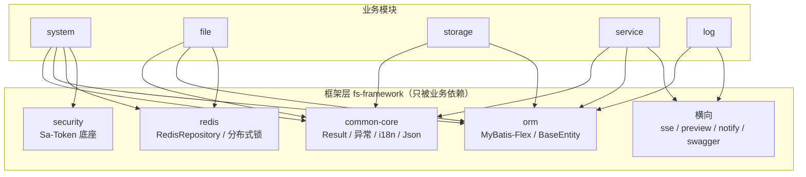
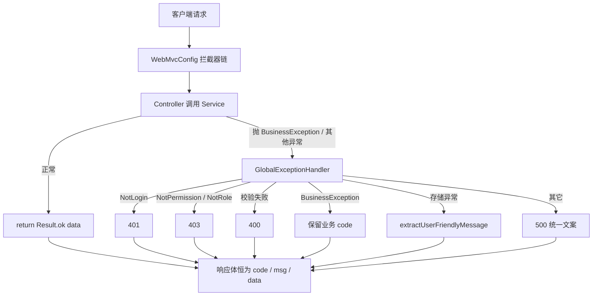
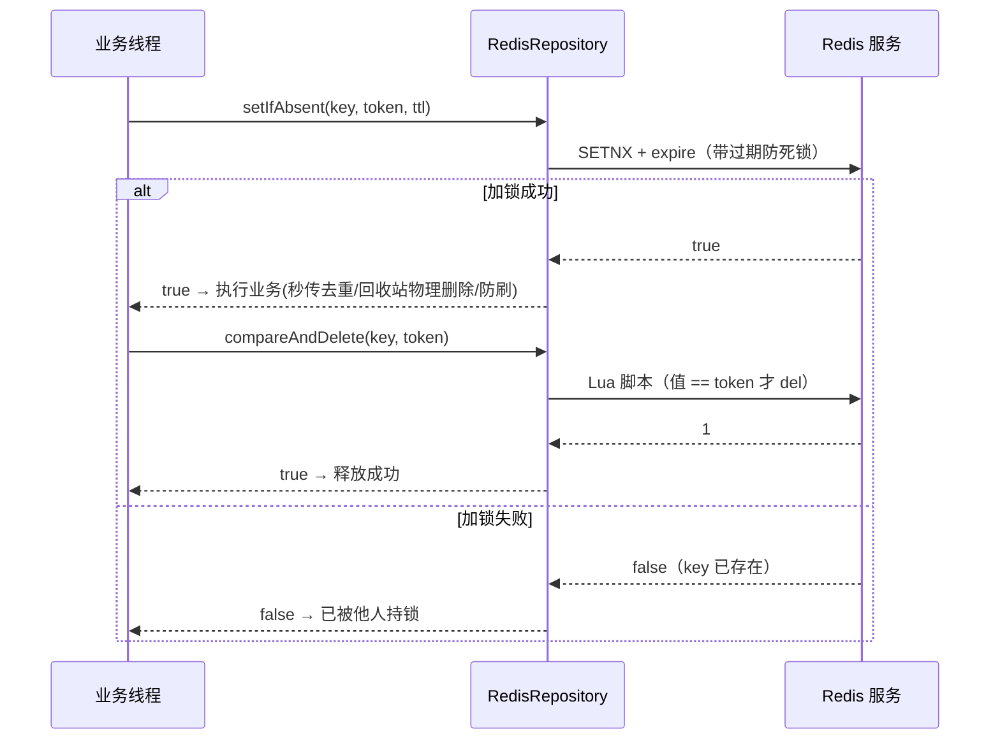

# GFS 安全框架与统一基建设计

> 面向读者：想理解 GFS 的「统一骨架」——统一返回/异常/i18n、ORM/实体基类、Redis 封装、Sa-Token 安全、以及 sse/preview/notify/swagger 等横向能力的开发者。
>
> 前提知识：`01-总体架构`（依赖方向）、`03`（安全在业务侧怎么用）。本文档是**底座篇**，回答「所有业务模块背后站着的公共设施长什么样、为什么」。

---

## 1. 设计定位

GFS 让每个业务模块（system/file/storage/service/log）都长得很统一。这个「统一」来自 `fs-framework` 下的一批**自动配置 + 基类**：

- **返回/异常**：`Result`（HTTP 200 + body code）、`GlobalExceptionHandler`、`BusinessException/ErrorCode`——所有 Controller 与业务层共用同一套「成功/失败语言」。
- **i18n**：`I18nUtils`——错误文案集中管理，多语言 + 前台友好。
- **ORM**：`MybatisFlexAutoConfigure` + `BaseEntity` + 插入/更新监听器——实体审计字段自动填充。
- **缓存/锁**：`RedisAutoConfigure` + `RedisRepository`——封装 String/Hash/Set/List/锁，业务只需关注语义。
- **安全**：`SaTokenAutoConfigure` + `SecurityProperties` + `StpInterfaceImpl`（业务侧）——会话、权限码注解鉴权。
- **横向**：sse（实时推送基座）、preview（预览基座）、notify（通知）、swagger（接口文档）。

**依赖纪律**：这些基座放 `fs-framework`，**只被业务依赖、不反向依赖业务**；业务通过 import 具体类获得能力，实现细节全部内聚在框架层。

---

## 2. 组件全景

| 模块 | 组件 | 位置 | 职责 |
| --- | --- | --- | --- |
| common-core | `Result` / `PageResult` | `domain/` | 统一返回：成功/失败/分页 |
| common-core | `GlobalExceptionHandler` | `exception/handler/` | `@RestControllerAdvice` 全量异常→`Result` |
| common-core | `BusinessException` / `ErrorCode` | `exception/` | 业务异常（带 code）与错误码集中定义 |
| common-core | `I18nUtils` / `ErrorMessageUtils` | `utils/` | i18n 文案解析；用户友好错误提取 |
| common-core | `IpUtils` 等 | `utils/` | IP/UA/JSON/树/TreeUtils 等通用工具 |
| common-core | `JacksonAutoConfigure` / `BigNumberSerializer` | `json/` | 全局 JSON 序列化（大数/Lossless） |
| orm | `MybatisFlexAutoConfigure` | `orm/` | MyBatis-Flex 装配、审计、逻辑删收窄、SQL 行为 |
| orm | `BaseEntity` + 监听器 | `orm/entity`、`orm/listener` | 实体基类 + insert/update 自动填充 |
| redis | `RedisAutoConfigure` / `RedisRepository` | `redis/` | Redis 封装：常见操作 + 分布式锁原语 |
| security | `SaTokenAutoConfigure` / `SecurityProperties` / `AllUrlHandler` | `security/` | Sa-Token 装配与开放 URL 清单 |
| security(业务) | `StpInterfaceImpl`（fs-system） | 见 03 | 权限/角色数据源接入 |
| sse/preview/notify/swagger | `sse/`、`preview/`、`notify/`、`swagger/` | 实时推送、预览、通知、接口文档基座 |

**图：框架层基础设施与业务模块的关系**



---

## 3. 核心链路

### 3.1 一次请求的骨架

```
客户端请求
  ▼ WebMvcConfig 拦截器链（fs-admin，见 01/03）
  ▼ Controller 调用 Service
      ├─ 正常 → return Result.ok(data)
      └─ 抛 BusinessException/其他异常 ↓
  ▼ GlobalExceptionHandler
      ├─ NotLogin→401 / NotPermission→403 / 校验失败→400
      ├─ BusinessException→保留业务 code
      ├─ 存储异常→extractUserFriendlyMessage
      └─ 其它→500 统一文案
  ▼ 响应体恒为 {code, msg, data}
```

**图：一次请求的骨架**



### 3.2 实体保存的审计自动填充

```
save(entity)（继承 BaseEntity）
  ▼ MybatisFlexAutoConfigure.customize(FlexGlobalConfig)
    注册 EntityInsertListener / EntityUpdateListener（作用于 BaseEntity）
  ▼ insert 时自动写 create_time/id；update 时自动写 update_time 等
```

### 3.3 Redis 使用（业务只需关心语义）

```
防刷计数：  redisRepository.incr(key,1) → expire(key,600)
分布式锁：  setIfAbsent(key, token, ttl) ... 释放用 compareAndDelete(key, token)
缓存读：    redisRepository.get(key) / hasKey(key)
```

**图：分布式锁（setIfAbsent 加锁 + Lua 释放）时序**



## 4. 关键代码段

### 4.1 统一返回 `Result`

```java
@Data
public class Result<T> implements Serializable {
    private T data;
    private Integer code = 200;
    private String msg = "success";
    public static <T> Result<T> ok(T model)      { return of(model, 200, "ok"); }
    public static <T> Result<T> error(String msg) { return of(null, 500, msg); }
    public static <T> Result<T> error(Integer code, String msg, T datas) { return of(datas, code, msg); }
}
```

> **决策依据**（详见 01 §4.1）：所有 REST 返回 HTTP 200，业务结果写在 body 的 code。前端只解析 `code`，业务层只需 `throw new BusinessException(code, msg)`，无需关心 HTTP 状态码。

### 4.2 `GlobalExceptionHandler`：异常即统一返回

```java
@RestControllerAdvice
public class GlobalExceptionHandler {
    // 未登录：按 Sa-Token 的 NotLoginException.type 细分 401/令牌类错误码
    @ExceptionHandler(NotLoginException.class)
    public Result<?> handlerNotLoginException(NotLoginException nle) {
        return Result.error(errorCode.getCode(), I18nUtils.getMessage(i18nKey), null);
    }
    // 权限/角色不足 → 403
    @ExceptionHandler({NotPermissionException.class, NotRoleException.class})
    public Result<?> handleNotPermissionException(...) {
        return Result.error(ErrorCode.FORBIDDEN.getCode(), I18nUtils.getMessage("auth.forbidden"), null);
    }
    // 业务异常：保留业务层给出的状态码（业务只负责抛，不负责 HTTP 层）
    @ExceptionHandler(BusinessException.class)
    public Result<?> handleBusinessException(BusinessException e) {
        return Result.error(e.getCode(), e.getMessage(), null);
    }
    // 存储异常等 → 取"用户友好"嵌套消息，避免把底层堆栈甩给前端
    @ExceptionHandler(StorageOperationException.class)
    public Result<?> handleStorageOperationException(StorageOperationException e) {
        return Result.error(ErrorMessageUtils.extractUserFriendlyMessage(e));
    }
}
```

**几个值得学习的细节**
- **SPA 兜底**：`NoResourceFoundException` 里判断 `isFrontendRoute`（GET + `Accept:text/html` + 非 `/apis|/api|preview|archive` + 无扩展名）→ `forward("/index.html")`，让 history 路由刷新/直达不被 404。
- **客户端断开**：通过类名 + 消息关键字（`Broken pipe`/`Connection reset`…递归 cause）识别 `ClientAbortException`，**不记 error 日志**，避免用户刷新页面产生一堆异常噪音。
- 上传超限、Bean 校验、重复键等各有专门 handler，全部收口成 `Result`。

### 4.3 ORM 装配 + 实体审计自动填充

```java
@MapperScan("${mybatis-flex.mapper-package}")
public class MybatisFlexAutoConfigure implements ConfigurationCustomizer, MyBatisFlexCustomizer {
    static {
        QueryColumnBehavior.setIgnoreFunction(QueryColumnBehavior.IGNORE_BLANK);   // 空值条件忽略
        QueryColumnBehavior.setSmartConvertInToEquals(true);                        // 单元素 IN 转 =
    }
    @Override
    public void customize(FlexGlobalConfig globalConfig) {
        // 全局数据填充监听器：作用于 BaseEntity 子类
        globalConfig.registerInsertListener(new EntityInsertListener(), BaseEntity.class);
        globalConfig.registerUpdateListener(new EntityUpdateListener(), BaseEntity.class);
        // 审计开关（sql_print 时强制开审计）+ 控制台收集器
        AuditManager.setAuditEnable(enableAudit);
        ...
    }
}
```

> `QueryColumnBehavior.IGNORE_BLANK` 特别重要：FileSystem 上很多「按条件查询」用 QueryWrapper 拼 null 条件，这个全局设置让**空值条件自动被忽略**，业务不用每处手动判空（与本地存储 `IS NULL` 特判互补，见 08/10）。

### 4.4 Redis 封装与分布式锁原语

```java
public class RedisRepository {
    // 「比较并删除」Lua 脚本：仅当值等于期望才删除 —— 安全释放分布式锁
    private static final DefaultRedisScript<Long> COMPARE_AND_DELETE_SCRIPT =
            new DefaultRedisScript<>(
              "if redis.call('get', KEYS[1]) == ARGV[1] then return redis.call('del', KEYS[1]) else return 0 end",
              Long.class);

    public Boolean setIfAbsent(String key, Object value, long time) {  // 加锁：仅 key 不存在时 set
        return redisTemplate.opsForValue().setIfAbsent(key, value, time, TimeUnit.SECONDS);
    }

    public boolean compareAndDelete(String key, Object expectedValue) { // 解锁：值与 token 一致才删
        Long r = redisTemplate.execute(COMPARE_AND_DELETE_SCRIPT, Collections.singletonList(key), expectedValue);
        return r != null && r > 0;
    }

    public Long incr(String key, long delta) { ... }   // 防刷计数
    public boolean expire(String key, long time) { ... }
}
```

> **学习点**：加锁用 `setIfAbsent(key, token, ttl)`（**带过期**，防死锁），解锁用 Lua `compareAndDelete`（**带归属校验**，防误删他人的锁）。业务里秒传去重、回收站物理删除、合集防刷都复用它（见 04/08）。

### 4.5 Sa-Token 安全底座

```java
@Configuration
@EnableConfigurationProperties(SecurityProperties.class)
public class SaTokenAutoConfigure {}
```

安全底座很薄，真正的权限数据来自业务侧 `StpInterfaceImpl`（fs-system，见 03）：Sa-Token 只提供会话与 `@SaCheckPermission`，`StpInterfaceImpl` 实现「用户→角色/权限码」的获取，二者在启动时由 Sa-Token SPI 自动接上。`AllUrlHandler` 维护一组**免鉴权开放 URL** 清单，供鉴权器放行登录/注册/分享下载等公开接口。

---

## 5. 技术选型理由

| 关注点 | 技术/方案 | 为什么 |
| --- | --- | --- |
| 返回体 | `Result`（HTTP200 + code） | 前端单一判断 code，业务层无需关心 HTTP；异常统一收口 |
| 异常 | `BusinessException` + 全局 handler | 「业务只抛、不管 HTTP」，集中一处翻译成统一结构 |
| 文案 | `I18nUtils` 键值 | 多语言、文案可集中改；存储/参数异常还能提取用户友好层 |
| ORM | MyBatis-Flex + 全局行为定制 | 保留 SQL 可控 + 类型安全 DSL；`IGNORE_BLANK` 减少判空噪声 |
| 审计字段 | BaseEntity + insert/update 监听器 | 复用 Java 监听机制，实体无需手写创建/更新时间 |
| 缓存/锁 | 自封装 `RedisRepository` | 常见操作一行语义化调用；锁用 setIfAbsent+Lua CAD 保证正确与无死锁 |
| 会话/鉴权 | Sa-Token | 轻量注解式权限，多端会话；权限数据经 SPI 由业务接入，框架保持薄 |
| JSON | JacksonAutoConfigure + BigNumberSerializer | 全局处理大数精度（Long id 前端不丢精度） |

---

## 6. 安全与边界

**已做防护**
- 未登录 / 令牌异常细分错误码；权限/角色不足返回 403；校验失败 400；业务异常保留业务 code。
- 存储/配置异常不向用户暴露底层堆栈，走 `extractUserFriendlyMessage`。
- 客户端断开连接异常降级为 debug 日志，不污染生产日志。
- 分布式锁带 TTL + 归属校验，避免死锁与误删锁。
- SPA 路由兜底仅放行 GET + `text/html` + 非接口/资源路径，不误伤 API。

**明确不做**
- 不做「AOP 全自动操作日志/审计」——由业务显式调用（见 12），避免切面引入误伤与开销。
- 不做「敏感配置加密存储」——configData 仅掩码展示（见 10）。
- 不全局仅缓存穿透保护——缓存控制留待具体业务（防刷等）按需使用 `RedisRepository` 原语，避免"银弹层"。

---

## 7. 关键文件索引

| 关注点 | 文件 |
| --- | --- |
| 统一返回 | `fs-common-core/.../domain/Result.java`、`PageResult.java` |
| 全局异常 | `fs-common-core/.../exception/handler/GlobalExceptionHandler.java` |
| 业务异常/错误码 | `fs-common-core/.../exception/BusinessException.java`、`ErrorCode.java` |
| i18n / 错误提取 | `fs-common-core/.../utils/I18nUtils.java`、`ErrorMessageUtils.java` |
| JSON 装配 | `fs-common-core/.../json/JacksonAutoConfigure.java`、`BigNumberSerializer.java` |
| ORM 装配 | `fs-orm/.../MybatisFlexAutoConfigure.java`、`orm/entity/BaseEntity.java`、`orm/listener/` |
| Redis 封装 | `fs-redis/.../RedisRepository.java`、`RedisAutoConfigure.java` |
| 安全底座 | `fs-security/.../SaTokenAutoConfigure.java`、`SecurityProperties.java`、`AllUrlHandler.java` |
| 业务侧权限 | `fs-system/.../StpInterfaceImpl.java`（见 03） |
| Web 拦截器链 | `fs-admin/.../web/WebMvcConfig.java` |
| 横向能力 | `fs-framework/{sse,preview,notify,swagger}/`（对应自动配置） |

---

## 8. 学习要点小结

- **统一语言**：`Result` + 全局异常 + i18n 把「成功/失败/错误码/多语言」收敛为一种结构，业务只管拼数据与抛异常。
- **薄框架 + 业务接线**：安全（Sa-Token）与 ORM（MyBatis-Flex）都只做装配，具体权限数据/字段填充通过 SPI/监听器由业务或监听器接入。
- **全局行为定调**：`IGNORE_BLANK`、审计字段填充、大数序列化等「一条规则全项目生效」，避免在每个 Controller/Service 里重复实现。
- **Redis 原语化**：自封装让防刷、缓存、分布式锁的语义一目了然，锁的正确性（TTL+归属校验）在底层保证一次。
- **异常的第二身份**：`GlobalExceptionHandler` 不只是「统一返回」，更承担 SPA 兜底、客户端断开降噪、用户友好错误提取——异常处理器也是**体验与稳定性**的战场。

---

到这里，GFS 的 13 份学习文档全部完成。可回到 `00-阅读指南与目录` 或 `README.md` 查看推荐阅读路径，按需反复精读。

> 配套索引见仓库根 `README.md`（或 `doc/README.md`），含全部文档链接与阅读路径。