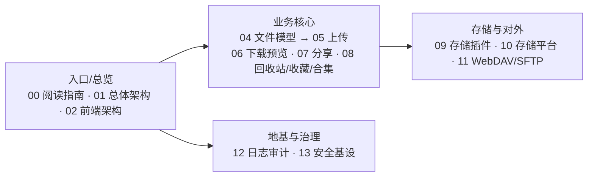

# GFS 系统设计文档

一套用于学习 GFS（现代化文件管理网盘系统）架构设计与技术选型的**中文系统设计文档**。

> 从零读懂：分层架构、模块职责、核心链路与关键代码设计动机。文档统一使用 `NN-中文标题.md` 命名，按编号顺序组织。

---

## 文档总览

| 编号 | 文档 | 一句话概括 |
| --- | --- | --- |
| 00 | [阅读指南与目录](00-阅读指南与目录.md) | 系统全貌、模块地图、阅读路径、写作规范 |
| 01 | [总体架构与技术选型](01-总体架构与技术选型.md) | 分层/依赖方向/技术栈/统一返回/双 SQL/存储 SPI |
| 02 | [前端架构设计](02-前端架构设计.md) | React 19 + Vite + TS + TanStack Query + Zustand + i18n |
| 03 | [认证与用户模块设计](03-认证与用户模块设计.md) | 登录策略/防爆破/权限模型/多端会话 |
| 04 | [文件数据模型与目录设计](04-文件数据模型与目录设计.md) | file_info 树/引用计数/落盘加密/挂载 |
| 05 | [上传链路设计](05-上传链路设计.md) | 分片/秒传/断点续传/幂等/内容去重/SSE |
| 06 | [下载与媒体预览设计](06-下载与媒体预览设计.md) | Range 流/预览策略/防盗链 |
| 07 | [文件分享与直链设计](07-文件分享与直链设计.md) | 分享/提取码/匿名下载/直链复用 |
| 08 | [回收站收藏与合集设计](08-回收站收藏与合集设计.md) | 软删除/还原/清空/收藏/免登录合集 |
| 09 | [存储插件体系设计](09-存储插件体系设计.md) | SPI/注册/工厂/缓存/分片复用 |
| 10 | [存储平台与配置设计](10-存储平台与配置设计.md) | 平台/配置/多激活/挂载同步 |
| 11 | [对外文件服务设计](11-对外文件服务设计.md) | WebDAV / SFTP 协议桥接 |
| 12 | [日志与审计模块设计](12-日志与审计模块设计.md) | 登录/操作日志/异步解耦 |
| 13 | [安全框架与统一基建设计](13-安全框架与统一基建设计.md) | 返回/异常/i18n/ORM/Redis/Sa-Token |

---

## 推荐阅读路径

- **快速建立整体认识**：`01 → 02 → 03`
- **深入文件核心（重点）**：`04 → 05 → 06 → 07 → 08`
- **存储与对外能力**：`09 → 10 → 11`
- **地基与治理**：`12 → 13`

> 每份文档末尾都有「学习要点小结」，并串联指引到下一份。首次阅读建议从 `00` 开始。

下面用 Mermaid 展示四类主题的推荐阅读递进关系：

---

## 说明

- 文档中的代码块为**真实源码节选**，并附「为什么这么设计」的解读；引用路径均为仓库内实际文件。
- 涉及表结构时请同时对照 `sql/mysql/gfs.sql` 与 `sql/postgresql/gfs_pg.sql`（双数据库基线，见 01）。
- 各文档遵循统写作规范（见 `00` 第 5 节）。